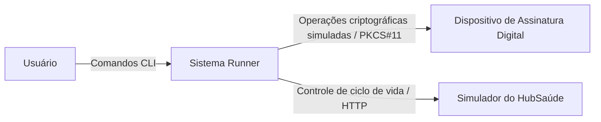
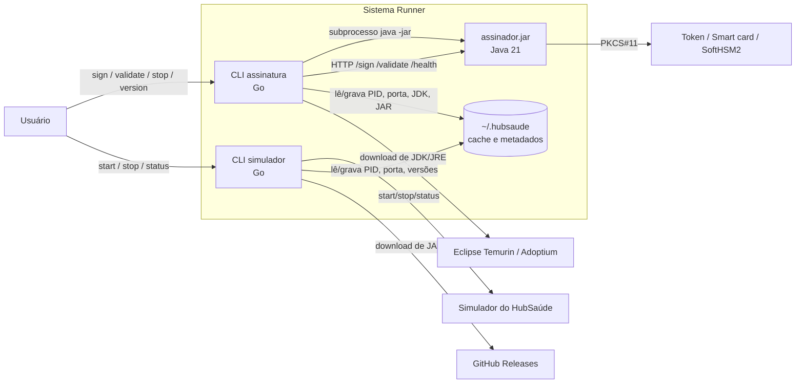
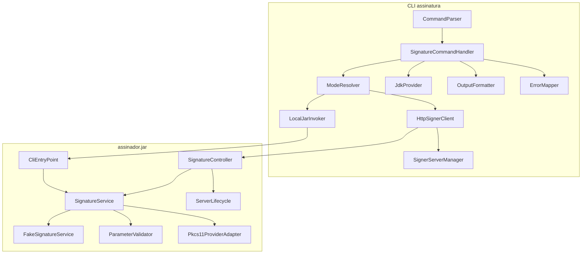
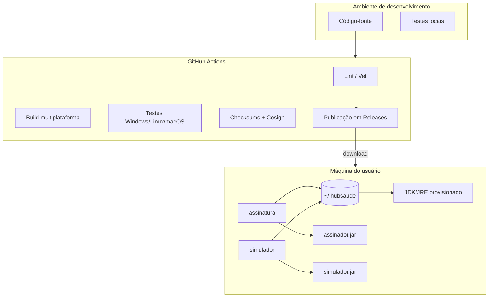

# 1. Identificação do documento

**Documento:** Especificação de Arquitetura de Software  
**Sistema:** Sistema Runner  
**Disciplina:** Implementação e Integração de Software  
**Curso:** Engenharia de Software  
**Contexto institucional:** Trabalho prático relacionado à Plataforma HubSaúde, iniciativa de interesse da Secretaria de Estado da Saúde de Goiás (SES-GO) e da Universidade Federal de Goiás (UFG).  
**Tipo de documento:** Especificação de Arquitetura de Software (EAS)  
**Versão:** 1.0  
**Data:** 07/06/2026  
**Status:** Versão inicial consolidada a partir dos artefatos de especificação, requisitos, design, critérios de qualidade, plano revisado e tarefas operacionais do projeto.  
**Autores:** Equipe do Sistema Runner  

---

# 2. Histórico de versões

| Versão | Data | Autor(es) | Descrição da alteração |
|---|---:|---|---|
| 1.0 | 07/06/2026 | Equipe do Sistema Runner | Criação da versão inicial da especificação de arquitetura de software, consolidando contexto, decisões arquiteturais, visões C4, tecnologias, comunicação, atributos de qualidade, organização do código-fonte, riscos e limitações. |

---

# 3. Sumário

- [1. Identificação do documento](#1-identificação-do-documento)
- [2. Histórico de versões](#2-histórico-de-versões)
- [3. Sumário](#3-sumário)
- [4. Introdução](#4-introdução)
  - [4.1 Objetivo do documento](#41-objetivo-do-documento)
  - [4.2 Escopo do documento](#42-escopo-do-documento)
  - [4.3 Público-alvo](#43-público-alvo)
- [5. Visão geral do sistema](#5-visão-geral-do-sistema)
  - [5.1 Descrição do sistema](#51-descrição-do-sistema)
  - [5.2 Objetivos do sistema](#52-objetivos-do-sistema)
  - [5.3 Principais funcionalidades](#53-principais-funcionalidades)
  - [5.4 Usuários do sistema](#54-usuários-do-sistema)
- [6. Requisitos arquiteturalmente relevantes](#6-requisitos-arquiteturalmente-relevantes)
- [7. Atributos de qualidade](#7-atributos-de-qualidade)
  - [7.1 Segurança](#71-segurança)
  - [7.2 Desempenho](#72-desempenho)
  - [7.3 Manutenibilidade](#73-manutenibilidade)
  - [7.4 Usabilidade](#74-usabilidade)
  - [7.5 Confiabilidade](#75-confiabilidade)
  - [7.6 Escalabilidade](#76-escalabilidade)
- [8. Restrições arquiteturais](#8-restrições-arquiteturais)
- [9. Estilo arquitetural adotado](#9-estilo-arquitetural-adotado)
- [10. Justificativa das decisões arquiteturais](#10-justificativa-das-decisões-arquiteturais)
- [11. Visões arquiteturais](#11-visões-arquiteturais)
  - [11.1 Visão de contexto](#111-visão-de-contexto)
  - [11.2 Visão de contêineres](#112-visão-de-contêineres)
  - [11.3 Visão de componentes](#113-visão-de-componentes)
  - [11.4 Visão de dados](#114-visão-de-dados)
  - [11.5 Visão de implantação](#115-visão-de-implantação)
- [12. Comunicação entre as partes do sistema](#12-comunicação-entre-as-partes-do-sistema)
- [13. Tecnologias utilizadas](#13-tecnologias-utilizadas)
- [14. Segurança](#14-segurança)
- [15. Organização do código-fonte](#15-organização-do-código-fonte)
- [16. Riscos e limitações](#16-riscos-e-limitações)

---

# 4. Introdução

## 4.1 Objetivo do documento

Este documento tem como objetivo descrever a arquitetura de software do **Sistema Runner**, apresentando sua organização estrutural, suas decisões arquiteturais, suas tecnologias, seus mecanismos de comunicação, suas visões arquiteturais e seus principais riscos.

A arquitetura aqui especificada orienta a implementação e integração dos componentes do sistema, garantindo que o desenvolvimento permaneça consistente com a Especificação de Requisitos de Software, com os diagramas C4 existentes, com o plano revisado de entregas e com os critérios de qualidade estabelecidos para o trabalho prático.

Este documento deve ser utilizado como referência para:

- orientar o desenvolvimento dos CLIs `assinatura` e `simulador`;
- orientar a implementação do `assinador.jar`;
- definir fronteiras entre componentes, responsabilidades e contratos de comunicação;
- apoiar a criação de testes unitários, testes de integração e testes de aceitação;
- apoiar a organização do repositório e do pipeline de CI/CD;
- registrar decisões arquiteturais relevantes;
- permitir rastreabilidade entre requisitos, arquitetura, código, testes e entregáveis.

## 4.2 Escopo do documento

Este documento cobre a arquitetura do **Sistema Runner**, considerando os seguintes elementos:

- CLI `assinatura`, responsável por permitir a criação e validação de assinaturas digitais simuladas por linha de comando;
- aplicação Java `assinador.jar`, responsável por validar parâmetros, simular criação de assinatura, simular validação de assinatura e, quando aplicável, interagir com dispositivo criptográfico via PKCS#11;
- CLI `simulador`, responsável por iniciar, parar e consultar o status do Simulador do HubSaúde;
- integração entre CLIs e aplicações Java por subprocesso, HTTP e gerenciamento de processos;
- provisionamento automático de JDK/JRE necessário para execução dos componentes Java;
- download e verificação de artefatos, como `simulador.jar` e binários distribuídos;
- distribuição multiplataforma dos CLIs em Windows, Linux e macOS;
- segurança de cadeia de suprimentos por checksums SHA256 e assinatura dos artefatos com Cosign/Sigstore;
- organização do código-fonte e diretrizes para CI/CD.

Não estão no escopo arquitetural deste documento:

- projeto de interface gráfica, pois o sistema é operado por linha de comando;
- implementação criptográfica real de assinatura digital;
- integração real com autoridades certificadoras;
- autenticação de usuários;
- armazenamento persistente de assinaturas digitais;
- desenho detalhado de algoritmos internos de criptografia, pois o sistema trabalha com simulação de assinatura e validação.

## 4.3 Público-alvo

| Público-alvo | Interesse no documento |
|---|---|
| Desenvolvedores do Sistema Runner | Compreender módulos, responsabilidades, contratos, tecnologias e organização do código. |
| Integradores e usuários técnicos | Entender como os CLIs interagem com aplicações Java e com o Simulador do HubSaúde. |
| Avaliadores da disciplina | Verificar coerência entre requisitos, arquitetura, implementação, testes e entregáveis. |
| Responsáveis por testes | Derivar testes unitários, testes de integração e testes de aceitação a partir da arquitetura. |
| Responsáveis por release | Compreender empacotamento, versionamento, publicação, checksums e assinatura de artefatos. |
| Futuros mantenedores | Evoluir o sistema com menor risco de acoplamento, duplicação ou quebra de contrato. |

---

# 5. Visão geral do sistema

## 5.1 Descrição do sistema

O **Sistema Runner** é um conjunto de aplicações de linha de comando e aplicações Java cujo objetivo é facilitar a execução de ferramentas relacionadas à Plataforma HubSaúde. O sistema atua como uma camada de conveniência e integração entre o usuário e aplicações Java, ocultando detalhes técnicos como instalação do Java, execução manual de arquivos `.jar`, passagem correta de parâmetros, gerenciamento de processos, comunicação HTTP, controle de portas e verificação de artefatos.

O usuário interage com o sistema por meio de comandos de terminal. O CLI `assinatura` recebe comandos para criar e validar assinaturas digitais simuladas e repassa essas solicitações ao `assinador.jar`. Essa comunicação pode ocorrer de duas formas: por invocação local, usando subprocesso, ou por invocação HTTP, usando o `assinador.jar` como servidor. O modo servidor é preferencial para reduzir o custo de inicialização da JVM em chamadas repetidas.

O CLI `simulador` permite iniciar, parar e consultar o status do Simulador do HubSaúde. Ele também deve ser capaz de baixar dinamicamente o `simulador.jar`, verificar sua disponibilidade local, confirmar se a porta necessária está disponível e validar se o serviço está realmente pronto para atender requisições.

A arquitetura valoriza portabilidade, automação, reprodutibilidade, rastreabilidade e separação de responsabilidades. O sistema deve funcionar em Windows, Linux e macOS, deve possuir CI/CD, deve gerar binários multiplataforma e deve publicar releases com mecanismos de integridade e autenticidade.

## 5.2 Objetivos do sistema

O objetivo geral do Sistema Runner é **facilitar o acesso à funcionalidade de execução de aplicações Java por linha de comandos**, permitindo que usuários utilizem ferramentas associadas ao HubSaúde sem conhecimento técnico aprofundado sobre Java, JVM, JARs, HTTP, portas ou dispositivos criptográficos.

Os objetivos específicos são:

1. Fornecer uma interface de linha de comando simples para criar assinaturas digitais simuladas.
2. Fornecer uma interface de linha de comando simples para validar assinaturas digitais simuladas.
3. Executar o `assinador.jar` em modo local quando solicitado explicitamente.
4. Executar e reutilizar o `assinador.jar` em modo servidor HTTP como modo preferencial.
5. Validar parâmetros no `assinador.jar`, mantendo uma autoridade única de validação.
6. Gerenciar o ciclo de vida do Simulador do HubSaúde por CLI.
7. Baixar e configurar automaticamente o JDK/JRE necessário quando ausente.
8. Baixar dinamicamente o `simulador.jar` quando necessário e evitar downloads redundantes.
9. Publicar binários multiplataforma por GitHub Releases.
10. Permitir verificação de integridade e autenticidade dos artefatos por SHA256 e Cosign/Sigstore.
11. Garantir testabilidade, rastreabilidade, documentação e reprodutibilidade.

## 5.3 Principais funcionalidades

As principais funcionalidades arquiteturalmente relevantes são:

- CLI `assinatura` com comandos de criação e validação de assinatura;
- comando de versão e ajuda para os CLIs;
- invocação local do `assinador.jar` via subprocesso;
- invocação HTTP do `assinador.jar` em modo servidor;
- inicialização, detecção, reutilização e parada do servidor `assinador.jar`;
- health check e readiness para evitar confundir porta ocupada com serviço válido;
- validação rigorosa de parâmetros dentro do `assinador.jar`;
- simulação de criação de assinatura digital;
- simulação de validação de assinatura digital;
- suporte à integração com dispositivo criptográfico via PKCS#11;
- CLI `simulador` com comandos `start`, `stop` e `status`;
- download dinâmico do `simulador.jar`;
- provisionamento automático de JDK/JRE;
- armazenamento local de metadados, versões, JDK/JRE, JARs e informações de processos;
- geração de binários para Windows, Linux e macOS;
- publicação de releases com SemVer, checksums SHA256 e assinatura Cosign;
- testes unitários, testes de integração e testes de aceitação.

## 5.4 Usuários do sistema

| Classe de usuário | Descrição | Necessidades arquiteturais associadas |
|---|---|---|
| Usuário final/integrador | Pessoa que utiliza os comandos no terminal para assinar, validar ou controlar o simulador. | CLI simples, mensagens claras, baixa dependência de configuração manual, portabilidade. |
| Desenvolvedor | Pessoa que implementa e mantém o sistema. | Separação de responsabilidades, baixo acoplamento, testes, CI/CD e estrutura de repositório clara. |
| Avaliador/professor | Pessoa responsável por avaliar a conformidade do trabalho prático. | Rastreabilidade, documentação, decisões justificadas e evidências de funcionamento. |
| Mantenedor de release | Pessoa que publica versões e artefatos executáveis. | Pipeline automatizado, versionamento semântico, assinatura, checksums e reprodutibilidade. |
| Integrador do HubSaúde | Usuário técnico interessado na execução de ferramentas associadas ao ambiente HubSaúde. | Execução simplificada de ferramentas Java, controle do simulador e validação de comportamento. |

---

# 6. Requisitos arquiteturalmente relevantes

Os requisitos arquiteturalmente relevantes são aqueles que afetam diretamente a estrutura do sistema, suas tecnologias, sua forma de implantação, seus mecanismos de comunicação ou seus atributos de qualidade.

| ID | Requisito arquiteturalmente relevante | Impacto arquitetural |
|---|---|---|
| RAR-01 | O sistema deve oferecer CLIs multiplataforma para Windows, Linux e macOS. | Exige tecnologia com boa capacidade de cross-compilation e baixo acoplamento a recursos específicos do sistema operacional. |
| RAR-02 | O CLI `assinatura` deve invocar o `assinador.jar` em modo local e em modo servidor. | Exige camada de abstração para invocação por subprocesso e por HTTP. |
| RAR-03 | O modo servidor deve ser o modo padrão, exceto quando o modo local for explicitamente solicitado. | Exige componente de gerenciamento de ciclo de vida, descoberta de instância ativa, health check e fallback controlado. |
| RAR-04 | O `assinador.jar` deve validar parâmetros como autoridade única. | Exige centralização da lógica de validação no componente Java e contrato claro entre CLI e JAR. |
| RAR-05 | O sistema deve distinguir erros de usuário e erros de sistema. | Exige modelo padronizado de erros, códigos de saída e respostas HTTP estruturadas. |
| RAR-06 | O CLI deve preservar argumentos com espaços, acentos e aspas. | Exige cuidado na construção de subprocessos, evitando concatenação insegura de comandos. |
| RAR-07 | O sistema deve gerenciar processos de longa duração. | Exige armazenamento de PID, porta, health check, readiness, shutdown e tratamento de processos órfãos. |
| RAR-08 | O Simulador do HubSaúde deve ser iniciado, parado e monitorado pelo CLI. | Exige componente específico de lifecycle management para o simulador. |
| RAR-09 | O sistema deve baixar JDK/JRE quando ausente. | Exige componente de provisionamento, cache local, verificação de versão e tratamento de falhas de rede. |
| RAR-10 | O sistema deve baixar dinamicamente o `simulador.jar`. | Exige componente de release/download, cache, comparação de versões e verificação de integridade. |
| RAR-11 | Os artefatos devem ser publicados com checksums e assinatura Cosign. | Exige pipeline CI/CD com etapa de geração de hash, assinatura, certificado e publicação. |
| RAR-12 | O sistema deve ter CI obrigatório com testes em múltiplas plataformas. | Exige workflows de build, teste, release e validação de portabilidade. |
| RAR-13 | O `assinador.jar` deve suportar PKCS#11. | Exige isolamento da integração criptográfica e testes com simulador como SoftHSM2. |
| RAR-14 | Não deve haver interface gráfica. | Direciona a arquitetura para uma solução de terminal, com foco em operabilidade por CLI. |
| RAR-15 | O sistema não deve implementar assinatura criptográfica real. | Mantém o domínio em modo de simulação, mas preserva contratos e validações coerentes. |
| RAR-16 | O projeto deve manter rastreabilidade entre requisitos, issues, PRs, commits, código e testes. | Exige disciplina de processo, documentação viva e ligação entre histórias e casos de teste. |
| RAR-17 | O repositório deve ser multi-módulo, contendo CLIs e aplicação Java. | Exige organização clara entre `cmd/`, `internal/` e diretório do projeto Java. |

---

# 7. Atributos de qualidade

## 7.1 Segurança

A segurança do Sistema Runner está concentrada em três dimensões principais: segurança da cadeia de suprimentos, segurança operacional e tratamento seguro da integração com dispositivos criptográficos.

### 7.1.1 Segurança da cadeia de suprimentos

Os binários publicados em releases devem ser acompanhados de checksums SHA256 e assinatura Cosign/Sigstore. Isso permite que o usuário verifique se o artefato baixado é autêntico e íntegro. A assinatura deve ser automatizada no pipeline de CI/CD, reduzindo o risco de erro manual.

### 7.1.2 Segurança operacional

O sistema não deve conter segredos, tokens, credenciais, IPs fixos ou caminhos absolutos sensíveis no código-fonte. Configurações como portas, URLs e diretórios devem ser parametrizáveis ou documentadas.

O sistema também deve evitar execução insegura de comandos. A invocação local do `assinador.jar` deve ser feita por API de subprocesso, preservando argumentos como lista, e não por concatenação de strings em shell.

### 7.1.3 Segurança na integração com PKCS#11

A integração com PKCS#11 deve ser isolada no `assinador.jar`. Quando o dispositivo criptográfico real não estiver disponível, o sistema deve retornar mensagens claras e não expor detalhes sensíveis desnecessários. Para testes, recomenda-se uso de simulador como SoftHSM2.

## 7.2 Desempenho

O principal requisito de desempenho é reduzir o custo de inicialização da JVM em execuções repetidas. Para isso, a arquitetura adota dois modos de execução:

- **modo local:** adequado para execuções esporádicas, pois inicia a JVM a cada chamada;
- **modo servidor:** adequado para múltiplas chamadas, pois mantém o `assinador.jar` em execução e recebe requisições HTTP.

O modo servidor deve ser o padrão quando não houver solicitação explícita de modo local. Isso reduz o tempo de resposta em chamadas subsequentes, evitando o ciclo completo de inicialização da JVM.

O sistema também deve evitar downloads redundantes de JDK/JRE e `simulador.jar`, utilizando cache local e comparação de versões.

## 7.3 Manutenibilidade

A manutenibilidade deve ser garantida por separação clara de responsabilidades. A arquitetura separa:

- interface de linha de comando;
- invocação por subprocesso;
- comunicação HTTP;
- gerenciamento de processos;
- download e cache de artefatos;
- provisionamento de JDK/JRE;
- validação e simulação de assinatura;
- integração com PKCS#11;
- publicação e assinatura de artefatos.

O contrato entre CLI e `assinador.jar` deve ser tratado como uma API. Isso significa que parâmetros, formatos de entrada, formatos de saída, respostas de erro e códigos de saída devem ser documentados e testados.

Decisões arquiteturais não óbvias devem ser registradas em ADRs curtos, como a escolha por Go, a escolha pelo modo servidor como padrão, a estratégia de descoberta de instância ativa, a porta padrão e a estratégia de cache em `~/.hubsaude/`.

## 7.4 Usabilidade

Como o sistema é operado por linha de comando, a usabilidade depende de comandos consistentes, mensagens claras e ajuda integrada.

Os CLIs devem possuir:

- comando de ajuda com exemplos;
- comando de versão rastreável;
- mensagens de sucesso compreensíveis;
- mensagens de erro que expliquem o que ocorreu, por que ocorreu e como corrigir;
- separação entre resultado em `stdout` e diagnóstico em `stderr`;
- nomes de comandos e parâmetros coerentes.

A arquitetura deve evitar exigir que o usuário conheça comandos Java, classpath, configuração manual de JDK/JRE ou endpoints HTTP internos.

## 7.5 Confiabilidade

A confiabilidade do sistema depende da capacidade de falhar de forma controlada. O sistema deve tratar explicitamente cenários como:

- `assinador.jar` ausente;
- JDK/JRE ausente;
- falha no download de dependências;
- porta ocupada por outro processo;
- processo registrado, mas não responsivo;
- timeout de requisição HTTP;
- conexão recusada;
- resposta HTTP malformada;
- payload inválido;
- falha no shutdown;
- dispositivo PKCS#11 indisponível;
- falha de assinatura ou verificação de artefato.

O CLI não deve assumir que uma porta ocupada representa uma instância válida. A verificação deve ser feita por health check real e, quando aplicável, readiness.

## 7.6 Escalabilidade

O Sistema Runner é uma aplicação local, não um serviço distribuído em nuvem. Portanto, escalabilidade neste contexto significa capacidade de lidar com múltiplas requisições sequenciais ou frequentes sem reiniciar a JVM a cada chamada.

O modo servidor contribui para escalabilidade operacional ao permitir reaproveitamento de uma instância ativa do `assinador.jar`. A arquitetura também permite evolução futura para suporte a múltiplas portas, múltiplas instâncias, filas internas ou maior concorrência HTTP, desde que isso seja necessário e registrado em novas decisões arquiteturais.

---

# 8. Restrições arquiteturais

| ID | Restrição arquitetural | Justificativa |
|---|---|---|
| RA-01 | Os CLIs devem ser desenvolvidos em Go 1.25. | Go oferece boa portabilidade, geração de binários estáticos e suporte a cross-compilation. |
| RA-02 | O `assinador.jar` deve ser desenvolvido em Java 21. | Restrição definida para o projeto Java responsável pela simulação e validação. |
| RA-03 | O sistema deve ser operado por CLI. | O escopo exclui interface gráfica. |
| RA-04 | Os binários devem funcionar em Windows, Linux e macOS, arquitetura `amd64`. | Requisito de distribuição multiplataforma. |
| RA-05 | O modo servidor deve ser preferencial. | Reduz custo de cold start da JVM e melhora desempenho em múltiplas chamadas. |
| RA-06 | O modo local deve ser explicitamente ativado. | Evita uso involuntário de uma estratégia menos eficiente. |
| RA-07 | A validação de parâmetros deve estar no `assinador.jar`. | Mantém autoridade única de validação e evita duplicação de regra no CLI. |
| RA-08 | O sistema deve usar health check para detectar instâncias vivas. | Evita confundir porta ocupada com serviço válido. |
| RA-09 | O diretório local gerenciado deve concentrar JDK/JRE, JARs, cache e metadados. | Facilita reuso e controle operacional. |
| RA-10 | Artefatos publicados devem conter checksums SHA256 e assinatura Cosign. | Requisito de integridade e autenticidade de distribuição. |
| RA-11 | O projeto deve ter CI/CD com GitHub Actions. | Garante reprodutibilidade, validação multiplataforma e release automatizada. |
| RA-12 | O repositório não deve versionar artefatos gerados. | Evita poluição do repositório e problemas de rastreabilidade. |
| RA-13 | A arquitetura deve preservar separação entre interface, transporte e domínio. | Reduz acoplamento e facilita testes. |
| RA-14 | O sistema não deve realizar assinatura digital real. | O escopo prevê simulação, não criptografia real. |
| RA-15 | O Simulador do HubSaúde deve ser gerenciado por comandos `start`, `stop` e `status`. | Requisito funcional de ciclo de vida do simulador. |

---

# 9. Estilo arquitetural adotado

A arquitetura do Sistema Runner combina os seguintes estilos e padrões arquiteturais:

## 9.1 Arquitetura modular multi-componente

O sistema é organizado em múltiplos componentes independentes, mas integrados:

- CLI `assinatura`;
- CLI `simulador`;
- aplicação Java `assinador.jar`;
- Simulador do HubSaúde (`simulador.jar` ou aplicação equivalente);
- componentes internos de invocação, download, provisionamento e gerenciamento de processos.

Essa organização permite separar responsabilidades e evoluir partes do sistema sem comprometer todo o conjunto.

## 9.2 Arquitetura em camadas dentro dos CLIs

Nos CLIs, recomenda-se uma separação lógica em camadas:

1. **Camada de interface CLI:** parsing de comandos, flags e mensagens ao usuário.
2. **Camada de aplicação/orquestração:** coordena casos de uso, como assinar, validar, iniciar ou parar serviços.
3. **Camada de integração:** invoca subprocessos, chama HTTP, baixa artefatos e gerencia JDK/JRE.
4. **Camada de infraestrutura local:** acessa sistema de arquivos, diretório `~/.hubsaude/`, metadados e logs.

## 9.3 Cliente-servidor no modo HTTP

No modo servidor, o CLI `assinatura` atua como cliente HTTP e o `assinador.jar` atua como servidor. Essa escolha reduz o custo de inicialização da JVM e permite reaproveitar uma instância viva para múltiplas operações.

## 9.4 Orquestração local de processos

O CLI atua como orquestrador local de processos Java. Ele inicia processos, verifica readiness, registra PID e porta, envia requisições, solicita shutdown e trata falhas. Isso permite que o usuário controle aplicações Java sem conhecer comandos de baixo nível.

## 9.5 Arquitetura orientada a contratos

A comunicação entre CLI e `assinador.jar` deve ser tratada como contrato explícito. O contrato inclui:

- comandos;
- parâmetros;
- payloads HTTP;
- formatos de resposta;
- códigos de saída;
- mensagens de erro;
- separação entre `stdout` e `stderr`.

Esse estilo facilita testes de contrato e reduz risco de divergência entre componentes.

---

# 10. Justificativa das decisões arquiteturais

| ID | Decisão arquitetural | Justificativa | Consequências |
|---|---|---|---|
| DA-01 | Desenvolver os CLIs em Go 1.25. | Go possui boa biblioteca padrão, suporte a subprocessos, HTTP, arquivos e cross-compilation. | Facilita geração de binários para Windows, Linux e macOS; exige domínio da linguagem Go pela equipe. |
| DA-02 | Desenvolver o `assinador.jar` em Java 21. | O projeto exige aplicação Java e integração com ambiente JVM. | Permite uso de recursos modernos do Java; exige JDK/JRE compatível. |
| DA-03 | Usar modo servidor como padrão para o `assinador.jar`. | Reduz o overhead de inicialização da JVM em chamadas repetidas. | Exige gerenciamento de ciclo de vida, health check, shutdown e tratamento de porta. |
| DA-04 | Manter modo local por flag explícita. | Oferece alternativa simples para execuções esporádicas e automações. | Cada chamada local sofre cold start da JVM; precisa de testes de subprocesso. |
| DA-05 | Centralizar validação de parâmetros no `assinador.jar`. | Evita duplicação de regras e mantém autoridade única de validação. | O CLI deve repassar corretamente os dados e interpretar erros retornados pelo JAR. |
| DA-06 | Separar resultado em `stdout` e diagnóstico em `stderr`. | Facilita uso em scripts e melhora operabilidade. | Exige disciplina na implementação de saídas. |
| DA-07 | Usar health check/readiness para detectar serviços ativos. | Evita confundir processo iniciado ou porta ocupada com serviço pronto. | Exige endpoints de verificação e lógica de espera/retry. |
| DA-08 | Usar diretório local `~/.hubsaude/` para cache e metadados. | Centraliza JDK/JRE, JARs, versões, PID, porta e logs. | Requer tratamento de permissões, limpeza e compatibilidade multiplataforma. |
| DA-09 | Baixar JDK/JRE automaticamente quando ausente. | Reduz barreira de uso para usuários sem Java instalado. | Exige download confiável, verificação de versão e tratamento de falhas de rede. |
| DA-10 | Publicar releases com checksums e Cosign. | Aumenta segurança da cadeia de suprimentos. | Exige automação no pipeline e documentação de verificação. |
| DA-11 | Organizar o repositório como multi-módulo. | Permite manter CLIs Go e aplicação Java em um projeto rastreável. | Exige organização clara de diretórios e workflows adequados. |
| DA-12 | Usar GitHub Actions para CI/CD. | Garante validação automatizada, portabilidade e publicação de artefatos. | O desenvolvimento passa a depender de workflows bem configurados. |
| DA-13 | Tratar comunicação CLI ↔ JAR como API. | Facilita testes de contrato, manutenção e evolução. | Exige documentação explícita de parâmetros, respostas e erros. |
| DA-14 | Isolar integração PKCS#11 no `assinador.jar`. | Mantém a responsabilidade criptográfica no componente Java e simplifica os CLIs. | Requer testes com token/smart card ou SoftHSM2. |
| DA-15 | Usar o modelo C4 para documentação arquitetural. | O modelo C4 facilita visualização em níveis progressivos: contexto, contêiner, componentes e implantação. | Exige manutenção dos diagramas em PlantUML e geração automatizada das imagens. |

---

# 11. Visões arquiteturais

## 11.1 Visão de contexto

A visão de contexto mostra o Sistema Runner como uma solução intermediária entre o usuário e sistemas externos associados ao HubSaúde.

### 11.1.1 Elementos da visão de contexto

| Elemento | Tipo | Responsabilidade |
|---|---|---|
| Usuário | Ator | Interage com o Sistema Runner por linha de comando. |
| Sistema Runner | Sistema | Facilita a execução de aplicações Java, assinatura simulada, validação simulada e controle do simulador. |
| Dispositivo de Assinatura Digital | Sistema externo | Token USB, smart card ou simulador compatível com PKCS#11. |
| Simulador do HubSaúde | Sistema externo/gerenciado | Aplicação Java/Web gerida pelo CLI `simulador`, usada para simulação de comportamento do HubSaúde. |

### 11.1.2 Diagrama textual de contexto



### 11.1.3 Interpretação

O usuário não precisa interagir diretamente com comandos Java, arquivos `.jar`, portas HTTP ou dispositivos criptográficos. O Sistema Runner encapsula essas interações por meio dos CLIs `assinatura` e `simulador`.

## 11.2 Visão de contêineres

A visão de contêineres detalha as principais unidades executáveis do sistema.

### 11.2.1 Contêineres internos e externos

| Contêiner | Tipo | Tecnologia | Responsabilidade |
|---|---|---|---|
| CLI `assinatura` | Aplicação CLI | Go 1.25 | Recebe comandos de criação/validação de assinatura, invoca o `assinador.jar`, exibe resultados e erros. |
| `assinador.jar` | Aplicação Java | Java 21 | Valida parâmetros, simula criação/validação de assinatura, expõe modo CLI/local e modo servidor HTTP. |
| CLI `simulador` | Aplicação CLI | Go 1.25 | Gerencia ciclo de vida do Simulador do HubSaúde. |
| Simulador do HubSaúde | Aplicação Java/Web | Java/JAR | Responde a endpoints de status e shutdown, sendo iniciado e monitorado pelo CLI `simulador`. |
| Dispositivo de Assinatura Digital | Sistema externo | PKCS#11 | Fornece interface para operações criptográficas reais ou simuladas. |
| Diretório local gerenciado | Armazenamento local | Sistema de arquivos | Armazena JDK/JRE, JARs, metadados de versão, PID, porta e logs. |
| GitHub Releases | Serviço externo | GitHub | Hospeda binários, JARs, checksums e assinaturas. |
| Adoptium/Eclipse Temurin | Serviço externo | HTTP/download | Fonte para download de JDK/JRE compatível. |

### 11.2.2 Diagrama textual de contêineres



### 11.2.3 Observações

O CLI `assinatura` e o CLI `simulador` são executáveis independentes, mas podem compartilhar pacotes internos, como componentes de download, logging, detecção de JDK/JRE e manipulação de arquivos locais. O `assinador.jar` deve permanecer isolado como autoridade de validação e simulação de assinatura.

## 11.3 Visão de componentes

A visão de componentes descreve a organização interna recomendada dos principais contêineres.

### 11.3.1 Componentes do CLI `assinatura`

| Componente | Responsabilidade |
|---|---|
| `CommandParser` | Define comandos, subcomandos, flags e validações básicas de presença no CLI. |
| `SignatureCommandHandler` | Orquestra os casos de uso `sign` e `validate`. |
| `ModeResolver` | Decide entre modo servidor e modo local, considerando flags, disponibilidade e padrão arquitetural. |
| `LocalJarInvoker` | Invoca o `assinador.jar` por subprocesso, preservando argumentos e capturando `stdout`, `stderr` e exit code. |
| `HttpSignerClient` | Envia requisições HTTP para `/sign`, `/validate` e endpoints de health check. |
| `SignerServerManager` | Inicia, detecta, reutiliza e encerra o `assinador.jar` em modo servidor. |
| `ProcessRegistry` | Lê e grava PID, porta, status e metadados em `~/.hubsaude/`. |
| `JdkProvider` | Detecta JDK/JRE compatível ou solicita provisionamento automático. |
| `OutputFormatter` | Formata resultados e erros de forma legível para o usuário. |
| `ErrorMapper` | Converte erros internos, HTTP ou de subprocesso em mensagens e códigos de saída coerentes. |

### 11.3.2 Componentes do `assinador.jar`

| Componente | Responsabilidade |
|---|---|
| `SignatureController` | Expõe endpoints HTTP `/sign` e `/validate` no modo servidor. |
| `CliEntryPoint` | Recebe invocações locais por linha de comando. |
| `SignatureService` | Define operações de criação e validação de assinatura. |
| `FakeSignatureService` | Implementa simulação de criação e validação de assinatura. |
| `ParameterValidator` | Valida parâmetros obrigatórios, formatos e consistência. |
| `Pkcs11ProviderAdapter` | Isola a integração com PKCS#11. |
| `ErrorResponseFactory` | Cria respostas padronizadas de erro. |
| `ServerLifecycle` | Controla inicialização, health check, readiness, timeout de inatividade e shutdown. |
| `LoggingAdapter` | Centraliza logs estruturados e níveis de log. |

### 11.3.3 Componentes do CLI `simulador`

| Componente | Responsabilidade |
|---|---|
| `SimulatorCommandParser` | Define comandos `start`, `stop`, `status` e flags relacionadas. |
| `SimulatorLifecycleManager` | Orquestra início, parada e consulta de status do simulador. |
| `SimulatorDownloader` | Baixa `simulador.jar` quando necessário. |
| `ReleaseMetadataClient` | Consulta `release.json` ou GitHub Releases para verificar versões. |
| `PortChecker` | Verifica disponibilidade de porta antes de iniciar o simulador. |
| `SimulatorHttpClient` | Consulta `/api/info`, `/shutdown` e endpoints de readiness. |
| `ProcessRegistry` | Registra PID, porta e metadados do simulador. |
| `ArtifactVerifier` | Valida checksum e, quando aplicável, assinatura do artefato baixado. |
| `OutputFormatter` | Exibe status e mensagens ao usuário. |

### 11.3.4 Diagrama textual de componentes



### 11.3.5 Critérios de separação de responsabilidades

A arquitetura deve evitar que:

- o CLI duplique validações complexas que pertencem ao `assinador.jar`;
- componentes de interface CLI conheçam detalhes de baixo nível de HTTP ou subprocessos;
- componentes de download fiquem acoplados a comandos específicos;
- mensagens de erro sejam espalhadas de forma inconsistente;
- o gerenciamento de processo seja implementado separadamente em vários lugares sem abstração comum.

## 11.4 Visão de dados

O Sistema Runner não possui banco de dados relacional nem armazenamento persistente de assinaturas. Os dados persistidos são predominantemente operacionais.

### 11.4.1 Dados transitórios

| Dado | Origem | Destino | Observação |
|---|---|---|---|
| Parâmetros de assinatura | Usuário via CLI ou HTTP | `assinador.jar` | Usados para simular assinatura. |
| Parâmetros de validação | Usuário via CLI ou HTTP | `assinador.jar` | Usados para simular validação. |
| Resultado de assinatura | `assinador.jar` | CLI/usuário | Não deve ser persistido como dado de negócio. |
| Resultado de validação | `assinador.jar` | CLI/usuário | Retorno simulado. |
| Mensagens de erro | Componentes internos | CLI/usuário | Devem ser claras e orientativas. |
| Payloads HTTP | CLI e `assinador.jar` | Comunicação interna | Devem seguir contrato documentado. |

### 11.4.2 Dados operacionais persistidos localmente

| Dado | Local sugerido | Finalidade |
|---|---|---|
| JDK/JRE provisionado | `~/.hubsaude/jdk/` | Reutilizar Java compatível sem novo download. |
| `simulador.jar` | `~/.hubsaude/artifacts/` | Executar o simulador sem novo download. |
| `assinador.jar`, se aplicável | `~/.hubsaude/artifacts/` | Executar o assinador quando distribuído externamente ao CLI. |
| Metadados de versão | `~/.hubsaude/metadata/` | Comparar versão local com versão remota. |
| PID do `assinador.jar` | `~/.hubsaude/run/` | Permitir status e shutdown. |
| Porta do `assinador.jar` | `~/.hubsaude/run/` | Localizar instância ativa. |
| PID do simulador | `~/.hubsaude/run/` | Permitir status e shutdown. |
| Porta do simulador | `~/.hubsaude/run/` | Consultar endpoints do simulador. |
| Logs | `~/.hubsaude/logs/` | Diagnóstico operacional. |
| Checksums baixados | `~/.hubsaude/metadata/` | Verificação de integridade. |

### 11.4.3 Dados de release

| Dado | Fonte | Uso |
|---|---|---|
| Tag SemVer | GitHub Releases | Identificar versão publicada. |
| Binários dos CLIs | GitHub Releases | Distribuição para usuários. |
| Checksums SHA256 | GitHub Releases | Verificar integridade. |
| Arquivos `.sig` | GitHub Releases | Verificar assinatura Cosign. |
| Arquivos `.pem` | GitHub Releases | Verificar certificado de assinatura. |
| `release.json` | Repositório/release | Identificar URLs e versões de artefatos. |

### 11.4.4 Política de persistência

A arquitetura deve persistir apenas dados operacionais necessários. Assinaturas simuladas, resultados de validação e parâmetros sensíveis não devem ser armazenados permanentemente pelo sistema, salvo se uma funcionalidade futura for formalmente especificada.

## 11.5 Visão de implantação

A implantação do Sistema Runner ocorre principalmente na máquina local do usuário. Os CLIs são distribuídos como binários pré-compilados e as aplicações Java são executadas localmente por meio de JDK/JRE detectado ou provisionado.

### 11.5.1 Ambientes de implantação

| Ambiente | Descrição |
|---|---|
| Desenvolvimento local | Ambiente usado por desenvolvedores para implementar, testar e executar o projeto. |
| CI/CD | GitHub Actions, responsável por lint, testes, build, release e assinatura de artefatos. |
| Máquina do usuário | Ambiente final em Windows, Linux ou macOS, onde os binários são executados. |
| GitHub Releases | Local de publicação de binários, checksums, assinaturas e certificados. |
| Serviços de download | Fontes externas para JDK/JRE e artefatos Java. |

### 11.5.2 Diagrama textual de implantação



### 11.5.3 Processo de release

O processo de release deve seguir, no mínimo, as seguintes etapas:

1. Criar tag SemVer no padrão `vX.Y.Z`.
2. Executar testes automatizados em Windows, Linux e macOS.
3. Gerar binários para `windows/amd64`, `linux/amd64` e `darwin/amd64`.
4. Gerar checksums SHA256.
5. Assinar artefatos com Cosign/Sigstore.
6. Publicar binários, checksums, `.sig` e `.pem` em GitHub Releases.
7. Permitir verificação independente pelo usuário.

---

# 12. Comunicação entre as partes do sistema

## 12.1 Comunicação Usuário → CLI

A comunicação entre usuário e sistema ocorre por linha de comando. O usuário executa comandos como:

```bash
assinatura sign [parâmetros]
assinatura validate [parâmetros]
assinatura stop [--port <porta>]
assinatura version
simulador start
simulador stop
simulador status
```

A arquitetura deve garantir que os comandos sejam previsíveis, documentados e consistentes.

## 12.2 Comunicação CLI `assinatura` → `assinador.jar` em modo local

No modo local, o CLI invoca o `assinador.jar` por subprocesso. A construção do comando deve usar lista de argumentos, não concatenação insegura por shell.

Fluxo geral:

```text
Usuário → assinatura CLI → subprocesso java -jar assinador.jar → resultado → assinatura CLI → Usuário
```

Regras arquiteturais:

- preservar espaços, acentos e aspas;
- capturar `stdout`, `stderr` e exit code;
- tratar ausência de JDK/JRE;
- tratar ausência de `assinador.jar`;
- distinguir erro de usuário e erro de sistema;
- não exigir que o usuário conheça o comando Java subjacente.

## 12.3 Comunicação CLI `assinatura` → `assinador.jar` em modo servidor

No modo servidor, o CLI se comunica com o `assinador.jar` por HTTP.

Fluxo geral:

```text
Usuário → assinatura CLI → HTTP → assinador.jar servidor → HTTP → assinatura CLI → Usuário
```

Endpoints esperados:

| Método | Endpoint | Finalidade |
|---|---|---|
| `GET` | `/health` ou equivalente | Confirmar que o servidor está vivo. |
| `GET` | `/ready` ou equivalente | Confirmar que o servidor está pronto. |
| `POST` | `/sign` | Criar assinatura simulada. |
| `POST` | `/validate` | Validar assinatura simulada. |
| `POST` ou `GET` | `/shutdown` ou equivalente | Encerrar servidor de forma controlada. |

Regras arquiteturais:

- modo servidor é o padrão;
- modo local deve ser explicitamente ativado;
- porta deve ser configurável;
- instância ativa deve ser detectada por health check real;
- timeout, conexão recusada e resposta malformada devem ser tratados;
- payloads e respostas devem ser documentados.

## 12.4 Comunicação `assinador.jar` → Dispositivo de Assinatura Digital

O `assinador.jar` deve interagir com dispositivo criptográfico por PKCS#11 quando essa funcionalidade for exercitada. Para testes, pode ser utilizado SoftHSM2 ou simulador equivalente.

Regras arquiteturais:

- a integração PKCS#11 deve ficar isolada em componente próprio;
- falhas de dispositivo devem gerar mensagens claras;
- testes de integração devem comprovar chamadas reais ou simuladas via PKCS#11;
- o CLI não deve conter lógica criptográfica de baixo nível.

## 12.5 Comunicação CLI `simulador` → Simulador do HubSaúde

O CLI `simulador` gerencia o ciclo de vida do Simulador do HubSaúde. Ele inicia o processo, consulta status e solicita encerramento.

Fluxo geral:

```text
Usuário → simulador CLI → processo simulador.jar → HTTP /api/info ou /shutdown → simulador CLI → Usuário
```

Endpoints esperados:

| Método | Endpoint | Finalidade |
|---|---|---|
| `GET` | `/api/info` | Consultar informações e status do simulador. |
| `POST` ou `GET` | `/shutdown` | Encerrar o simulador de forma controlada. |
| `GET` | `/health` ou equivalente | Confirmar que o processo está vivo, se disponível. |
| `GET` | `/ready` ou equivalente | Confirmar que o simulador está pronto, se disponível. |

Regras arquiteturais:

- verificar disponibilidade da porta antes de iniciar;
- não confundir processo iniciado com serviço pronto;
- registrar PID e porta;
- informar erro claro quando a porta estiver ocupada por outro processo;
- evitar baixar novamente o `simulador.jar` quando a versão local for válida.

## 12.6 Comunicação com serviços de download

O sistema pode consultar GitHub Releases, `release.json` e fontes de JDK/JRE. Essa comunicação deve tratar:

- falha de rede;
- URL inválida;
- arquivo incompleto;
- versão incompatível;
- checksum divergente;
- artefato já disponível localmente.

---

# 13. Tecnologias utilizadas

| Tecnologia | Uso previsto | Justificativa |
|---|---|---|
| Go 1.25 | Desenvolvimento dos CLIs `assinatura` e `simulador`. | Boa portabilidade, biblioteca padrão robusta, suporte a cross-compilation. |
| Cobra | Estruturação de comandos e flags dos CLIs. | Facilita criação de CLIs com subcomandos, ajuda e versionamento. |
| Java 21 | Desenvolvimento do `assinador.jar` e execução de aplicações Java. | Restrição do projeto e compatibilidade com aplicações Java modernas. |
| Maven | Build do projeto Java, quando adotado conforme estrutura prevista. | Organização de dependências, testes e empacotamento do JAR. |
| HTTP | Comunicação entre CLI e `assinador.jar` em modo servidor; comunicação com simulador. | Protocolo simples, conhecido e adequado para integração local. |
| PKCS#11 | Integração com token, smart card ou simulador criptográfico. | Padrão para comunicação com dispositivos criptográficos. |
| SoftHSM2 | Simulação de dispositivo criptográfico em testes. | Permite testar integração PKCS#11 sem hardware real. |
| GitHub Actions | CI/CD para lint, testes, build, release e assinatura. | Automatiza validação e publicação. |
| GitHub Releases | Distribuição de binários e artefatos. | Canal padronizado de publicação do projeto. |
| SHA256 | Verificação de integridade dos artefatos. | Permite detectar alteração ou corrupção de arquivos. |
| Cosign/Sigstore | Assinatura e verificação de autenticidade dos artefatos. | Melhora segurança da cadeia de suprimentos. |
| Eclipse Temurin/Adoptium | Fonte para JDK/JRE provisionado. | Distribuição Java confiável e multiplataforma. |
| PlantUML | Geração de diagramas C4. | Permite versionar diagramas como texto e gerar imagens automaticamente. |
| Modelo C4 | Documentação arquitetural em níveis. | Facilita entendimento progressivo: contexto, contêineres, componentes e implantação. |
| Git | Controle de versão. | Suporte a rastreabilidade por commits, branches, tags e PRs. |

---

# 14. Segurança

Embora o Sistema Runner não implemente assinatura digital criptográfica real, ele possui responsabilidades importantes de segurança relacionadas à distribuição, execução local e integração com dispositivos criptográficos.

## 14.1 Segurança dos artefatos distribuídos

Todos os artefatos publicados em release devem conter:

- arquivo principal do artefato;
- checksum SHA256;
- assinatura Cosign (`.sig`);
- certificado Cosign (`.pem`).

O objetivo é permitir que o usuário verifique a integridade e autenticidade do binário antes de executá-lo.

## 14.2 Segurança no pipeline de release

A assinatura dos artefatos deve ser realizada automaticamente pelo CI/CD. O processo deve usar identidade OIDC e registrar a assinatura no transparency log do Sigstore, conforme definido nos requisitos do projeto.

## 14.3 Segurança no download de dependências

Downloads de JDK/JRE e `simulador.jar` devem ser tratados com cuidado. A arquitetura recomenda:

- baixar apenas de fontes conhecidas ou parametrizadas explicitamente;
- verificar checksum quando disponível;
- não executar artefato cujo checksum esteja incorreto;
- evitar download repetido quando a versão local já for válida;
- retornar erro claro em caso de falha de verificação.

## 14.4 Segurança na execução de subprocessos

A invocação de `java -jar` deve ser feita por mecanismos seguros da linguagem Go, usando lista de argumentos. A arquitetura deve evitar formar comandos por concatenação de texto para execução em shell, pois isso aumenta risco de erros com espaços, acentos, aspas e possíveis injeções.

## 14.5 Segurança de configuração local

O sistema deve evitar armazenar segredos. O diretório `~/.hubsaude/` deve armazenar apenas dados operacionais, como JDK/JRE, JARs, metadados, PID, porta e logs. Caso futuramente sejam adicionadas informações sensíveis, deverá haver decisão arquitetural específica para criptografia, permissões e descarte seguro.

## 14.6 Segurança na integração com PKCS#11

A arquitetura deve isolar a integração PKCS#11. O `assinador.jar` deve lidar com falhas de dispositivo, biblioteca ausente, slot indisponível ou token não encontrado de forma explícita, sem expor detalhes sensíveis desnecessários.

## 14.7 Segurança de logs

Logs devem ser úteis para diagnóstico, mas não devem registrar dados sensíveis desnecessariamente. Recomenda-se utilizar níveis de log e permitir modos como `--verbose` e `--quiet`.

---

# 15. Organização do código-fonte

A organização do código-fonte deve refletir a natureza multi-módulo do projeto, separando CLIs, pacotes internos compartilhados e aplicação Java.

## 15.1 Estrutura recomendada do repositório

```text
runner/
├── cmd/
│   ├── assinatura/
│   │   └── main.go
│   └── simulador/
│       └── main.go
├── internal/
│   ├── cli/
│   ├── invoker/
│   ├── jdk/
│   ├── release/
│   ├── process/
│   ├── config/
│   ├── output/
│   └── errors/
├── assinador/
│   ├── pom.xml
│   └── src/
│       ├── main/
│       │   └── java/
│       └── test/
│           └── java/
├── docs/
│   ├── arquitetura/
│   ├── adr/
│   └── diagramas/
├── .github/
│   └── workflows/
│       ├── build.yml
│       └── release.yml
├── go.mod
├── go.sum
├── .gitignore
├── .gitattributes
├── LICENSE
└── README.md
```

## 15.2 Responsabilidades dos diretórios

| Diretório | Responsabilidade |
|---|---|
| `cmd/assinatura/` | Ponto de entrada do CLI de assinatura. |
| `cmd/simulador/` | Ponto de entrada do CLI de gerenciamento do simulador. |
| `internal/cli/` | Construção dos comandos, subcomandos e flags. |
| `internal/invoker/` | Invocação do `assinador.jar` por subprocesso ou HTTP. |
| `internal/jdk/` | Detecção e provisionamento de JDK/JRE. |
| `internal/release/` | Consulta de releases, download e verificação de artefatos. |
| `internal/process/` | Gerenciamento de PID, porta, health check, readiness e shutdown. |
| `internal/config/` | Configurações, diretórios, portas padrão e variáveis de ambiente. |
| `internal/output/` | Formatação de resultados para o terminal. |
| `internal/errors/` | Padronização de erros e códigos de saída. |
| `assinador/` | Projeto Java do `assinador.jar`. |
| `docs/arquitetura/` | Documentos arquiteturais. |
| `docs/adr/` | Registros de decisão arquitetural. |
| `docs/diagramas/` | Fontes PlantUML e imagens dos diagramas. |
| `.github/workflows/` | Workflows de build, teste, release e assinatura. |

## 15.3 Convenções de código e repositório

A organização do código deve seguir as seguintes diretrizes:

- manter idioma único e nomenclatura consistente em paths;
- evitar espaços e acentos em nomes de arquivos e diretórios;
- não versionar binários, diretórios de build, caches ou artefatos gerados;
- usar `.gitignore` adequado para Go, Java, IDEs e sistema operacional;
- usar `.gitattributes` para tratar encoding UTF-8 e line endings;
- manter README atualizado com build, execução, testes, contribuição e status;
- registrar ADRs para decisões não óbvias;
- vincular issues, PRs e commits às histórias de usuário.

## 15.4 Organização dos testes

A arquitetura recomenda uma pirâmide de testes:

| Tipo de teste | Finalidade | Exemplos |
|---|---|---|
| Testes unitários | Validar componentes isolados. | Parser de comandos, validação de parâmetros, formatação de erro. |
| Testes de integração | Validar comunicação entre partes reais. | CLI → subprocesso → `assinador.jar`; CLI → HTTP → `assinador.jar`; CLI → simulador. |
| Testes de contrato | Garantir estabilidade da API CLI ↔ JAR. | Payloads, respostas, códigos de saída, `stdout`/`stderr`. |
| Testes de aceitação | Validar comportamento esperado do usuário. | `assinatura sign`, `assinatura validate`, `simulador start`, `simulador status`. |
| Testes de release | Validar geração e publicação de artefatos. | Binários, checksums, `.sig`, `.pem`. |
| Testes negativos | Validar falhas controladas. | Porta ocupada, JAR ausente, Java ausente, timeout, payload inválido. |

---

# 16. Riscos e limitações

## 16.1 Riscos arquiteturais

| ID | Risco | Impacto | Mitigação |
|---|---|---|---|
| R-01 | Dificuldade de manter consistência entre CLI e `assinador.jar`. | Quebra de integração e erros em runtime. | Definir contrato documentado e testes de contrato. |
| R-02 | Falhas no gerenciamento de processos em diferentes sistemas operacionais. | `start`, `stop` e `status` podem se comportar de forma inconsistente. | Testar em Windows, Linux e macOS; isolar lógica de processo. |
| R-03 | Porta ocupada ser confundida com instância válida. | CLI pode enviar requisição para processo errado. | Usar health check e readiness, não apenas verificação de porta. |
| R-04 | Download automático falhar por rede, URL inválida ou indisponibilidade externa. | Usuário não consegue executar JDK/JRE ou simulador. | Mensagens claras, cache local, retry controlado e documentação de instalação manual. |
| R-05 | Dependências externas mudarem ou ficarem indisponíveis. | Build ou execução podem falhar. | Fixar versões, usar tags/commits, documentar fontes e manter checksums. |
| R-06 | Integração PKCS#11 ser difícil de testar sem hardware real. | Funcionalidade pode ficar não comprovada. | Usar SoftHSM2 ou simulador equivalente em testes de integração. |
| R-07 | Binários publicados sem assinatura ou checksum. | Risco de cadeia de suprimentos e reprovação do critério de qualidade. | Automatizar geração de SHA256 e Cosign no workflow de release. |
| R-08 | Excesso de lógica no CLI. | Aumenta acoplamento e duplica validações. | Manter validação principal no `assinador.jar` e CLI como orquestrador. |
| R-09 | Testes flaky em processos e portas. | CI instável e baixa confiança nos testes. | Usar portas configuráveis, esperas com timeout e isolamento de testes. |
| R-10 | Documentação desatualizada. | Usuários e avaliadores podem executar comandos incorretos. | Tratar README e documentos como artefatos vivos, atualizados a cada mudança relevante. |

## 16.2 Limitações conhecidas

| ID | Limitação | Descrição |
|---|---|---|
| L-01 | Assinatura digital é simulada. | O sistema não realiza criptografia real nem substitui uma infraestrutura de assinatura digital em produção. |
| L-02 | Validação de assinatura é simulada. | O resultado de validação é pré-determinado ou baseado em critérios simples. |
| L-03 | Não há interface gráfica. | Toda interação ocorre por linha de comando. |
| L-04 | Não há autenticação de usuários. | O sistema não possui login, controle de sessão ou perfis de acesso. |
| L-05 | Não há armazenamento persistente de assinaturas. | O sistema não mantém histórico de assinaturas geradas ou validadas. |
| L-06 | O funcionamento depende de artefatos externos em alguns fluxos. | Download de JDK/JRE, `simulador.jar` e releases exige disponibilidade de rede quando não houver cache local. |
| L-07 | O suporte a PKCS#11 pode depender do ambiente. | Tokens, smart cards e simuladores podem exigir bibliotecas nativas e configuração específica. |
| L-08 | A escalabilidade é local. | O objetivo é melhorar chamadas locais repetidas, não escalar como serviço distribuído de produção. |
| L-09 | O documento define arquitetura inicial. | Mudanças futuras devem ser registradas por ADRs e refletidas na documentação. |

## 16.3 Recomendações finais

Para reduzir os riscos e manter a arquitetura coerente, recomenda-se:

1. Implementar primeiro o fluxo mínimo ponta a ponta em modo local.
2. Depois evoluir para o modo servidor com health check, readiness e shutdown.
3. Manter testes de contrato entre CLI e `assinador.jar` desde as primeiras entregas.
4. Automatizar CI/CD antes de ampliar funcionalidades.
5. Registrar decisões arquiteturais em ADRs curtos.
6. Evitar duplicação de regras de validação entre CLI e JAR.
7. Tratar cenários negativos como parte essencial do projeto, não como complemento.
8. Manter a documentação alinhada com o comportamento real do sistema.

---

**Fim do documento.**
