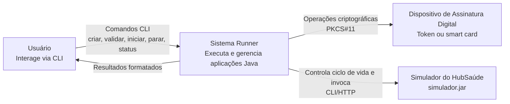
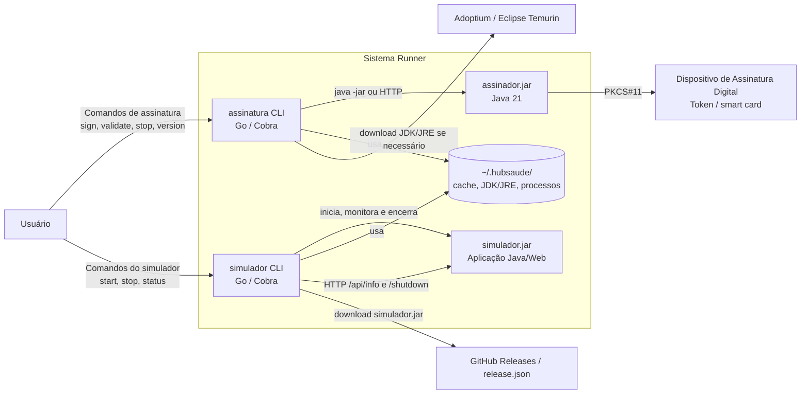
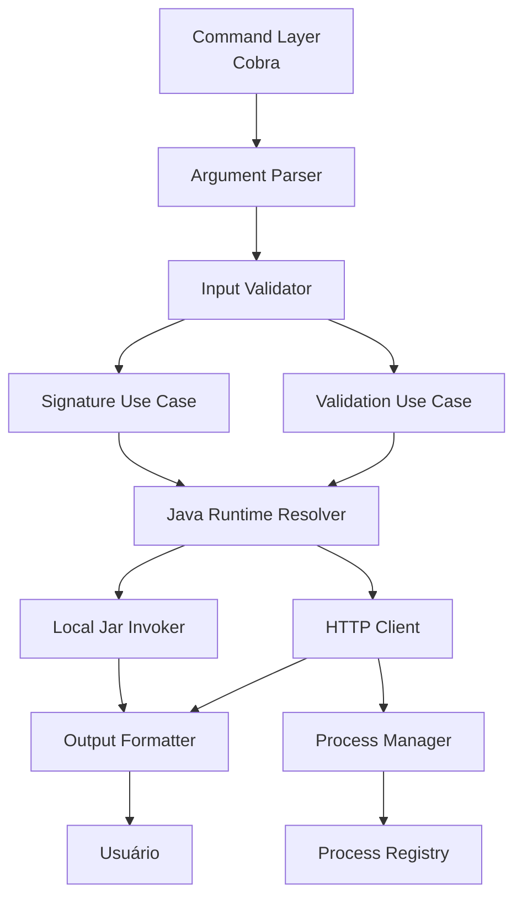
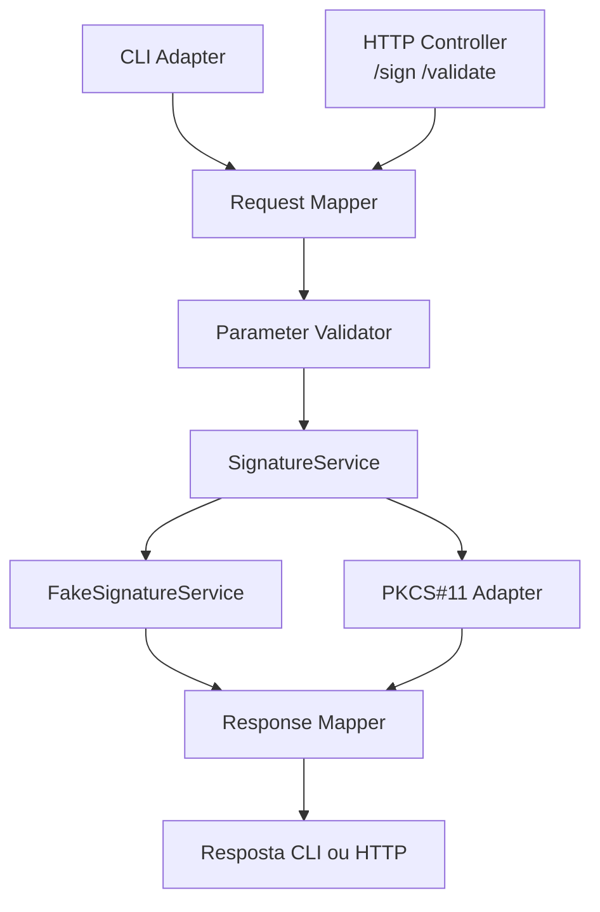
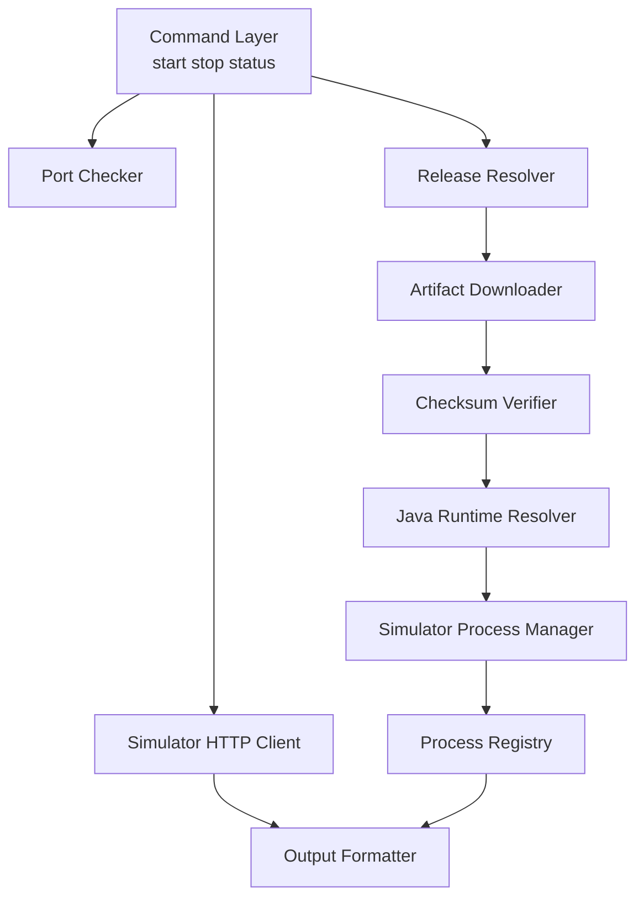
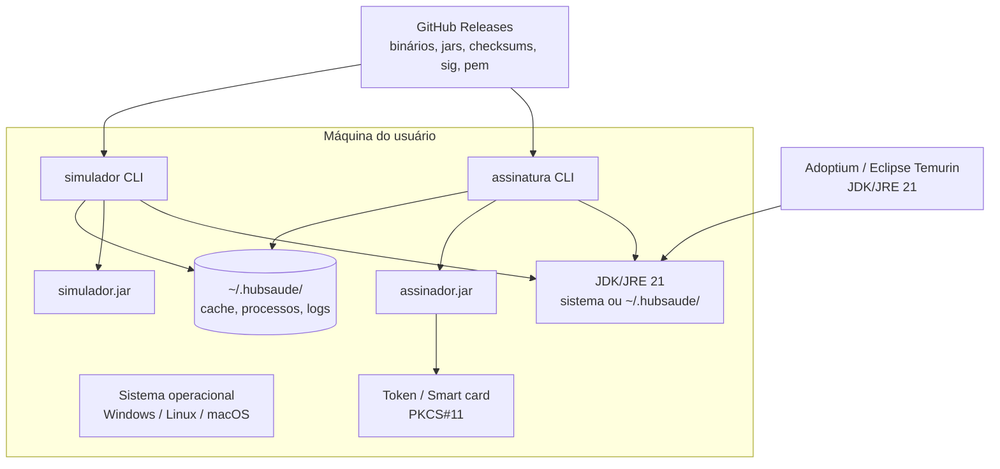

# Documento de Arquitetura de Software — Sistema Runner

## 1. Identificação do documento

| Campo | Informação |
|---|---|
| **Nome do sistema** | Sistema Runner |
| **Nome do documento** | Documento de Arquitetura de Software |
| **Versão do documento** | 1.0 |
| **Data de elaboração** | 07/05/2026 |
| **Responsável pela elaboração** | Equipe do projeto / Disciplina de Implementação e Integração de Software |
| **Instituição / contexto acadêmico** | Bacharelado em Engenharia de Software — Universidade Federal de Goiás (UFG) |
| **Contexto de aplicação** | Plataforma HubSaúde — interoperabilidade de dados em saúde |
| **Documento relacionado** | Especificação de Requisitos de Software — Sistema Runner |
| **Tipo de sistema** | Ferramenta de linha de comandos, integração com aplicações Java, gerenciamento de simulador e simulação de assinatura digital |

---

## 2. Histórico de versões

| Versão | Data | Autor / Responsável | Descrição da alteração |
|---|---|---|---|
| 1.0 | 07/05/2026 | Equipe do projeto | Elaboração inicial do Documento de Arquitetura de Software do Sistema Runner, com base nos arquivos de especificação, design arquitetural C4, plano revisitado e documento de requisitos previamente elaborado. |

---

## 3. Sumário

1. [Identificação do documento](#1-identificação-do-documento)  
2. [Histórico de versões](#2-histórico-de-versões)  
3. [Sumário](#3-sumário)  
4. [Introdução](#4-introdução)  
   4.1 [Objetivo do documento](#41-objetivo-do-documento)  
   4.2 [Escopo do documento](#42-escopo-do-documento)  
   4.3 [Público-alvo](#43-público-alvo)  
5. [Visão geral do sistema](#5-visão-geral-do-sistema)  
   5.1 [Descrição do sistema](#51-descrição-do-sistema)  
   5.2 [Objetivos do sistema](#52-objetivos-do-sistema)  
   5.3 [Principais funcionalidades](#53-principais-funcionalidades)  
   5.4 [Usuários do sistema](#54-usuários-do-sistema)  
6. [Requisitos arquiteturalmente relevantes](#6-requisitos-arquiteturalmente-relevantes)  
7. [Atributos de qualidade](#7-atributos-de-qualidade)  
   7.1 [Segurança](#71-segurança)  
   7.2 [Desempenho](#72-desempenho)  
   7.3 [Manutenibilidade](#73-manutenibilidade)  
   7.4 [Usabilidade](#74-usabilidade)  
   7.5 [Confiabilidade](#75-confiabilidade)  
   7.6 [Escalabilidade](#76-escalabilidade)  
8. [Restrições arquiteturais](#8-restrições-arquiteturais)  
9. [Estilo arquitetural adotado](#9-estilo-arquitetural-adotado)  
10. [Justificativa das decisões arquiteturais](#10-justificativa-das-decisões-arquiteturais)  
11. [Visões arquiteturais](#11-visões-arquiteturais)  
   11.1 [Visão de contexto](#111-visão-de-contexto)  
   11.2 [Visão de contêineres](#112-visão-de-contêineres)  
   11.3 [Visão de componentes](#113-visão-de-componentes)  
   11.4 [Visão de dados](#114-visão-de-dados)  
   11.5 [Visão de implantação](#115-visão-de-implantação)  
12. [Comunicação entre as partes do sistema](#12-comunicação-entre-as-partes-do-sistema)  
13. [Tecnologias utilizadas](#13-tecnologias-utilizadas)  
14. [Segurança](#14-segurança)  
15. [Organização do código-fonte](#15-organização-do-código-fonte)  
16. [Riscos e limitações](#16-riscos-e-limitações)  

---

## 4. Introdução

O Sistema Runner é uma solução de software criada para facilitar a execução e o gerenciamento de aplicações Java por meio de interfaces de linha de comandos. O sistema está relacionado ao contexto da Plataforma HubSaúde, iniciativa associada à interoperabilidade de dados em saúde, e foi definido no contexto de uma disciplina de Implementação e Integração de Software do Bacharelado em Engenharia de Software.

A arquitetura do Sistema Runner deve permitir que usuários e integradores executem aplicações Java sem precisar conhecer detalhes de configuração do ambiente Java, comandos `java -jar`, portas, processos em segundo plano, downloads de dependências, validação de parâmetros ou comunicação com dispositivos criptográficos. Para isso, o sistema organiza suas responsabilidades em aplicações de linha de comando, aplicações Java, componentes de integração, mecanismos de provisionamento de JDK/JRE, controle de processos, comunicação HTTP e publicação segura de artefatos.

Este documento descreve a arquitetura de software proposta para o Sistema Runner, mantendo correspondência com a especificação, o plano revisitado, os diagramas C4 e o documento de requisitos previamente elaborado.

### 4.1 Objetivo do documento

O objetivo deste documento é registrar a arquitetura de software do Sistema Runner, apresentando:

- a visão geral da solução;
- os requisitos que influenciam diretamente a arquitetura;
- os atributos de qualidade considerados;
- as restrições arquiteturais;
- o estilo arquitetural adotado;
- as decisões arquiteturais e suas justificativas;
- as visões de contexto, contêineres, componentes, dados e implantação;
- a comunicação entre as partes do sistema;
- as tecnologias utilizadas;
- a organização prevista do código-fonte;
- os principais riscos e limitações arquiteturais.

Este documento serve como guia para implementação, integração, manutenção, testes e avaliação do Sistema Runner.

### 4.2 Escopo do documento

Este documento cobre a arquitetura das seguintes partes do Sistema Runner:

- aplicação CLI `assinatura`, desenvolvida em Go;
- aplicação Java `assinador.jar`, desenvolvida em Java 21;
- aplicação CLI `simulador`, desenvolvida em Go;
- integração local entre CLI e aplicações Java por meio de `java -jar`;
- integração HTTP entre CLI e `assinador.jar` em modo servidor;
- gerenciamento do ciclo de vida do `assinador.jar` e do `simulador.jar`;
- provisionamento automático de JDK/JRE;
- armazenamento local de arquivos, metadados, cache e registros de processo;
- distribuição multiplataforma por GitHub Releases;
- assinatura e verificação dos artefatos com SHA256 e Cosign;
- suporte arquitetural à comunicação com dispositivo criptográfico via PKCS#11.

Este documento não cobre a implementação real de assinatura digital criptográfica, a validação criptográfica real de assinaturas, a integração com autoridades certificadoras, a geração de certificados digitais, autenticação de usuários ou interface gráfica, pois esses itens estão fora do escopo definido para o sistema.

### 4.3 Público-alvo

| Público-alvo | Interesse no documento |
|---|---|
| **Desenvolvedores do Sistema Runner** | Entender a estrutura da solução, responsabilidades dos módulos, tecnologias e formas de integração. |
| **Integradores da Plataforma HubSaúde** | Compreender como o Runner executa aplicações Java e expõe comandos simplificados. |
| **Avaliadores e professores** | Avaliar a coerência entre requisitos, arquitetura, decisões técnicas e entregáveis. |
| **Estudantes da disciplina** | Usar o documento como referência para implementação e integração de software. |
| **Usuários técnicos** | Entender como o sistema executa, gerencia e distribui os artefatos necessários. |
| **Mantenedores futuros** | Apoiar evolução, correção, refatoração e extensão do sistema. |

---

## 5. Visão geral do sistema

### 5.1 Descrição do sistema

O Sistema Runner é composto por um conjunto de aplicações e componentes que trabalham em conjunto para executar e gerenciar aplicações Java associadas ao HubSaúde. Sua função principal é oferecer uma interface simples de linha de comandos para operações que, sem o Runner, exigiriam conhecimento técnico sobre Java, processos, portas, parâmetros, arquivos `.jar` e dependências locais.

O sistema possui dois CLIs principais:

1. **`assinatura`**: CLI responsável por receber comandos de criação e validação de assinatura digital simulada e invocar o `assinador.jar` localmente ou via HTTP.
2. **`simulador`**: CLI responsável por iniciar, parar, monitorar e obter dinamicamente o `simulador.jar`, que representa o Simulador do HubSaúde.

Além dos CLIs, o sistema inclui o **`assinador.jar`**, aplicação Java responsável por validar parâmetros e simular operações de criação e validação de assinatura digital. O `assinador.jar` pode funcionar em modo local, quando é chamado diretamente por `java -jar`, ou em modo servidor, quando expõe endpoints HTTP como `/sign` e `/validate`.

O sistema também prevê integração com um **Dispositivo de Assinatura Digital**, como token USB ou smart card, por meio da interface PKCS#11. Essa integração é relevante arquiteturalmente porque exige isolamento da lógica criptográfica, tratamento adequado de falhas e possibilidade de testes com simuladores como SoftHSM2.

### 5.2 Objetivos do sistema

#### Objetivo geral

Facilitar a execução, integração e gerenciamento de aplicações Java relacionadas ao HubSaúde, por meio de interfaces de linha de comandos simples, multiplataforma, seguras e adequadas ao uso por usuários técnicos e integradores.

#### Objetivos específicos

- permitir a execução de aplicações Java sem exigir instalação ou configuração manual do Java pelo usuário;
- fornecer comandos CLI simples para criação e validação simulada de assinaturas digitais;
- permitir que o `assinador.jar` seja invocado por modo local ou por modo servidor HTTP;
- gerenciar o ciclo de vida do `assinador.jar` em modo servidor;
- permitir iniciar, parar e consultar o status do Simulador do HubSaúde;
- baixar automaticamente JDK/JRE e `simulador.jar` quando necessário;
- reutilizar downloads já existentes em cache local;
- validar rigorosamente os parâmetros de entrada;
- apresentar mensagens claras de sucesso e erro;
- distribuir binários multiplataforma;
- garantir integridade e autenticidade dos artefatos por meio de SHA256 e Cosign;
- manter uma estrutura de código modular, testável e evolutiva.

### 5.3 Principais funcionalidades

| Código | Funcionalidade | Descrição |
|---|---|---|
| FA-01 | CLI de assinatura | Recebe comandos de criação e validação de assinatura simulada. |
| FA-02 | Invocação local do assinador | Executa `assinador.jar` por meio de `java -jar`. |
| FA-03 | Invocação HTTP do assinador | Envia requisições para endpoints `/sign` e `/validate`. |
| FA-04 | Modo servidor do assinador | Inicia, detecta, reutiliza, monitora e encerra o `assinador.jar`. |
| FA-05 | Simulação de criação de assinatura | Retorna assinatura simulada quando parâmetros válidos são recebidos. |
| FA-06 | Simulação de validação de assinatura | Retorna resultado simulado de validação. |
| FA-07 | Validação rigorosa de parâmetros | Verifica presença, formato e consistência dos parâmetros recebidos. |
| FA-08 | Suporte a PKCS#11 | Permite interação com token ou smart card real ou simulado. |
| FA-09 | CLI do Simulador | Inicia, para e consulta status do Simulador do HubSaúde. |
| FA-10 | Download dinâmico do `simulador.jar` | Obtém automaticamente a versão mais recente quando necessário. |
| FA-11 | Provisionamento de JDK/JRE | Detecta ou baixa ambiente Java compatível. |
| FA-12 | Cache local gerenciado | Armazena JDK/JRE, `.jar`, metadados, versões e registros de processos. |
| FA-13 | Distribuição multiplataforma | Gera binários para Windows, Linux e macOS. |
| FA-14 | Segurança de artefatos | Publica checksums SHA256, arquivos `.sig` e `.pem` com Cosign. |
| FA-15 | Documentação e testes | Inclui documentação de uso, testes unitários, testes de integração e testes de aceitação. |

### 5.4 Usuários do sistema

| Classe de usuário | Descrição | Necessidades atendidas pela arquitetura |
|---|---|---|
| **Usuário do Sistema Runner** | Pessoa que usa comandos no terminal para assinar, validar ou controlar simulador. | CLI simples, ajuda integrada, mensagens claras e execução sem configuração manual de Java. |
| **Integrador da Plataforma HubSaúde** | Profissional que precisa executar aplicações Java do ecossistema HubSaúde. | Automação, integração local/HTTP, gerenciamento de processos e distribuição segura. |
| **Desenvolvedor do Sistema Runner** | Pessoa que implementa e mantém os CLIs, o `assinador.jar` e pipelines. | Modularidade, separação de responsabilidades, testes e CI/CD. |
| **Avaliador / professor** | Responsável por avaliar o trabalho acadêmico. | Rastreabilidade entre requisitos, arquitetura, código e testes. |
| **Operador técnico** | Pessoa que executa o sistema em ambiente local ou de teste. | Binários prontos, logs, diagnóstico, verificação de artefatos e controle de processos. |

---

## 6. Requisitos arquiteturalmente relevantes

Requisitos arquiteturalmente relevantes são aqueles que influenciam diretamente a estrutura do sistema, a escolha de tecnologias, a separação de componentes, os mecanismos de comunicação, a implantação ou os atributos de qualidade.

| ID | Requisito arquiteturalmente relevante | Impacto arquitetural |
|---|---|---|
| RAR-01 | O sistema deve fornecer CLIs multiplataforma para Windows, Linux e macOS. | Adoção de Go para os CLIs e pipeline de cross-compilation. |
| RAR-02 | O CLI `assinatura` deve invocar o `assinador.jar` localmente via `java -jar`. | Necessidade de componente de invocação de processo e resolução do Java. |
| RAR-03 | O CLI `assinatura` deve invocar o `assinador.jar` via HTTP quando em modo servidor. | Necessidade de cliente HTTP, endpoints no Java e controle de processo persistente. |
| RAR-04 | O `assinador.jar` deve validar parâmetros e simular assinatura/validação. | Separação entre camada de entrada, validação, serviço de assinatura e formatação de resposta. |
| RAR-05 | O `assinador.jar` deve expor endpoints `/sign` e `/validate`. | Adoção de arquitetura com controlador HTTP e serviço reaproveitável. |
| RAR-06 | O sistema deve iniciar, detectar, reutilizar e encerrar processos Java em segundo plano. | Criação de componente de gerenciamento de ciclo de vida e registro de PID/porta. |
| RAR-07 | O sistema deve provisionar automaticamente JDK/JRE. | Necessidade de componente de detecção, download, instalação local e cache. |
| RAR-08 | O CLI `simulador` deve controlar o `simulador.jar`. | Necessidade de CLI específico, gerenciador de processo e comunicação HTTP com `/api/info` e `/shutdown`. |
| RAR-09 | O `simulador.jar` deve ser obtido dinamicamente. | Necessidade de resolvedor de release, download, comparação de versão e verificação de integridade. |
| RAR-10 | O sistema deve usar `~/.hubsaude/` para arquivos e registros locais. | Definição de visão de dados local e controle de estado operacional. |
| RAR-11 | O sistema deve gerar releases com SHA256 e assinatura Cosign. | Necessidade de pipeline CI/CD, geração de checksums e assinatura de artefatos. |
| RAR-12 | O sistema deve suportar interação com dispositivo criptográfico via PKCS#11. | Necessidade de adaptador isolado para dispositivo criptográfico e tratamento de falhas. |
| RAR-13 | Erros devem ser claros e orientativos. | Necessidade de padronização de respostas, tratamento de exceções e formatação de saída. |
| RAR-14 | O sistema deve ser testável. | Separação entre lógica de domínio, infraestrutura, CLI, HTTP e processos externos. |
| RAR-15 | O sistema não deve implementar assinatura real. | A arquitetura deve isolar a simulação, deixando claro o limite funcional e evitando falsa expectativa de segurança criptográfica. |

---

## 7. Atributos de qualidade

### 7.1 Segurança

A segurança da arquitetura está concentrada principalmente na integridade dos artefatos distribuídos, na autenticação da origem dos binários, na comunicação com dispositivos criptográficos e no tratamento cuidadoso de arquivos locais.

| Aspecto | Decisão arquitetural |
|---|---|
| Integridade de artefatos | Releases devem incluir checksums SHA256. |
| Autenticidade de artefatos | Artefatos devem ser assinados com Cosign, acompanhados de `.sig` e `.pem`. |
| Cadeia de suprimentos | Pipeline automatizado reduz riscos de erro manual na geração de releases. |
| Dispositivo criptográfico | Comunicação com token/smart card deve ser isolada em adaptador PKCS#11. |
| Dados sensíveis | O sistema não deve persistir assinaturas digitais nem certificados reais. |
| Tratamento de falhas | Ausência de token, smart card ou biblioteca PKCS#11 deve gerar mensagem clara. |
| Diretório local | Arquivos devem ser armazenados em diretório gerenciado, evitando dispersão de dados no sistema operacional. |

#### Cenário de qualidade — segurança de artefato

| Campo | Descrição |
|---|---|
| Fonte | Usuário ou integrador |
| Estímulo | Baixa um binário publicado em release |
| Ambiente | Máquina local Windows, Linux ou macOS |
| Artefato | Binário do CLI `assinatura` ou `simulador` |
| Resposta | Usuário verifica checksum SHA256 e assinatura Cosign |
| Medida de resposta | Verificação deve confirmar autenticidade e integridade ou rejeitar o artefato |

### 7.2 Desempenho

O desempenho está relacionado principalmente à redução do tempo de resposta em múltiplas operações de assinatura ou validação. O modo local é simples, mas inicia uma JVM a cada execução. O modo servidor evita esse custo mantendo o `assinador.jar` em execução.

| Aspecto | Decisão arquitetural |
|---|---|
| Execução esporádica | Usar modo local via `java -jar`. |
| Execução repetitiva | Usar modo servidor HTTP para evitar cold start. |
| Reutilização de processo | Detectar instância ativa e reaproveitá-la. |
| Provisionamento | Reutilizar JDK/JRE baixado em cache local. |
| Download do simulador | Evitar download repetido quando a versão já está instalada. |

#### Cenário de qualidade — desempenho em múltiplas requisições

| Campo | Descrição |
|---|---|
| Fonte | Usuário do CLI |
| Estímulo | Executa várias operações de assinatura em sequência |
| Ambiente | `assinador.jar` disponível em modo servidor |
| Artefato | CLI `assinatura` e `assinador.jar` |
| Resposta | CLI detecta servidor ativo e envia requisições HTTP |
| Medida de resposta | Operações subsequentes não devem reiniciar a JVM desnecessariamente |

### 7.3 Manutenibilidade

A manutenibilidade é tratada por meio de modularização, separação de responsabilidades e organização por camadas e componentes.

| Aspecto | Decisão arquitetural |
|---|---|
| CLIs | Separar comandos, serviços, validações, invocadores e formatadores. |
| Java | Separar controlador HTTP, adaptador CLI, validação, serviço de assinatura e adaptador PKCS#11. |
| Download | Isolar lógica de download, checksum e resolução de release. |
| Processos | Isolar gerenciamento de PID, porta, health check e encerramento. |
| Testes | Facilitar testes unitários por interfaces e componentes independentes. |
| Evolução | Permitir inclusão futura de novas aplicações Java gerenciadas pelo Runner. |

#### Cenário de qualidade — alteração de parâmetro

| Campo | Descrição |
|---|---|
| Fonte | Desenvolvedor |
| Estímulo | Novo parâmetro passa a ser obrigatório para assinatura simulada |
| Ambiente | Código em manutenção |
| Artefato | Validador de parâmetros e comandos do CLI |
| Resposta | Alteração é feita no componente de validação e refletida no help do CLI |
| Medida de resposta | Não deve exigir alteração em todos os componentes do sistema |

### 7.4 Usabilidade

A usabilidade está relacionada à experiência do usuário no terminal. O sistema deve reduzir a complexidade de uso das aplicações Java.

| Aspecto | Decisão arquitetural |
|---|---|
| CLI intuitivo | Comandos como `sign`, `validate`, `start`, `stop`, `status` e `version`. |
| Ajuda integrada | Uso de `--help` nos comandos. |
| Erros explicativos | Mensagens devem indicar causa e orientação de correção. |
| Saída formatada | Resultados devem ser apresentados em formato legível. |
| Ocultação da complexidade Java | Usuário não precisa digitar `java -jar` manualmente. |
| Provisionamento automático | Usuário não precisa instalar Java manualmente. |

#### Cenário de qualidade — erro de parâmetro

| Campo | Descrição |
|---|---|
| Fonte | Usuário |
| Estímulo | Executa comando `sign` sem parâmetro obrigatório |
| Ambiente | Terminal |
| Artefato | CLI `assinatura` e `assinador.jar` |
| Resposta | Sistema informa o parâmetro ausente e orienta como corrigir |
| Medida de resposta | Mensagem deve ser compreensível sem exigir leitura do código-fonte |

### 7.5 Confiabilidade

A confiabilidade é tratada por meio de validação de entradas, tratamento de exceções, controle de processos, verificação de portas, fallback e atualização correta dos registros locais.

| Aspecto | Decisão arquitetural |
|---|---|
| Validação de entrada | Parâmetros são verificados antes do processamento. |
| Porta ocupada | CLI verifica disponibilidade antes de iniciar processos. |
| Processo inativo | Registro local é confirmado por health check. |
| Fallback | CLI pode usar modo local quando servidor não estiver disponível. |
| Download | Arquivos baixados devem ser verificados por checksum. |
| Encerramento | Registros de processo devem ser atualizados após parada. |
| Falhas externas | Erros de rede, Java ausente ou `.jar` não encontrado devem ser tratados. |

#### Cenário de qualidade — servidor registrado, mas inativo

| Campo | Descrição |
|---|---|
| Fonte | CLI `assinatura` |
| Estímulo | Encontra registro de processo do `assinador.jar` |
| Ambiente | Processo registrado não responde |
| Artefato | Gerenciador de processo e cliente HTTP |
| Resposta | Sistema considera a instância inativa e usa fallback ou inicia nova instância |
| Medida de resposta | Usuário recebe mensagem clara e a operação não deve falhar silenciosamente |

### 7.6 Escalabilidade

A escalabilidade, neste contexto, não significa escalar para milhares de usuários em servidores distribuídos, pois o Sistema Runner é uma ferramenta local de linha de comandos. A escalabilidade relevante é a capacidade de lidar com crescimento de uso, múltiplas execuções, novos comandos e novas aplicações Java gerenciadas pelo Runner.

| Aspecto | Decisão arquitetural |
|---|---|
| Mais operações por sessão | Uso do modo servidor para reduzir cold start. |
| Mais comandos CLI | Estrutura baseada em Cobra facilita inclusão de comandos. |
| Novas aplicações Java | Arquitetura de gerenciador de runtime/processos pode ser reaproveitada. |
| Mais plataformas | Cross-compilation e pipelines automatizados. |
| Evolução de releases | Versionamento semântico e mecanismos de download dinâmico. |

#### Cenário de qualidade — inclusão de nova aplicação Java

| Campo | Descrição |
|---|---|
| Fonte | Equipe de desenvolvimento |
| Estímulo | Uma nova aplicação Java do HubSaúde deve ser gerenciada pelo Runner |
| Ambiente | Evolução futura do sistema |
| Artefato | Camada de gerenciamento de runtime, download e processo |
| Resposta | Nova CLI ou novo comando reutiliza componentes existentes |
| Medida de resposta | A inclusão não deve exigir reescrita completa da arquitetura |

---

## 8. Restrições arquiteturais

| ID | Restrição arquitetural | Descrição |
|---|---|---|
| RA-01 | CLIs em Go | Os CLIs `assinatura` e `simulador` devem ser desenvolvidos em Go. |
| RA-02 | Go 1.25 | A versão de referência para os CLIs é Go 1.25. |
| RA-03 | Uso de Cobra | A estrutura de comandos deve usar Cobra ou permanecer compatível com a organização prevista para Cobra. |
| RA-04 | `assinador.jar` em Java | O componente `assinador.jar` deve ser desenvolvido em Java. |
| RA-05 | Java 21 | O `assinador.jar` deve ser compatível com Java 21. |
| RA-06 | Interface CLI | O sistema não deve possuir interface gráfica. |
| RA-07 | Plataformas suportadas | O sistema deve ser distribuído para Windows, Linux e macOS em amd64. |
| RA-08 | Invocação local | O modo local deve usar `java -jar assinador.jar`. |
| RA-09 | Invocação servidor | O modo servidor deve usar HTTP. |
| RA-10 | Endpoints do assinador | O `assinador.jar` deve expor `/sign` e `/validate` no modo HTTP. |
| RA-11 | Porta do simulador | O Simulador do HubSaúde usa porta padrão 8443. |
| RA-12 | Endpoints do simulador | O status do simulador deve ser consultado por `/api/info` e o encerramento por `/shutdown`, conforme implementação disponível. |
| RA-13 | Diretório gerenciado | Arquivos locais devem ser armazenados preferencialmente em `~/.hubsaude/`. |
| RA-14 | PKCS#11 | A integração com dispositivo criptográfico deve usar a interface PKCS#11. |
| RA-15 | GitHub Actions | A geração de binários e releases deve ser automatizada por pipeline. |
| RA-16 | GitHub Releases | A distribuição dos artefatos deve ocorrer por GitHub Releases. |
| RA-17 | Segurança de release | Artefatos devem possuir checksum SHA256 e assinatura Cosign. |
| RA-18 | Sem assinatura real | O sistema não deve implementar assinatura digital criptográfica real. |
| RA-19 | Sem validação real | O sistema não deve implementar validação criptográfica real. |
| RA-20 | Sem persistência de assinaturas | O sistema não deve armazenar assinaturas digitais de forma persistente. |
| RA-21 | Sem autoridade certificadora | O sistema não deve integrar com autoridades certificadoras reais. |

---

## 9. Estilo arquitetural adotado

A arquitetura do Sistema Runner combina mais de um estilo arquitetural, pois o sistema possui CLIs locais, aplicações Java, integração por processo, integração HTTP e componentes de suporte a download, cache e segurança.

### 9.1 Estilo principal: arquitetura modular orientada a comandos

O estilo principal adotado é uma **arquitetura modular orientada a comandos**, adequada para aplicações CLI. Nesse estilo, cada comando do usuário é tratado por um módulo específico, que delega tarefas para serviços internos.

Exemplos:

- `assinatura sign` delega para serviço de assinatura;
- `assinatura validate` delega para serviço de validação;
- `assinatura stop` delega para gerenciador de processo;
- `simulador start` delega para gerenciador do simulador;
- `simulador status` delega para cliente HTTP e registro local.

Esse estilo favorece clareza, expansão de comandos e testabilidade.

### 9.2 Estilo complementar: arquitetura em camadas

Cada aplicação deve ser organizada em camadas lógicas:

| Camada | Responsabilidade |
|---|---|
| **Interface** | Receber comandos CLI ou requisições HTTP. |
| **Aplicação** | Orquestrar casos de uso, validar fluxo e coordenar serviços. |
| **Domínio / serviço** | Executar lógica de simulação, validação e decisão. |
| **Infraestrutura** | Executar processos, baixar arquivos, acessar sistema de arquivos, comunicar via HTTP e PKCS#11. |

Essa separação evita que a lógica de negócio fique misturada com detalhes de terminal, HTTP, sistema operacional ou download.

### 9.3 Estilo complementar: cliente-servidor local

Quando o `assinador.jar` está em modo servidor, a arquitetura adota um estilo **cliente-servidor local**:

- o CLI `assinatura` atua como cliente;
- o `assinador.jar` atua como servidor HTTP local;
- a comunicação ocorre por endpoints como `/sign` e `/validate`.

Esse estilo melhora o desempenho quando há múltiplas operações sucessivas, pois evita reiniciar a JVM a cada comando.

### 9.4 Estilo complementar: adapter / port-adapter

O sistema também utiliza uma lógica próxima ao estilo **portas e adaptadores**, pois precisa interagir com elementos externos diferentes:

| Porta ou interface | Adaptador |
|---|---|
| Operação de assinatura | `FakeSignatureService` e futuro adaptador PKCS#11 |
| Execução Java | Invocador `java -jar` |
| Comunicação HTTP | Cliente HTTP do CLI e controladores HTTP do Java |
| Download de artefatos | Adaptador para GitHub Releases e URL de release |
| Assinatura de artefatos | Pipeline com Cosign |
| Sistema de arquivos | Repositório local em `~/.hubsaude/` |

Essa abordagem facilita substituições e testes.

---

## 10. Justificativa das decisões arquiteturais

| Decisão | Justificativa |
|---|---|
| **Usar Go para os CLIs** | Go facilita geração de binários estáticos e cross-compilation para Windows, Linux e macOS, reduzindo dependências externas para o usuário final. |
| **Usar Cobra nos CLIs** | Cobra fornece estrutura adequada para comandos, subcomandos, flags, ajuda integrada e organização de aplicações CLI. |
| **Usar Java 21 no `assinador.jar`** | O projeto define Java 21 como restrição, e isso padroniza a execução do componente Java. |
| **Separar CLI `assinatura` e CLI `simulador`** | Cada CLI possui responsabilidade própria: assinatura/validação e gerenciamento do simulador. Isso melhora clareza, manutenção e usabilidade. |
| **Permitir modo local e modo servidor** | O modo local é simples e adequado para uso esporádico; o modo servidor melhora desempenho em múltiplas requisições. |
| **Expor `/sign` e `/validate` no `assinador.jar`** | Endpoints HTTP padronizam a comunicação no modo servidor e permitem reutilizar a lógica de validação e simulação. |
| **Isolar validação de parâmetros** | A validação é central no projeto e deve ser reutilizada tanto no modo local quanto no modo HTTP. |
| **Usar `~/.hubsaude/` como diretório gerenciado** | Centraliza JDK/JRE, `.jar`, cache, metadados e registros de processos em local previsível. |
| **Registrar PID e porta dos processos** | Permite detectar, reutilizar e encerrar processos iniciados pelo Runner. |
| **Usar health check HTTP** | Evita confiar apenas em arquivo de PID, que pode estar desatualizado. |
| **Baixar JDK/JRE automaticamente** | Atende ao objetivo de ocultar a complexidade de instalação do Java. |
| **Baixar `simulador.jar` dinamicamente** | Permite manter o simulador atualizado sem download manual. |
| **Verificar checksum de downloads** | Reduz risco de arquivo corrompido ou divergente. |
| **Assinar artefatos com Cosign** | Aumenta a confiança na origem dos binários e melhora a segurança da cadeia de suprimentos. |
| **Não implementar assinatura real** | Mantém o sistema coerente com o escopo acadêmico e com a proposta de simulação. |
| **Isolar PKCS#11 em adaptador** | Permite tratar complexidade criptográfica e cenários de ausência de dispositivo sem contaminar o restante da aplicação. |

---

## 11. Visões arquiteturais

### 11.1 Visão de contexto

A visão de contexto apresenta o Sistema Runner como uma solução intermediária entre o usuário e sistemas externos.

#### Elementos da visão de contexto

| Elemento | Tipo | Descrição |
|---|---|---|
| Usuário | Ator | Pessoa que interage com o Sistema Runner via CLI. |
| Sistema Runner | Sistema | Conjunto de CLIs e componentes que executam, integram e gerenciam aplicações Java. |
| Dispositivo de Assinatura Digital | Sistema externo | Token ou smart card que executa operações criptográficas via PKCS#11. |
| Simulador do HubSaúde | Sistema externo | Aplicação Java/Web real, gerenciada pelo Runner. |

#### Diagrama de contexto — representação em Mermaid



#### Descrição da visão

O usuário envia comandos ao Sistema Runner. O Runner interpreta esses comandos e realiza as ações necessárias. Quando o comando está relacionado à assinatura, o sistema invoca o `assinador.jar`. Quando o comando está relacionado ao Simulador do HubSaúde, o sistema inicia, monitora ou encerra o `simulador.jar`. Quando houver necessidade de interação criptográfica, o `assinador.jar` se comunica com o dispositivo de assinatura digital via PKCS#11.

### 11.2 Visão de contêineres

A visão de contêineres apresenta as principais unidades executáveis do sistema.

#### Contêineres internos e externos

| Contêiner / sistema | Tipo | Tecnologia | Responsabilidade |
|---|---|---|---|
| `assinatura CLI` | Contêiner interno | Go | Receber comandos de assinatura e validação e invocar o `assinador.jar`. |
| `simulador CLI` | Contêiner interno | Go | Gerenciar ciclo de vida do Simulador do HubSaúde. |
| `assinador.jar` | Contêiner interno | Java 21 | Validar parâmetros e simular criação/validação de assinatura. |
| Simulador do HubSaúde | Sistema externo | Java / aplicação web | Aplicação gerenciada pelo CLI `simulador`. |
| Dispositivo de Assinatura Digital | Sistema externo | Hardware / PKCS#11 | Token ou smart card compatível com PKCS#11. |
| GitHub Releases | Sistema externo | Plataforma web | Distribuição de binários, `.jar`, checksums e assinaturas. |
| Adoptium / Eclipse Temurin | Sistema externo | Serviço de download | Fornecimento de JDK/JRE compatível. |

#### Diagrama de contêineres — representação em Mermaid



#### Comunicação entre contêineres

| Origem | Destino | Mecanismo | Finalidade |
|---|---|---|---|
| Usuário | `assinatura CLI` | CLI | Criar ou validar assinatura simulada. |
| Usuário | `simulador CLI` | CLI | Iniciar, parar ou consultar o simulador. |
| `assinatura CLI` | `assinador.jar` | `java -jar` | Invocação local. |
| `assinatura CLI` | `assinador.jar` | HTTP | Invocação em modo servidor. |
| `assinador.jar` | Dispositivo de Assinatura Digital | PKCS#11 | Interação com token ou smart card. |
| `simulador CLI` | `simulador.jar` | Processo local / HTTP | Gerenciamento do ciclo de vida do simulador. |
| CLIs | `~/.hubsaude/` | Sistema de arquivos | Cache, JDK/JRE, metadados e processos. |
| CLIs | GitHub Releases / Adoptium | HTTPS | Download de artefatos e JDK/JRE. |

### 11.3 Visão de componentes

A visão de componentes detalha a estrutura interna dos principais contêineres.

#### 11.3.1 Componentes do CLI `assinatura`

| Componente | Responsabilidade |
|---|---|
| `Command Layer` | Define comandos `sign`, `validate`, `stop`, `version` e opções globais. |
| `Argument Parser` | Lê e interpreta flags e parâmetros do terminal. |
| `Input Validator` | Realiza validações básicas antes da invocação do `assinador.jar`. |
| `Signature Use Case` | Coordena fluxo de criação de assinatura simulada. |
| `Validation Use Case` | Coordena fluxo de validação de assinatura simulada. |
| `Java Runtime Resolver` | Detecta ou provisiona JDK/JRE compatível. |
| `Local Jar Invoker` | Executa `java -jar assinador.jar` no modo local. |
| `HTTP Client` | Envia requisições para `/sign` e `/validate` no modo servidor. |
| `Process Manager` | Inicia, detecta, reutiliza e encerra o `assinador.jar`. |
| `Process Registry` | Registra PID, porta, aplicação e metadados em `~/.hubsaude/`. |
| `Output Formatter` | Formata resultados e erros para o usuário. |
| `Error Handler` | Padroniza mensagens de erro. |



#### 11.3.2 Componentes do `assinador.jar`

| Componente | Responsabilidade |
|---|---|
| `CLI Adapter` | Recebe chamadas locais quando o `.jar` é executado via linha de comando. |
| `HTTP Controller` | Expõe endpoints `/sign` e `/validate`. |
| `Request Mapper` | Converte argumentos ou JSON HTTP em objetos internos. |
| `Parameter Validator` | Valida presença, formato e consistência dos parâmetros. |
| `SignatureService` | Interface com operações `sign` e `validate`. |
| `FakeSignatureService` | Implementação que retorna resultados simulados. |
| `PKCS11 Adapter` | Encapsula comunicação com token, smart card ou simulador. |
| `Response Mapper` | Padroniza respostas de sucesso e erro. |
| `Exception Handler` | Trata exceções e converte falhas em mensagens compreensíveis. |



#### 11.3.3 Componentes do CLI `simulador`

| Componente | Responsabilidade |
|---|---|
| `Command Layer` | Define comandos `start`, `stop`, `status` e opções. |
| `Port Checker` | Verifica disponibilidade da porta padrão 8443 ou porta informada. |
| `Release Resolver` | Consulta `release.json` ou GitHub Releases para identificar versão atual. |
| `Artifact Downloader` | Baixa `simulador.jar` quando necessário. |
| `Checksum Verifier` | Verifica integridade do arquivo baixado. |
| `Java Runtime Resolver` | Detecta ou provisiona JDK/JRE compatível. |
| `Simulator Process Manager` | Inicia e encerra o processo do simulador. |
| `Simulator HTTP Client` | Consulta `/api/info` e invoca `/shutdown`. |
| `Process Registry` | Registra PID, porta e metadados do simulador. |
| `Output Formatter` | Apresenta status, erros e instruções ao usuário. |



### 11.4 Visão de dados

A visão de dados descreve os dados manipulados pelo sistema e onde eles são armazenados.

#### 11.4.1 Dados principais

| Dado | Descrição | Persistência |
|---|---|---|
| Parâmetros de assinatura | Dados informados pelo usuário para criar assinatura simulada. | Não persistente. |
| Parâmetros de validação | Dados informados pelo usuário para validar assinatura simulada. | Não persistente. |
| Resposta simulada | Assinatura simulada ou resultado de validação. | Não persistente. |
| Versão dos CLIs | Versão do binário executável. | Embutida no binário. |
| JDK/JRE local | Ambiente Java baixado automaticamente. | Persistente em `~/.hubsaude/`. |
| `assinador.jar` | Aplicação Java de assinatura simulada. | Persistente/local conforme distribuição. |
| `simulador.jar` | Aplicação Java do Simulador do HubSaúde. | Persistente em cache local. |
| Registro de processo | PID, porta, tipo de processo e status. | Persistente em `~/.hubsaude/processos/`. |
| Metadados de versão | Versão local e remota de artefatos. | Persistente em cache local. |
| Checksums | Hashes SHA256 de artefatos. | Persistente em release ou cache. |
| Assinaturas Cosign | Arquivos `.sig` e `.pem`. | Publicados em release. |
| Logs operacionais | Eventos, erros e diagnósticos. | Opcional em `~/.hubsaude/logs/`. |

#### 11.4.2 Estrutura local sugerida

```text
~/.hubsaude/
  jdk/
    java-21/
  jre/
    java-21/
  assinador/
    assinador.jar
    metadata.json
  simulador/
    simulador.jar
    metadata.json
  processos/
    assinador-<porta>.json
    simulador-<porta>.json
  cache/
    release.json
    checksums.txt
  logs/
    runner.log
```

#### 11.4.3 Exemplo de registro de processo

```json
{
  "application": "assinador",
  "pid": 15342,
  "port": 8080,
  "mode": "server",
  "startedAt": "2026-05-07T20:30:00Z",
  "healthEndpoint": "http://localhost:8080/health"
}
```

#### 11.4.4 Exemplo de metadados do simulador

```json
{
  "artifact": "simulador.jar",
  "version": "1.2.0",
  "source": "https://github.com/kyriosdata/assinador/releases/latest/download/simulador.jar",
  "checksumSha256": "valor-sha256-esperado",
  "downloadedAt": "2026-05-07T20:30:00Z"
}
```

### 11.5 Visão de implantação

A implantação do Sistema Runner ocorre principalmente na máquina local do usuário. Os CLIs são distribuídos como binários multiplataforma. O Java pode estar instalado no sistema ou ser baixado automaticamente para diretório gerenciado.

#### Ambientes de implantação

| Ambiente | Descrição |
|---|---|
| Máquina do usuário | Local onde os CLIs são executados. |
| Diretório `~/.hubsaude/` | Armazena JDK/JRE, `.jar`, registros, cache e logs. |
| GitHub Releases | Disponibiliza binários, `.jar`, checksums e assinaturas. |
| Adoptium / Eclipse Temurin | Fornece JDK/JRE compatível. |
| Dispositivo criptográfico | Token ou smart card conectado à máquina do usuário. |

#### Diagrama de implantação — representação em Mermaid



#### Estratégia de implantação

1. O usuário baixa o binário adequado para seu sistema operacional.
2. O usuário executa o CLI no terminal.
3. O CLI verifica se o JDK/JRE necessário está disponível.
4. Se necessário, o CLI baixa e armazena o JDK/JRE em `~/.hubsaude/`.
5. Para operações de assinatura, o CLI usa o `assinador.jar` localmente ou via HTTP.
6. Para operações do simulador, o CLI baixa o `simulador.jar`, se necessário, e inicia o processo.
7. Os processos iniciados são registrados em `~/.hubsaude/processos/`.
8. O usuário pode consultar status ou encerrar processos pelos próprios comandos CLI.

---

## 12. Comunicação entre as partes do sistema

### 12.1 Comunicação usuário → CLI

A comunicação entre usuário e sistema ocorre por linha de comandos.

Exemplos:

```bash
assinatura version
assinatura sign --documento documento.json --certificado certificado.pem
assinatura validate --documento documento.json --assinatura assinatura.txt
assinatura stop --port 8080

simulador start
simulador status
simulador stop
```

A interface CLI deve fornecer ajuda, mensagens de erro e resultados formatados.

### 12.2 Comunicação CLI `assinatura` → `assinador.jar` em modo local

No modo local, o CLI executa o `assinador.jar` por processo do sistema operacional:

```bash
java -jar assinador.jar sign [parâmetros]
java -jar assinador.jar validate [parâmetros]
```

Fluxo:

1. CLI valida parâmetros básicos.
2. CLI localiza Java compatível.
3. CLI monta comando `java -jar`.
4. CLI executa processo.
5. `assinador.jar` valida parâmetros.
6. `assinador.jar` retorna resposta.
7. CLI formata saída ao usuário.

### 12.3 Comunicação CLI `assinatura` → `assinador.jar` em modo servidor

No modo servidor, o CLI usa HTTP.

| Operação | Método | Endpoint |
|---|---|---|
| Criar assinatura simulada | POST | `/sign` |
| Validar assinatura simulada | POST | `/validate` |

Fluxo:

1. CLI verifica se há instância registrada.
2. CLI confirma disponibilidade por health check ou tentativa HTTP.
3. CLI envia requisição para `/sign` ou `/validate`.
4. `assinador.jar` valida parâmetros.
5. `assinador.jar` retorna JSON de sucesso ou erro.
6. CLI formata o resultado para terminal.

### 12.4 Comunicação `assinador.jar` → dispositivo criptográfico

A comunicação com token ou smart card ocorre por PKCS#11.

Responsabilidades arquiteturais:

- carregar configuração do provider PKCS#11;
- tratar ausência de dispositivo;
- tratar falha de biblioteca;
- isolar código criptográfico em adaptador;
- permitir testes com SoftHSM2 ou simulador equivalente.

### 12.5 Comunicação CLI `simulador` → `simulador.jar`

O CLI `simulador` controla o ciclo de vida do `simulador.jar`.

| Ação | Comunicação |
|---|---|
| Iniciar | Processo local Java. |
| Consultar status | HTTP `GET /api/info`. |
| Encerrar | HTTP `/shutdown`, conforme implementação disponível. |
| Registrar processo | Escrita em `~/.hubsaude/processos/`. |

### 12.6 Comunicação com serviços externos

| Serviço | Protocolo | Uso |
|---|---|---|
| GitHub Releases | HTTPS | Baixar binários, `.jar`, checksums e assinaturas. |
| `release.json` | HTTPS | Identificar versão e URL do `simulador.jar` e JDK/JRE. |
| Adoptium / Eclipse Temurin | HTTPS | Baixar JDK/JRE compatível. |
| Sigstore / Cosign | Ferramentas de verificação | Verificar assinatura de artefatos. |

---

## 13. Tecnologias utilizadas

| Tecnologia | Uso no sistema | Justificativa |
|---|---|---|
| **Go 1.25** | Desenvolvimento dos CLIs `assinatura` e `simulador`. | Boa portabilidade e facilidade de geração de binários multiplataforma. |
| **Cobra** | Estrutura dos comandos CLI. | Organização de comandos, subcomandos, flags e help integrado. |
| **Java 21** | Desenvolvimento do `assinador.jar`. | Restrição definida pelo projeto e compatibilidade com a aplicação Java. |
| **HTTP** | Comunicação entre CLI e `assinador.jar` em modo servidor; comunicação com simulador. | Protocolo simples e amplamente suportado. |
| **PKCS#11** | Comunicação com dispositivo de assinatura digital. | Padrão para interação com tokens e smart cards. |
| **SoftHSM2 ou equivalente** | Testes de integração criptográfica. | Permite simular dispositivo criptográfico em ambiente de teste. |
| **GitHub Actions** | Pipeline de CI/CD. | Automatiza build, testes, geração de binários e releases. |
| **GitHub Releases** | Distribuição dos artefatos. | Facilita publicação versionada para usuários. |
| **SHA256** | Verificação de integridade. | Permite detectar alteração ou corrupção de artefatos. |
| **Cosign / Sigstore** | Assinatura de artefatos. | Melhora segurança da cadeia de suprimentos. |
| **OIDC** | Identidade para assinatura com Cosign. | Evita chaves estáticas e melhora rastreabilidade. |
| **Eclipse Temurin / Adoptium** | Download de JDK/JRE. | Fonte padronizada para runtime Java. |
| **PlantUML / Mermaid** | Representação de diagramas arquiteturais. | Apoia documentação visual da arquitetura. |

---

## 14. Segurança

A arquitetura do Sistema Runner deve considerar segurança em diferentes camadas, mesmo sendo um sistema de simulação.

### 14.1 Segurança dos artefatos distribuídos

Os binários publicados em release devem ser acompanhados de:

- arquivo de checksums SHA256;
- assinatura Cosign;
- certificado `.pem`;
- arquivo de assinatura `.sig`.

Exemplo conceitual:

```text
assinatura-1.0.0-linux-amd64
assinatura-1.0.0-linux-amd64.sig
assinatura-1.0.0-linux-amd64.pem
checksums.txt
```

A verificação deve ser documentada para permitir que o usuário confirme a autenticidade e a integridade do binário antes da execução.

### 14.2 Segurança no download de dependências

O sistema pode baixar JDK/JRE e `simulador.jar`. Por isso, a arquitetura deve prever:

- download por HTTPS;
- comparação de versões;
- verificação de checksum quando disponível;
- armazenamento em diretório controlado;
- rejeição de arquivos corrompidos ou divergentes.

### 14.3 Segurança no uso de PKCS#11

O suporte a PKCS#11 deve ser implementado de forma isolada, pois envolve comunicação com dispositivos criptográficos.

Cuidados necessários:

- não registrar PINs, senhas ou dados sensíveis em logs;
- tratar ausência de dispositivo sem expor stack trace desnecessário;
- isolar configuração do provider;
- permitir ambiente de teste com SoftHSM2;
- deixar claro que a assinatura do projeto é simulada, salvo futuras evoluções fora do escopo.

### 14.4 Segurança operacional local

O sistema deve:

- evitar armazenamento persistente de assinaturas digitais;
- manter registros locais apenas para controle operacional;
- atualizar registros de processo após parada;
- evitar execução silenciosa de arquivos desconhecidos;
- informar ao usuário quando baixar ou executar artefatos;
- permitir verificação de integridade.

### 14.5 Limite de segurança do escopo

O Sistema Runner não é, nesta versão, uma solução completa de assinatura digital. Ele simula assinatura e validação, não substitui uma infraestrutura criptográfica real e não deve ser tratado como mecanismo de produção para assinatura digital juridicamente válida.

---

## 15. Organização do código-fonte

A organização abaixo é uma proposta coerente com os requisitos, com o plano revisitado e com a separação de responsabilidades prevista na arquitetura.

```text
sistema-runner/
  README.md
  docs/
    arquitetura.md
    requisitos.md
    manual-usuario.md
    diagramas/
      contexto.puml
      conteineres.puml
      componentes.puml
      implantacao.puml

  cmd/
    assinatura/
      main.go
    simulador/
      main.go

  internal/
    cli/
      assinatura/
        commands/
          root.go
          sign.go
          validate.go
          stop.go
          version.go
        formatter/
          output_formatter.go
      simulador/
        commands/
          root.go
          start.go
          stop.go
          status.go
        formatter/
          output_formatter.go

    java/
      runtime/
        resolver.go
        downloader.go
        detector.go
      invoker/
        local_invoker.go
        http_invoker.go

    process/
      manager.go
      registry.go
      healthcheck.go
      port_checker.go

    artifacts/
      release_resolver.go
      downloader.go
      checksum.go
      cache.go

    config/
      paths.go
      metadata.go

    errors/
      error_handler.go
      messages.go

  projetos/
    assinador-java/
      pom.xml
      src/
        main/
          java/
            br/
              ufg/
                hubsaude/
                  assinador/
                    Main.java
                    cli/
                      CliAdapter.java
                    controller/
                      SignatureController.java
                    service/
                      SignatureService.java
                      FakeSignatureService.java
                    validation/
                      ParameterValidator.java
                    pkcs11/
                      PKCS11Adapter.java
                    dto/
                      SignRequest.java
                      SignResponse.java
                      ValidateRequest.java
                      ValidateResponse.java
                    error/
                      GlobalExceptionHandler.java
        test/
          java/
            br/
              ufg/
                hubsaude/
                  assinador/
                    service/
                    validation/
                    controller/

  scripts/
    geraimagens.sh
    geraimagens.bat

  .github/
    workflows/
      build.yml
      release.yml

  go.mod
  go.sum
```

### 15.1 Diretrizes de organização

- O diretório `cmd/` deve conter os pontos de entrada dos binários.
- O diretório `internal/` deve conter a lógica interna dos CLIs.
- A lógica de processo, download, cache e Java deve ser reutilizável pelos CLIs.
- O projeto Java deve ficar separado em `projetos/assinador-java/`.
- Testes devem acompanhar os módulos correspondentes.
- Workflows de CI/CD devem ficar em `.github/workflows/`.
- Documentação e diagramas devem ficar em `docs/`.

### 15.2 Separação de responsabilidades

| Área | Responsabilidade |
|---|---|
| `cmd/` | Inicialização dos binários. |
| `internal/cli/` | Definição de comandos e interação com o usuário. |
| `internal/java/` | Detecção de Java, provisionamento e invocação de `.jar`. |
| `internal/process/` | Gestão de PID, porta, status e encerramento. |
| `internal/artifacts/` | Download, release, checksum e cache. |
| `internal/config/` | Caminhos locais e metadados. |
| `internal/errors/` | Padronização de erros. |
| `projetos/assinador-java/` | Implementação Java do assinador. |
| `.github/workflows/` | Automação de build, testes e releases. |

---

## 16. Riscos e limitações

### 16.1 Riscos arquiteturais

| ID | Risco | Impacto | Mitigação |
|---|---|---|---|
| R-01 | Diferenças entre sistemas operacionais | Comandos de processo, permissões e caminhos podem variar entre Windows, Linux e macOS. | Criar abstrações de sistema operacional e testar nos três ambientes via CI/CD. |
| R-02 | Falha no provisionamento de JDK/JRE | Usuário pode não conseguir executar aplicações Java. | Tratar falhas de rede, permitir uso de Java já instalado e exibir orientação clara. |
| R-03 | Porta ocupada | Assinador ou simulador pode não iniciar. | Verificar porta antes de iniciar e permitir configuração por `--port`. |
| R-04 | Registro de PID desatualizado | CLI pode acreditar que processo está ativo quando não está. | Confirmar estado por health check HTTP antes de reutilizar processo. |
| R-05 | Download de artefato corrompido | Sistema pode tentar executar arquivo inválido. | Verificar checksum antes de executar. |
| R-06 | Complexidade de PKCS#11 | Tokens, smart cards e bibliotecas variam entre ambientes. | Isolar PKCS#11 em adaptador e testar com SoftHSM2. |
| R-07 | Confusão entre simulação e assinatura real | Usuário pode interpretar resultado simulado como assinatura válida juridicamente. | Documentar claramente que as operações são simuladas. |
| R-08 | Falha de assinatura de release | Artefatos podem ser publicados sem autenticação adequada. | Automatizar Cosign no pipeline e validar presença de `.sig` e `.pem`. |
| R-09 | Mudança em URLs externas | Download de JDK/JRE ou `simulador.jar` pode falhar. | Usar configuração externa, `release.json` e opção `--source`. |
| R-10 | Baixa cobertura de testes de integração | Erros podem aparecer apenas em ambiente real. | Criar testes unitários, integração local, endpoints HTTP e testes por plataforma. |

### 16.2 Limitações conhecidas

- O sistema não realiza assinatura digital criptográfica real.
- O sistema não realiza validação criptográfica real.
- O sistema não gera certificados digitais.
- O sistema não integra com autoridades certificadoras.
- O sistema não oferece interface gráfica.
- O sistema depende de terminal para uso.
- O sistema depende de acesso à internet para downloads automáticos, quando dependências não estiverem instaladas.
- A compatibilidade inicial prevista é para arquitetura amd64.
- O suporte a PKCS#11 pode depender de configuração específica do dispositivo criptográfico.
- O `simulador.jar` depende de disponibilidade em repositório ou URL configurada.
- O modo servidor depende de portas livres e do correto gerenciamento de processos locais.

### 16.3 Recomendações para evolução futura

- Permitir suporte a arquiteturas adicionais, como ARM64.
- Incluir logs estruturados configuráveis.
- Adicionar comando de diagnóstico, como `runner doctor`.
- Melhorar a verificação de integridade para todos os downloads externos.
- Incluir configuração centralizada em arquivo, como `config.yaml`.
- Incluir suporte a múltiplas versões de `assinador.jar` e `simulador.jar`.
- Evoluir o suporte PKCS#11 caso o projeto avance para assinatura real.
- Adicionar métricas locais de execução, tempo de resposta e falhas.
- Criar documentação de troubleshooting para erros comuns.
- Automatizar testes end-to-end com ambiente Java e simulador.

---

## Referências documentais utilizadas

- Especificação original do Sistema Runner — Trabalho Prático.
- Plano Revisado #2 do Sistema Runner.
- Documento de Design do Sistema Runner com Modelo C4.
- Especificação de Requisitos de Software — Sistema Runner.
- Diagramas de Contexto e Contêineres fornecidos nos arquivos.
- Boas práticas de Engenharia de Software para documentação arquitetural, modularidade, rastreabilidade, testes, segurança de artefatos e integração entre sistemas.
