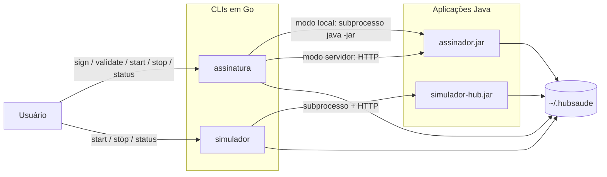

# 1. Identificação do documento

**Documento:** Especificação de Implementação e Integração de Software  
**Sistema:** Sistema Runner  
**Disciplina:** Implementação e Integração de Software  
**Curso:** Engenharia de Software  
**Contexto institucional:** Trabalho prático relacionado à Plataforma HubSaúde, iniciativa de interesse da Secretaria de Estado da Saúde de Goiás (SES-GO) e da Universidade Federal de Goiás (UFG).  
**Tipo de documento:** Especificação de Implementação e Integração de Software (EIIS)  
**Versão:** 1.0  
**Data:** 07/06/2026  
**Status:** Versão inicial consolidada a partir dos documentos de requisitos, arquitetura, projeto detalhado, modelo C4, critérios de qualidade e implementação funcional do Sistema Runner.  
**Autores:** Equipe do Sistema Runner  

---

# 2. Histórico de versões

| Versão | Data | Autor(es) | Descrição da alteração |
|---|---:|---|---|
| 1.0 | 07/06/2026 | Equipe do Sistema Runner | Criação da versão inicial da especificação de implementação e integração de software, descrevendo tecnologias, organização do código, módulos implementados, funcionalidades, modelo de dados, integrações, endpoints, configuração, instalação, execução, testes, segurança, controle de versão, evidências, limitações e melhorias futuras. |

---

# 3. Sumário

- [1. Identificação do documento](#1-identificação-do-documento)
- [2. Histórico de versões](#2-histórico-de-versões)
- [3. Sumário](#3-sumário)
- [4. Objetivo do documento](#4-objetivo-do-documento)
- [5. Visão geral do sistema](#5-visão-geral-do-sistema)
- [6. Escopo da implementação](#6-escopo-da-implementação)
- [7. Tecnologias utilizadas](#7-tecnologias-utilizadas)
- [8. Organização de pastas e arquivos](#8-organização-de-pastas-e-arquivos)
- [9. Arquitetura da implementação](#9-arquitetura-da-implementação)
- [10. Módulos implementados](#10-módulos-implementados)
- [11. Funcionalidades implementadas](#11-funcionalidades-implementadas)
- [12. Modelo de dados](#12-modelo-de-dados)
- [13. Integração entre as partes do sistema](#13-integração-entre-as-partes-do-sistema)
- [14. APIs e endpoints implementados](#14-apis-e-endpoints-implementados)
- [15. Integração com banco de dados](#15-integração-com-banco-de-dados)
- [16. Configuração do ambiente](#16-configuração-do-ambiente)
- [17. Variáveis de ambiente](#17-variáveis-de-ambiente)
- [18. Procedimento de instalação](#18-procedimento-de-instalação)
- [19. Procedimento de execução](#19-procedimento-de-execução)
- [20. Testes realizados](#20-testes-realizados)
- [21. Tratamento de erros](#21-tratamento-de-erros)
- [22. Segurança implementada](#22-segurança-implementada)
- [23. Controle de versão](#23-controle-de-versão)
- [24. Evidências da implementação e integração](#24-evidências-da-implementação-e-integração)
- [25. Limitações e melhorias futuras](#25-limitações-e-melhorias-futuras)
- [26. Referências](#26-referências)

---

# 4. Objetivo do documento

Este documento tem como objetivo especificar a implementação e a integração de software do **Sistema Runner**, descrevendo como os requisitos, a arquitetura, o modelo C4 e o projeto detalhado foram materializados em uma solução executável.

A especificação apresenta a organização do código-fonte, as tecnologias utilizadas, os módulos implementados, as funcionalidades entregues, os pontos de integração entre os componentes, os endpoints HTTP disponíveis, as configurações de ambiente, os procedimentos de instalação e execução, os testes realizados, os mecanismos de tratamento de erros, as práticas de segurança adotadas, o controle de versão e as limitações conhecidas.

Este documento deve servir como referência para:

- compreender o estado atual da implementação;
- orientar a execução local do sistema;
- apoiar a continuidade do desenvolvimento;
- demonstrar a integração entre os CLIs Go e as aplicações Java;
- registrar evidências de build, teste e smoke test;
- preservar a rastreabilidade entre requisitos, arquitetura, projeto detalhado, código e testes;
- apoiar a avaliação acadêmica da atividade de Implementação e Integração de Software.

---

# 5. Visão geral do sistema

O **Sistema Runner** é uma solução de linha de comando projetada para facilitar a execução de aplicações Java relacionadas à Plataforma HubSaúde. O sistema atua como uma camada de conveniência entre o usuário e componentes Java, evitando que o usuário precise executar manualmente comandos como `java -jar`, configurar classpath, localizar JARs, gerenciar processos em segundo plano, controlar portas HTTP ou interpretar respostas técnicas de baixo nível.

A implementação atual é composta por:

- **CLI `assinatura`**, desenvolvido em Go, responsável por criar e validar assinaturas digitais simuladas;
- **`assinador.jar`**, desenvolvido em Java 21, responsável por validar parâmetros e simular operações de assinatura e validação;
- **modo local**, no qual o CLI `assinatura` invoca o `assinador.jar` por subprocesso;
- **modo servidor**, no qual o `assinador.jar` permanece em execução como servidor HTTP e recebe requisições do CLI;
- **CLI `simulador`**, desenvolvido em Go, responsável por iniciar, parar e consultar o status do Simulador do HubSaúde;
- **`simulador-hub.jar`**, aplicação Java simples de apoio, usada para simular o comportamento básico do Simulador do HubSaúde;
- **diretório local gerenciado**, por padrão `~/.hubsaude/`, usado para logs, registros de processos, metadados e área prevista para artefatos e JDK/JRE provisionado;
- **scripts de build e smoke test**, que automatizam geração de JARs, compilação dos CLIs e validação dos fluxos principais;
- **workflows de CI/CD**, com build multiplataforma, testes automatizados, geração de checksums e assinatura de artefatos com Cosign no processo de release.

A implementação mantém coerência com o escopo definido nos documentos anteriores: o sistema **não realiza assinatura digital criptográfica real**. As operações de assinatura e validação são simuladas para fins de implementação e integração de software.

---

# 6. Escopo da implementação

## 6.1 Itens implementados

A implementação atual contempla:

| Item | Situação | Descrição |
|---|---|---|
| CLI `assinatura` | Implementado | Executável em Go com comandos `sign`, `validate`, `start`, `stop`, `status`, `version` e ajuda. |
| CLI `simulador` | Implementado | Executável em Go com comandos `start`, `stop`, `status`, `version` e ajuda. |
| `assinador.jar` | Implementado | Aplicação Java 21 com modo local, modo servidor HTTP, validação de parâmetros e simulação de assinatura/validação. |
| `simulador-hub.jar` | Implementado | Simulador Java de apoio com endpoints básicos de status, health check e shutdown. |
| Invocação local | Implementada | O CLI `assinatura` executa `java -jar assinador.jar` por subprocesso quando `--local` é usado. |
| Invocação HTTP | Implementada | O CLI `assinatura` envia requisições HTTP ao `assinador.jar` em modo servidor. |
| Gerenciamento de processo | Implementado | Registro de PID, porta e comando em `~/.hubsaude/run`. |
| Health check/readiness | Implementado | Verificação de disponibilidade por endpoints HTTP. |
| Logs operacionais | Implementado | Saídas dos processos Java são gravadas em `~/.hubsaude/logs`. |
| Scripts de build | Implementados | Scripts `build_java.sh`, `build_all.sh` e `smoke_test.sh`. |
| CI/CD | Implementado | Workflows `build.yml` e `release.yml`. |
| Checksums e assinatura de release | Implementados no workflow | `release.yml` gera checksums SHA256 e assina artefatos com Cosign. |
| Testes automatizados | Implementados parcialmente | Testes Go para comandos de versão e validação de porta. |

## 6.2 Itens parcialmente implementados ou preparados para evolução

| Item | Situação | Observação |
|---|---|---|
| Provisionamento automático de JDK/JRE | Parcial | A implementação detecta `JAVA_HOME` e `PATH`, mas ainda não baixa automaticamente JDK/JRE. |
| Download automático do `simulador.jar` | Parcial | A arquitetura e o diretório `artifacts/` estão previstos, mas a implementação atual exige JAR local ou caminho informado. |
| Integração PKCS#11 real | Parcial | Existe adaptador reservado, mas a implementação atual não executa fluxo criptográfico real. |
| Testes de contrato completos | Parcial | A estrutura permite expansão, mas ainda há poucos testes automatizados. |
| Testes multiplataforma reais | Preparado | Workflows foram configurados para Windows, Linux e macOS, mas a validação local foi realizada no ambiente disponível. |

## 6.3 Itens fora do escopo implementado

Não foram implementados, por não fazerem parte do escopo do trabalho:

- assinatura digital criptográfica real;
- validação criptográfica real de assinatura;
- integração com autoridade certificadora;
- autenticação de usuários;
- interface gráfica;
- banco de dados relacional;
- persistência de assinaturas como dado de negócio;
- implantação em nuvem como serviço de produção.

---

# 7. Tecnologias utilizadas

| Tecnologia | Versão ou referência | Uso na implementação |
|---|---|---|
| Go | Referência do projeto: Go 1.25; `go.mod` atual: Go 1.23 | Implementação dos CLIs `assinatura` e `simulador`. |
| Java | Java 21 | Implementação do `assinador.jar` e do `simulador-hub.jar`. |
| Biblioteca padrão Go | `flag`, `net/http`, `os/exec`, `context`, `encoding/json`, `os`, `filepath` | Parsing de comandos, HTTP, subprocessos, arquivos, contexto e serialização. |
| Biblioteca padrão Java | `com.sun.net.httpserver.HttpServer`, `MessageDigest`, `Instant` | Servidor HTTP local, simulação de assinatura, respostas e timestamps. |
| Bash | Shell script | Automação de build e smoke test. |
| GitHub Actions | Workflows YAML | CI/CD, build, testes, release e assinatura de artefatos. |
| Cosign/Sigstore | Workflow de release | Assinatura de artefatos publicados em release. |
| SHA256 | `sha256sum` | Verificação de integridade de artefatos. |
| GitHub Releases | Canal de distribuição | Publicação de binários, JARs, checksums e assinaturas. |
| Diretório local `~/.hubsaude/` | Sistema de arquivos | Logs, registros de processo, cache previsto, JDK/JRE previsto e artefatos previstos. |

Observação técnica: o plano e a arquitetura adotam **Go 1.25** como versão de referência. O arquivo `go.mod` da implementação atual declara `go 1.23`, enquanto os workflows de CI usam `go-version: '1.25'`. Recomenda-se alinhar o `go.mod` para Go 1.25 em uma próxima revisão, preservando a coerência plena entre código, documentação e CI.

---

# 8. Organização de pastas e arquivos

A implementação foi organizada em estrutura multi-módulo, separando pontos de entrada, pacotes internos, projetos Java, scripts, documentação e workflows.

```text
runner_implementation/
├── cmd/
│   ├── assinatura/
│   │   ├── main.go
│   │   └── version_test.go
│   └── simulador/
│       ├── main.go
│       └── version_test.go
├── internal/
│   ├── config/
│   │   └── defaults.go
│   ├── errors/
│   │   └── app_error.go
│   ├── invoker/
│   │   ├── http.go
│   │   ├── io.go
│   │   └── local.go
│   ├── jdk/
│   │   └── provider.go
│   ├── output/
│   │   └── formatter.go
│   ├── process/
│   │   ├── health.go
│   │   ├── health_test.go
│   │   └── registry.go
│   ├── signature/
│   │   └── handler.go
│   ├── simulator/
│   │   └── lifecycle.go
│   └── storage/
│       └── file_store.go
├── assinador/
│   ├── pom.xml
│   └── src/main/java/br/ufg/hubsaude/runner/assinador/
│       ├── AssinadorApplication.java
│       ├── cli/
│       │   └── CliEntryPoint.java
│       ├── domain/
│       │   ├── ErrorResponse.java
│       │   ├── SignRequest.java
│       │   ├── SignResponse.java
│       │   ├── ValidateRequest.java
│       │   └── ValidateResponse.java
│       ├── error/
│       │   └── ErrorResponseFactory.java
│       ├── http/
│       │   └── SignatureController.java
│       ├── pkcs11/
│       │   └── Pkcs11ProviderAdapter.java
│       ├── server/
│       │   └── ServerLifecycle.java
│       ├── service/
│       │   ├── FakeSignatureService.java
│       │   └── SignatureService.java
│       ├── util/
│       │   └── JsonUtil.java
│       └── validation/
│           ├── ParameterValidator.java
│           └── ValidationResult.java
├── simulador-hub/
│   ├── pom.xml
│   └── src/main/java/br/ufg/hubsaude/runner/simulador/
│       └── SimuladorApplication.java
├── scripts/
│   ├── build_all.sh
│   ├── build_java.sh
│   └── smoke_test.sh
├── docs/
│   └── adr/
│       ├── 0001-linguagens-e-execucao.md
│       └── 0002-cache-local.md
├── .github/
│   └── workflows/
│       ├── build.yml
│       └── release.yml
├── dist/
│   ├── assinatura
│   └── simulador
├── go.mod
├── .gitignore
├── .gitattributes
├── LICENSE
└── README.md
```

## 8.1 Responsabilidades principais dos diretórios

| Diretório | Responsabilidade |
|---|---|
| `cmd/assinatura` | Ponto de entrada do CLI `assinatura`. |
| `cmd/simulador` | Ponto de entrada do CLI `simulador`. |
| `internal/config` | Portas padrão, caminhos, diretório `~/.hubsaude/` e variáveis de ambiente. |
| `internal/errors` | Erros estruturados e códigos de saída. |
| `internal/invoker` | Invocação local por subprocesso e cliente HTTP. |
| `internal/jdk` | Detecção de Java em `JAVA_HOME` ou `PATH`. |
| `internal/output` | Formatação de resultados, status e erros. |
| `internal/process` | Health check, readiness, porta e registro de processos. |
| `internal/signature` | Orquestração das operações do CLI `assinatura`. |
| `internal/simulator` | Orquestração do ciclo de vida do Simulador do HubSaúde. |
| `internal/storage` | Escrita e leitura de arquivos JSON em disco. |
| `assinador` | Projeto Java do `assinador.jar`. |
| `simulador-hub` | Simulador Java de apoio. |
| `scripts` | Scripts de build e validação manual. |
| `.github/workflows` | Automação de CI/CD. |
| `docs/adr` | Registros de decisão técnica. |

---

# 9. Arquitetura da implementação

A implementação segue uma arquitetura modular local, com separação entre interface de linha de comando, orquestração de casos de uso, integração com processos, integração HTTP, validação de parâmetros, simulação de negócio e persistência operacional em sistema de arquivos.

## 9.1 Visão lógica



## 9.2 Princípios de implementação adotados

A implementação busca atender aos seguintes princípios:

- **Separação de responsabilidades:** cada pacote interno tem função específica;
- **Baixo acoplamento:** CLIs não implementam a lógica de assinatura, apenas orquestram chamadas;
- **Contrato explícito entre CLI e JAR:** comunicação por argumentos, JSON, HTTP e códigos de saída;
- **Falha controlada:** erros de usuário, sistema e integração são classificados;
- **Reprodutibilidade:** scripts e workflows automatizam build e testes;
- **Portabilidade:** CLIs em Go e aplicações Java empacotadas em JAR;
- **Rastreabilidade:** estrutura do projeto reflete requisitos, arquitetura, C4 e projeto detalhado;
- **Segurança básica:** uso de localhost, separação de stdout/stderr, checksums e assinatura de release no CI.

## 9.3 Padrões aplicados

| Padrão ou prática | Aplicação no sistema |
|---|---|
| CLI Controller | `cmd/assinatura/main.go` e `cmd/simulador/main.go` fazem roteamento de comandos. |
| Service/Handler | `signature.Handler` e `simulator.LifecycleManager` orquestram casos de uso. |
| Adapter | `LocalJarInvoker`, `HTTPSignerClient` e `Pkcs11ProviderAdapter` adaptam integrações externas. |
| Repository/File Store | `ProcessRegistry` e `FileStore` abstraem persistência operacional. |
| DTO | `SignRequest`, `SignResponse`, `ValidateRequest`, `ValidateResponse` transportam dados. |
| Error Mapper | `AppError` classifica erros e associa códigos de saída. |
| Health Check | `process.Health` e endpoints `/health`, `/ready`, `/api/info`. |
| CI/CD Pipeline | Workflows de build e release automatizam validação e distribuição. |

---

# 10. Módulos implementados

## 10.1 Módulos Go

| Módulo | Arquivo(s) | Responsabilidade | Status |
|---|---|---|---|
| CLI `assinatura` | `cmd/assinatura/main.go` | Parsing de comandos, flags e execução de operações de assinatura. | Implementado |
| CLI `simulador` | `cmd/simulador/main.go` | Parsing de comandos e execução de operações do simulador. | Implementado |
| Configuração | `internal/config/defaults.go` | Define portas, paths e variáveis de ambiente. | Implementado |
| Erros | `internal/errors/app_error.go` | Define `AppError`, tipos de erro e códigos de saída. | Implementado |
| Invocação local | `internal/invoker/local.go` | Executa `java -jar` por subprocesso e captura saída. | Implementado |
| Cliente HTTP | `internal/invoker/http.go` | Envia requisições GET/POST para processos locais. | Implementado |
| Java/JDK | `internal/jdk/provider.go` | Localiza `java` por `JAVA_HOME` ou `PATH`. | Parcial |
| Processo | `internal/process/health.go`, `registry.go` | Verifica portas, health check, readiness e registro de PID. | Implementado |
| Assinatura | `internal/signature/handler.go` | Orquestra `sign`, `validate`, `start`, `stop`, `status`. | Implementado |
| Simulador | `internal/simulator/lifecycle.go` | Orquestra `start`, `stop`, `status` do simulador. | Implementado |
| Storage | `internal/storage/file_store.go` | Lê/grava JSON de metadados operacionais. | Implementado |
| Output | `internal/output/formatter.go` | Exibe respostas, status e erros. | Implementado |

## 10.2 Módulos Java do `assinador.jar`

| Módulo | Arquivo(s) | Responsabilidade | Status |
|---|---|---|---|
| Aplicação | `AssinadorApplication.java` | Ponto de entrada do JAR. | Implementado |
| CLI local | `CliEntryPoint.java` | Comandos `sign`, `validate` e `server` no JAR. | Implementado |
| HTTP | `SignatureController.java` | Endpoints `/health`, `/ready`, `/sign`, `/validate`, `/shutdown`. | Implementado |
| Serviço | `SignatureService.java`, `FakeSignatureService.java` | Simulação de assinatura e validação. | Implementado |
| Domínio | `SignRequest`, `SignResponse`, `ValidateRequest`, `ValidateResponse`, `ErrorResponse` | DTOs de entrada, saída e erro. | Implementado |
| Validação | `ParameterValidator.java`, `ValidationResult.java` | Validação de parâmetros obrigatórios. | Implementado |
| Servidor | `ServerLifecycle.java` | Ciclo de vida HTTP, readiness, shutdown e timer de inatividade. | Implementado |
| Erros | `ErrorResponseFactory.java` | Respostas JSON de validação e erro sistêmico. | Implementado |
| JSON | `JsonUtil.java` | Serialização simples e parsing de campos. | Implementado |
| PKCS#11 | `Pkcs11ProviderAdapter.java` | Adaptador reservado para integração criptográfica. | Parcial |

## 10.3 Módulo Java do Simulador do HubSaúde

| Módulo | Arquivo(s) | Responsabilidade | Status |
|---|---|---|---|
| Simulador de apoio | `SimuladorApplication.java` | Servidor HTTP local com `/api/info`, `/health` e `/shutdown`. | Implementado |

## 10.4 Módulos de automação

| Módulo | Arquivo(s) | Responsabilidade | Status |
|---|---|---|---|
| Build Java | `scripts/build_java.sh` | Compila `assinador.jar` e `simulador-hub.jar`. | Implementado |
| Build geral | `scripts/build_all.sh` | Compila Java, executa testes Go e gera binários. | Implementado |
| Smoke test | `scripts/smoke_test.sh` | Valida fluxos principais ponta a ponta. | Implementado |
| Build CI | `.github/workflows/build.yml` | Testes e cross-compilation por plataforma. | Implementado |
| Release CI | `.github/workflows/release.yml` | Build de release, checksums, Cosign e publicação. | Implementado |

---

# 11. Funcionalidades implementadas

## 11.1 CLI `assinatura`

| Funcionalidade | Comando | Descrição | Status |
|---|---|---|---|
| Exibir ajuda | `assinatura --help` | Mostra comandos, opções e exemplos. | Implementado |
| Exibir versão | `assinatura version` | Mostra versão atual; valor padrão local é `dev`. | Implementado |
| Criar assinatura local | `assinatura sign --local --document <arquivo>` | Invoca `assinador.jar` por subprocesso. | Implementado |
| Validar assinatura local | `assinatura validate --local --signature <valor>` | Invoca `assinador.jar` por subprocesso. | Implementado |
| Iniciar servidor | `assinatura start --port <porta>` | Inicia `assinador.jar` em modo HTTP. | Implementado |
| Criar assinatura via HTTP | `assinatura sign --port <porta> --document <arquivo>` | Garante servidor ativo e chama `/sign`. | Implementado |
| Validar assinatura via HTTP | `assinatura validate --port <porta> --signature <valor>` | Garante servidor ativo e chama `/validate`. | Implementado |
| Consultar status | `assinatura status --port <porta>` | Consulta `/health` e `/ready`. | Implementado |
| Parar servidor | `assinatura stop --port <porta>` | Chama `/shutdown`. | Implementado |
| Configurar timeout | `assinatura start --timeout <minutos>` | Envia timeout de inatividade ao servidor. | Implementado |

## 11.2 `assinador.jar`

| Funcionalidade | Descrição | Status |
|---|---|---|
| Modo CLI local | Aceita `sign`, `validate` e `server` por argumentos. | Implementado |
| Modo servidor HTTP | Expõe endpoints locais. | Implementado |
| Validação de criação de assinatura | Exige `documentPath`/`--document` e limita tamanho de `profile`. | Implementado |
| Validação de validação de assinatura | Exige `signatureValue` ou `signaturePath`. | Implementado |
| Geração de assinatura simulada | Gera identificador e valor de assinatura com prefixo simulado. | Implementado |
| Validação simulada | Considera válidas assinaturas com prefixos simulados reconhecidos. | Implementado |
| Respostas JSON | Retorna JSON de sucesso e erro. | Implementado |
| Auto-shutdown por inatividade | Reinicia timer em requisições e encerra após timeout. | Implementado |
| PKCS#11 | Estrutura reservada para expansão. | Parcial |

## 11.3 CLI `simulador`

| Funcionalidade | Comando | Descrição | Status |
|---|---|---|---|
| Exibir ajuda | `simulador --help` | Mostra comandos e exemplos. | Implementado |
| Exibir versão | `simulador version` | Mostra versão atual; valor padrão local é `dev`. | Implementado |
| Iniciar simulador | `simulador start --port <porta>` | Inicia `simulador-hub.jar`. | Implementado |
| Consultar status | `simulador status --port <porta>` | Consulta `/api/info`. | Implementado |
| Parar simulador | `simulador stop --port <porta>` | Chama `/shutdown`. | Implementado |
| Registrar processo | Automático | Grava PID, porta e comando em `~/.hubsaude/run`. | Implementado |
| Gravar logs | Automático | Grava saída em `~/.hubsaude/logs`. | Implementado |

## 11.4 Simulador Java de apoio

| Funcionalidade | Endpoint | Descrição | Status |
|---|---|---|---|
| Informações/status | `/api/info` | Retorna nome, status, versão e timestamp. | Implementado |
| Health check | `/health` | Retorna `UP`. | Implementado |
| Shutdown | `/shutdown` | Encerra o servidor local. | Implementado |

---

# 12. Modelo de dados

A implementação não utiliza banco de dados relacional. O modelo de dados é composto por DTOs de domínio, respostas HTTP/CLI e metadados operacionais armazenados em arquivos JSON.

## 12.1 Dados de domínio

### 12.1.1 `SignRequest`

| Campo | Tipo | Origem | Obrigatório | Descrição |
|---|---|---|---|---|
| `documentPath` | String | CLI/HTTP | Sim | Caminho ou identificador do documento a ser assinado de forma simulada. |
| `profile` | String | CLI/HTTP | Não | Perfil de assinatura; padrão `padrao`. |

### 12.1.2 `SignResponse`

| Campo | Tipo | Descrição |
|---|---|---|
| `signatureId` | String | Identificador da assinatura simulada. |
| `status` | String | Status da operação, por exemplo `sucesso`. |
| `signatureValue` | String | Valor textual da assinatura simulada. |
| `algorithm` | String | Algoritmo simulado, como `SIMULATED-SHA256-RSA`. |
| `createdAt` | Instant/String | Data e hora de criação. |
| `message` | String | Mensagem informativa ao usuário. |

### 12.1.3 `ValidateRequest`

| Campo | Tipo | Origem | Obrigatório | Descrição |
|---|---|---|---|---|
| `signatureValue` | String | CLI/HTTP | Condicional | Valor da assinatura simulada. |
| `signaturePath` | String | CLI/HTTP | Condicional | Caminho de arquivo de assinatura. |
| `documentPath` | String | CLI/HTTP | Não | Caminho do documento associado. |

Pelo menos um dos campos `signatureValue` ou `signaturePath` deve ser informado.

### 12.1.4 `ValidateResponse`

| Campo | Tipo | Descrição |
|---|---|---|
| `valid` | Boolean | Indica se a assinatura simulada foi reconhecida. |
| `status` | String | `valida` ou `invalida`. |
| `reason` | String | Justificativa simulada. |
| `validatedAt` | Instant/String | Data e hora da validação. |
| `message` | String | Mensagem informativa ao usuário. |

## 12.2 Dados de erro

### 12.2.1 `ErrorResponse`

| Campo | Tipo | Descrição |
|---|---|---|
| `errorCode` | String | Código de erro. |
| `message` | String | Mensagem principal. |
| `details` | String | Detalhes técnicos ou de validação. |
| `suggestion` | String | Orientação para correção. |
| `timestamp` | Instant/String | Data e hora do erro. |

### 12.2.2 `AppError`

| Campo | Tipo | Descrição |
|---|---|---|
| `Kind` | Enum/String | `USER_ERROR`, `SYSTEM_ERROR` ou `INTEGRATION_ERROR`. |
| `Code` | String | Código interno do erro. |
| `Message` | String | Mensagem legível. |
| `Suggestion` | String | Como resolver. |
| `Cause` | Error | Erro técnico associado, quando houver. |
| `ExitCode` | Int | Código de saída do processo. |

## 12.3 Dados operacionais

### 12.3.1 `ProcessInfo`

| Campo | Tipo | Descrição |
|---|---|---|
| `name` | String | Nome do processo gerenciado, como `assinador` ou `simulador`. |
| `pid` | Int | Identificador do processo no sistema operacional. |
| `port` | Int | Porta HTTP associada. |
| `command` | Lista de strings | Comando usado para iniciar o processo. |
| `startedAt` | Timestamp | Data e hora de início. |

Esses dados são gravados em `~/.hubsaude/run/<nome>-<porta>.json`.

## 12.4 Dados não persistidos

A implementação não persiste:

- assinaturas simuladas como histórico;
- documentos submetidos;
- resultados de validação como dado de negócio;
- credenciais;
- certificados;
- dados de usuários.

---

# 13. Integração entre as partes do sistema

## 13.1 Integração Usuário → CLI

O usuário interage com o sistema por comandos de terminal. Os comandos são processados pelos arquivos `cmd/assinatura/main.go` e `cmd/simulador/main.go`, que interpretam argumentos, validam flags básicas e acionam handlers internos.

Exemplos:

```bash
./dist/assinatura sign --local --document documento.xml
./dist/assinatura sign --port 8080 --document documento.xml
./dist/simulador start --port 8443
```

## 13.2 Integração CLI `assinatura` → `assinador.jar` em modo local

No modo local, o CLI `assinatura` executa o `assinador.jar` por subprocesso.

Fluxo:

```text
Usuário → assinatura CLI → LocalJarInvoker → java -jar assinador.jar → stdout/stderr/exit code → assinatura CLI → Usuário
```

Características:

- ativado com a flag `--local`;
- usa `java` localizado por `JAVA_HOME` ou `PATH`;
- preserva argumentos como lista, sem montar comando por concatenação em shell;
- captura `stdout`, `stderr` e código de saída;
- converte falhas em erro estruturado.

## 13.3 Integração CLI `assinatura` → `assinador.jar` em modo servidor

No modo servidor, o CLI garante que o `assinador.jar` esteja ativo e faz chamadas HTTP locais.

Fluxo:

```text
Usuário → assinatura CLI → EnsureServer → health/ready → HTTP /sign ou /validate → assinador.jar → resposta JSON → Usuário
```

Características:

- modo padrão quando `--local` não é informado;
- usa porta padrão `8080`, salvo configuração por `--port`;
- inicia servidor quando não há instância saudável;
- verifica `/health` e `/ready`;
- chama `/sign` e `/validate` por `POST`;
- chama `/shutdown` para encerramento.

## 13.4 Integração CLI `simulador` → `simulador-hub.jar`

O CLI `simulador` inicia o simulador Java e controla seu ciclo de vida por HTTP.

Fluxo:

```text
Usuário → simulador CLI → processo java -jar simulador-hub.jar → /api/info ou /shutdown → simulador CLI → Usuário
```

Características:

- usa porta padrão `8443`, salvo configuração por `--port`;
- verifica porta antes de iniciar;
- grava PID e porta em `~/.hubsaude/run`;
- grava logs em `~/.hubsaude/logs`;
- consulta `/api/info` para status;
- chama `/shutdown` para encerramento.

## 13.5 Integração com sistema de arquivos

A implementação usa o sistema de arquivos para persistência operacional. O diretório padrão é `~/.hubsaude/`, podendo ser alterado pela variável `HUBSAUDE_HOME`.

Estrutura esperada:

```text
~/.hubsaude/
├── run/
│   ├── assinador-8080.json
│   └── simulador-8443.json
├── logs/
│   ├── assinador-8080.log
│   └── simulador-8443.log
├── artifacts/
└── jdk/
```

## 13.6 Integração com CI/CD

A integração com GitHub Actions ocorre em dois workflows:

- `build.yml`: executa `go vet`, `go test`, build Java e cross-compilation dos CLIs;
- `release.yml`: executa testes, gera binários por plataforma, copia JARs, gera `checksums.txt`, assina artefatos com Cosign e publica no GitHub Releases.

---

# 14. APIs e endpoints implementados

## 14.1 Endpoints do `assinador.jar`

| Método | Endpoint | Implementado em | Descrição | Resposta esperada |
|---|---|---|---|---|
| `GET` | `/health` | `SignatureController` | Verifica se o servidor está ativo. | `{"status":"UP"}` |
| `GET` | `/ready` | `SignatureController` | Verifica se o servidor está pronto. | `{"status":"READY"}` |
| `POST` | `/sign` | `SignatureController` | Cria assinatura simulada. | JSON de `SignResponse`. |
| `POST` | `/validate` | `SignatureController` | Valida assinatura simulada. | JSON de `ValidateResponse`. |
| `GET` | `/shutdown` | `SignatureController` | Solicita encerramento controlado. | `{"status":"SHUTTING_DOWN"}` |

### 14.1.1 Exemplo de payload para `/sign`

```json
{
  "documentPath": "documento.xml",
  "profile": "padrao"
}
```

### 14.1.2 Exemplo de resposta de `/sign`

```json
{
  "signatureId": "assinatura-simulada-01759ce856ca188c",
  "status": "sucesso",
  "signatureValue": "SIMULATED-SIGNATURE-01759ce856ca188c",
  "algorithm": "SIMULATED-SHA256-RSA",
  "message": "Assinatura simulada criada com sucesso. Nenhuma criptografia real foi executada."
}
```

### 14.1.3 Exemplo de payload para `/validate`

```json
{
  "signatureValue": "SIMULATED-SIGNATURE-teste"
}
```

### 14.1.4 Exemplo de resposta de `/validate`

```json
{
  "valid": true,
  "status": "valida",
  "reason": "assinatura simulada reconhecida",
  "message": "Validacao simulada concluida. Nenhuma validacao criptografica real foi executada."
}
```

## 14.2 Endpoints do `simulador-hub.jar`

| Método | Endpoint | Implementado em | Descrição | Resposta esperada |
|---|---|---|---|---|
| `GET` | `/api/info` | `SimuladorApplication` | Retorna status e informações básicas do simulador. | JSON com nome, status, versão e timestamp. |
| `GET` | `/health` | `SimuladorApplication` | Verifica se o simulador está ativo. | `{"status":"UP"}` |
| `GET` | `/shutdown` | `SimuladorApplication` | Solicita encerramento controlado. | `{"status":"SHUTTING_DOWN"}` |

### 14.2.1 Exemplo de resposta de `/api/info`

```json
{
  "name": "Simulador do HubSaude",
  "status": "READY",
  "version": "1.0.0",
  "timestamp": "2026-06-07T18:08:00Z"
}
```

---

# 15. Integração com banco de dados

A implementação atual **não possui integração com banco de dados**.

Essa decisão está alinhada ao escopo do sistema, pois o Runner não precisa armazenar assinaturas, usuários, certificados ou histórico de operações como dados de negócio. A persistência existente é apenas operacional e ocorre em arquivos locais.

## 15.1 Persistência operacional utilizada

| Tipo de dado | Local | Finalidade |
|---|---|---|
| PID e porta | `~/.hubsaude/run/*.json` | Permitir status e controle de processos. |
| Logs | `~/.hubsaude/logs/*.log` | Diagnóstico de processos Java. |
| Artefatos | `~/.hubsaude/artifacts/` | Área prevista para JARs baixados futuramente. |
| JDK/JRE | `~/.hubsaude/jdk/` | Área prevista para provisionamento automático futuro. |

## 15.2 Justificativa para ausência de banco de dados

A ausência de banco de dados é adequada porque:

- o sistema é uma ferramenta local de linha de comando;
- as assinaturas são simuladas;
- não há cadastro de usuário;
- não há autenticação;
- não há requisitos de histórico persistente;
- os dados necessários ao funcionamento são metadados operacionais simples.

---

# 16. Configuração do ambiente

## 16.1 Pré-requisitos para desenvolvimento local

Para compilar e executar o projeto localmente, recomenda-se instalar:

| Ferramenta | Versão recomendada | Finalidade |
|---|---|---|
| Go | 1.25 | Compilar e testar os CLIs. |
| Java JDK | 21 | Compilar e executar os JARs. |
| Bash | Compatível | Executar scripts de build e smoke test. |
| Git | Atual | Versionamento do projeto. |

Verificações:

```bash
go version
java -version
javac -version
jar --version
git --version
```

## 16.2 Sistema operacional

A arquitetura e o CI/CD têm como alvo:

- Linux `amd64`;
- Windows `amd64`;
- macOS `amd64`.

A validação local do documento foi realizada em ambiente Linux.

## 16.3 Diretório local gerenciado

Por padrão, o sistema utiliza:

```bash
~/.hubsaude
```

Esse diretório pode ser alterado com:

```bash
export HUBSAUDE_HOME=/tmp/hubsaude-runner-test
```

Essa opção é útil para testes, porque evita misturar arquivos temporários de validação com dados reais do usuário.

---

# 17. Variáveis de ambiente

| Variável | Obrigatória | Valor padrão | Finalidade |
|---|---|---|---|
| `HUBSAUDE_HOME` | Não | `~/.hubsaude` | Altera diretório local gerenciado. |
| `ASSINADOR_JAR` | Não | `assinador/target/assinador.jar` | Define caminho alternativo para o `assinador.jar`. |
| `SIMULADOR_JAR` | Não | `simulador-hub/target/simulador-hub.jar` | Define caminho alternativo para o JAR do simulador. |
| `JAVA_HOME` | Não, se `java` estiver no `PATH` | Não definido | Define caminho do Java. |
| `PKCS11_CONFIG` | Não | Não definido | Reservada para configuração PKCS#11 futura. |

Exemplo de uso:

```bash
export HUBSAUDE_HOME=/tmp/hubsaude-runner-test
export ASSINADOR_JAR=/caminho/para/assinador.jar
export SIMULADOR_JAR=/caminho/para/simulador-hub.jar
```

---

# 18. Procedimento de instalação

## 18.1 Obter o projeto

Considerando que o projeto foi entregue compactado, o primeiro passo é descompactar o arquivo:

```bash
unzip sistema_runner_implementacao.zip
cd runner_implementation
```

Caso esteja em um repositório Git:

```bash
git clone <url-do-repositorio>
cd runner_implementation
```

## 18.2 Verificar pré-requisitos

```bash
go version
java -version
javac -version
jar --version
```

## 18.3 Compilar o projeto completo

```bash
./scripts/build_all.sh
```

Esse script executa:

1. compilação do `assinador.jar`;
2. compilação do `simulador-hub.jar`;
3. testes Go;
4. geração dos binários `dist/assinatura` e `dist/simulador`.

## 18.4 Compilar apenas os JARs Java

```bash
./scripts/build_java.sh
```

## 18.5 Compilar manualmente os CLIs Go

```bash
mkdir -p dist
go build -o dist/assinatura ./cmd/assinatura
go build -o dist/simulador ./cmd/simulador
```

No Windows, a extensão recomendada é `.exe`:

```bash
go build -o dist/assinatura.exe ./cmd/assinatura
go build -o dist/simulador.exe ./cmd/simulador
```

---

# 19. Procedimento de execução

## 19.1 Executar ajuda dos CLIs

```bash
./dist/assinatura --help
./dist/simulador --help
```

## 19.2 Verificar versão

```bash
./dist/assinatura version
./dist/simulador version
```

Em execução local, a versão padrão é `dev`. Em release, o workflow injeta a versão com `-ldflags`.

## 19.3 Criar assinatura simulada em modo local

```bash
./dist/assinatura sign --local --document documento.xml
```

## 19.4 Validar assinatura simulada em modo local

```bash
./dist/assinatura validate --local --signature SIMULATED-SIGNATURE-teste
```

## 19.5 Iniciar o `assinador.jar` em modo servidor

```bash
./dist/assinatura start --port 8080 --timeout 30
```

## 19.6 Criar assinatura simulada via HTTP

```bash
./dist/assinatura sign --port 8080 --document documento.xml
```

## 19.7 Consultar status do `assinador.jar`

```bash
./dist/assinatura status --port 8080
```

## 19.8 Parar o `assinador.jar`

```bash
./dist/assinatura stop --port 8080
```

## 19.9 Iniciar o Simulador do HubSaúde

```bash
./dist/simulador start --port 8443
```

## 19.10 Consultar status do Simulador

```bash
./dist/simulador status --port 8443
```

## 19.11 Parar o Simulador

```bash
./dist/simulador stop --port 8443
```

## 19.12 Executar smoke test completo

```bash
HUBSAUDE_HOME=/tmp/hubsaude-runner-test ./scripts/smoke_test.sh
```

---

# 20. Testes realizados

## 20.1 Testes automatizados Go

Comando executado:

```bash
go test ./...
```

Resultado observado:

```text
ok   github.com/kyriosdata/runner/cmd/assinatura
ok   github.com/kyriosdata/runner/cmd/simulador
ok   github.com/kyriosdata/runner/internal/process
```

Pacotes sem arquivos de teste foram identificados como `[no test files]`, o que é esperado para pacotes ainda não cobertos por testes unitários específicos.

## 20.2 Build dos JARs Java

Comando executado:

```bash
./scripts/build_java.sh
```

Resultado observado:

```text
JARs gerados:
- assinador/target/assinador.jar
- simulador-hub/target/simulador-hub.jar
```

## 20.3 Smoke test de integração

Comando executado:

```bash
HUBSAUDE_HOME=/tmp/hubsaude-doc-test2 ./scripts/smoke_test.sh
```

Resultado observado:

```text
[1/5] assinatura version
[2/5] assinatura sign --local
[3/5] assinatura validate --local
[4/5] simulador start/status/stop
[5/5] assinatura server start/sign/stop
Smoke test concluído com sucesso.
```

O smoke test validou:

- comando `assinatura version`;
- assinatura simulada em modo local;
- validação simulada em modo local;
- inicialização, consulta e parada do Simulador do HubSaúde;
- inicialização do `assinador.jar` em modo servidor;
- assinatura simulada via HTTP;
- encerramento do `assinador.jar`.

## 20.4 Testes implementados no código

| Teste | Arquivo | Objetivo |
|---|---|---|
| Versão do CLI `assinatura` | `cmd/assinatura/version_test.go` | Verificar se o comando `version` funciona. |
| Versão do CLI `simulador` | `cmd/simulador/version_test.go` | Verificar se o comando `version` funciona. |
| Porta inválida | `internal/process/health_test.go` | Verificar comportamento da checagem de porta inválida. |

## 20.5 Testes ainda recomendados

| Tipo de teste | Recomendação |
|---|---|
| Testes unitários de validação Java | Cobrir todos os cenários de `ParameterValidator`. |
| Testes de contrato CLI ↔ JAR | Validar JSON, códigos HTTP, stdout, stderr e exit code. |
| Testes de cenários negativos | JAR ausente, Java ausente, porta ocupada, timeout e payload malformado. |
| Testes de PKCS#11 | Usar SoftHSM2 ou simulador equivalente. |
| Testes multiplataforma locais | Validar manualmente em Windows e macOS, além do CI. |
| Testes de release | Verificar checksums, `.sig`, `.pem` e download dos artefatos. |

---

# 21. Tratamento de erros

## 21.1 Estratégia geral

A implementação classifica erros em três categorias principais:

| Categoria | Tipo | Código de saída | Exemplo |
|---|---|---:|---|
| Erro do usuário | `USER_ERROR` | `2` | Comando desconhecido, parâmetro obrigatório ausente, porta inválida. |
| Erro do sistema | `SYSTEM_ERROR` | `3` | Falha ao criar diretório, Java não encontrado, falha ao abrir log. |
| Erro de integração | `INTEGRATION_ERROR` | `4` | Porta ocupada, servidor não pronto, falha HTTP, shutdown indisponível. |

## 21.2 Exemplos de erros tratados

| Situação | Código | Mensagem/sugestão |
|---|---|---|
| Comando desconhecido | `UNKNOWN_COMMAND` | Orienta usar `--help`. |
| Documento ausente | `MISSING_DOCUMENT` | Orienta informar `--document <arquivo>`. |
| Assinatura ausente | `MISSING_SIGNATURE` | Orienta informar `--signature` ou `--signature-file`. |
| Porta inválida | `INVALID_PORT` | Orienta informar porta entre 1 e 65535. |
| JAR ausente | `JAR_NOT_FOUND` ou `SIMULATOR_JAR_NOT_FOUND` | Orienta executar `scripts/build_java.sh` ou informar caminho do JAR. |
| Java ausente | `JDK_NOT_FOUND` | Orienta instalar Java 21 ou configurar `JAVA_HOME`. |
| Porta ocupada | `PORT_BUSY` | Orienta encerrar processo ou usar outra porta. |
| Servidor não pronto | `SERVER_NOT_READY` | Orienta consultar logs. |
| Falha de shutdown | `SHUTDOWN_FAILED` ou `SIMULATOR_SHUTDOWN_FAILED` | Orienta verificar porta ou remover processo manualmente. |

## 21.3 Separação entre resultado e diagnóstico

A implementação busca separar:

- **resultado normal:** enviado a `stdout`;
- **erros e diagnósticos:** enviados a `stderr`.

Essa prática permite que o sistema seja usado em scripts e pipelines com maior previsibilidade.

## 21.4 Tratamento de erros no `assinador.jar`

No Java, erros de validação geram resposta JSON de erro e código HTTP `400`. Erros sistêmicos geram resposta JSON com código HTTP `500`. Métodos HTTP não permitidos retornam `405`.

---

# 22. Segurança implementada

## 22.1 Segurança da execução local

A execução de subprocessos foi implementada por meio de APIs próprias de processo, usando lista de argumentos. Essa abordagem evita montagem insegura de comandos por concatenação de strings em shell e preserva argumentos com espaços, acentos e aspas.

## 22.2 Uso de localhost

Os servidores HTTP são iniciados em `127.0.0.1`, restringindo o acesso ao ambiente local da máquina. Isso é adequado para a natureza do Sistema Runner, que é uma ferramenta local de apoio à execução de aplicações Java.

## 22.3 Segurança dos artefatos de release

O workflow `release.yml` implementa:

- geração de binários por plataforma;
- geração de `checksums.txt` com SHA256;
- instalação do Cosign;
- assinatura de artefatos com `cosign sign-blob`;
- geração de arquivos `.sig` e `.pem`;
- publicação dos artefatos no GitHub Releases.

## 22.4 Segredos e credenciais

A implementação não armazena:

- senhas;
- tokens;
- chaves privadas;
- credenciais de usuário;
- certificados reais;
- dados sensíveis de usuários.

## 22.5 PKCS#11

A implementação contém um adaptador `Pkcs11ProviderAdapter` reservado para integração futura com dispositivo criptográfico ou simulador como SoftHSM2. O fluxo atual não executa assinatura criptográfica real.

## 22.6 Limitações de segurança

| Limitação | Impacto | Melhoria recomendada |
|---|---|---|
| Download automático de JDK/JRE ainda não implementado | Usuário precisa ter Java instalado ou configurar `JAVA_HOME`. | Implementar download com checksum e fonte confiável. |
| Verificação de checksum de JAR local ainda não é obrigatória | Artefatos locais podem ser substituídos sem validação. | Adicionar manifesto de versões e checksums. |
| PKCS#11 não executa fluxo real | Integração criptográfica ainda não comprovada. | Adicionar testes com SoftHSM2. |

---

# 23. Controle de versão

## 23.1 Git e organização de branches

A implementação foi estruturada para uso com Git e GitHub. A branch principal prevista é `main`, conforme as decisões técnicas do projeto.

Boas práticas recomendadas:

- commits atômicos;
- mensagens no imperativo;
- uso de Conventional Commits quando possível;
- issues vinculadas a histórias de usuário;
- pull requests pequenos e revisáveis;
- revisão antes de merge;
- CI obrigatório antes de integrar alterações.

## 23.2 Versionamento semântico

O projeto deve utilizar SemVer no formato:

```text
vMAJOR.MINOR.PATCH
```

Exemplo:

```text
v0.1.0
v1.0.0
```

O workflow de release é disparado por tags no padrão `v*`.

## 23.3 Injeção de versão nos binários

Os CLIs possuem variável:

```go
var version = "dev"
```

No build de release, o valor é sobrescrito por `-ldflags`, por exemplo:

```bash
go build -ldflags "-X main.version=v0.1.0" -o dist/assinatura-v0.1.0-linux-amd64 ./cmd/assinatura
```

## 23.4 Artefatos de release

O workflow de release gera artefatos como:

```text
assinatura-v0.1.0-linux-amd64
assinatura-v0.1.0-windows-amd64.exe
assinatura-v0.1.0-darwin-amd64
simulador-v0.1.0-linux-amd64
simulador-v0.1.0-windows-amd64.exe
simulador-v0.1.0-darwin-amd64
assinador.jar
simulador-hub.jar
checksums.txt
<artefato>.sig
<artefato>.pem
```

## 23.5 Higiene do repositório

A implementação inclui:

- `.gitignore` para evitar versionamento de artefatos gerados;
- `.gitattributes` para padronização de arquivos;
- `LICENSE`;
- `README.md`;
- ADRs em `docs/adr`.

Observação: o pacote entregue contém diretórios `target/` e `dist/` já gerados para facilitar a avaliação local. Em um repositório Git definitivo, esses artefatos devem ser ignorados ou publicados apenas via release, não versionados como código-fonte.

---

# 24. Evidências da implementação e integração

## 24.1 Evidência de estrutura implementada

Foram implementados os seguintes artefatos principais:

```text
cmd/assinatura/main.go
cmd/simulador/main.go
internal/signature/handler.go
internal/simulator/lifecycle.go
assinador/target/assinador.jar
simulador-hub/target/simulador-hub.jar
dist/assinatura
dist/simulador
scripts/build_all.sh
scripts/smoke_test.sh
.github/workflows/build.yml
.github/workflows/release.yml
```

## 24.2 Evidência de testes Go

Comando:

```bash
go test ./...
```

Resultado resumido:

```text
ok github.com/kyriosdata/runner/cmd/assinatura
ok github.com/kyriosdata/runner/cmd/simulador
ok github.com/kyriosdata/runner/internal/process
```

## 24.3 Evidência de build Java

Comando:

```bash
./scripts/build_java.sh
```

Resultado:

```text
JARs gerados:
- assinador/target/assinador.jar
- simulador-hub/target/simulador-hub.jar
```

## 24.4 Evidência de build dos binários

Comando:

```bash
./scripts/build_all.sh
```

Resultado esperado:

```text
Binários gerados em dist/:
- assinatura
- simulador
```

## 24.5 Evidência de assinatura local

Comando:

```bash
./dist/assinatura sign --local --document "documento ação.xml"
```

Resultado observado:

```text
Status: sucesso
Identificador da assinatura: assinatura-simulada-37a4f9eeb3f5652d
Mensagem: Assinatura simulada criada com sucesso. Nenhuma criptografia real foi executada.
```

## 24.6 Evidência de validação local

Comando:

```bash
./dist/assinatura validate --local --signature SIMULATED-SIGNATURE-teste
```

Resultado observado:

```text
Status: valida
Assinatura válida: true
Motivo: assinatura simulada reconhecida
Mensagem: Validacao simulada concluida. Nenhuma validacao criptografica real foi executada.
```

## 24.7 Evidência de integração do Simulador

Comandos:

```bash
./dist/simulador start --port 18443
./dist/simulador status --port 18443
./dist/simulador stop --port 18443
```

Resultado observado:

```text
Simulador do HubSaúde iniciado na porta 18443.
Simulador do HubSaúde: em execução
Porta: 18443
Pronto para requisições: true
Simulador do HubSaúde encerrado na porta 18443.
```

## 24.8 Evidência de integração HTTP do `assinador.jar`

Comandos:

```bash
./dist/assinatura start --port 18080 --timeout 1
./dist/assinatura sign --port 18080 --document documento.xml
./dist/assinatura stop --port 18080
```

Resultado observado:

```text
assinador.jar iniciado na porta 18080.
Status: sucesso
Identificador da assinatura: assinatura-simulada-01759ce856ca188c
Mensagem: Assinatura simulada criada com sucesso. Nenhuma criptografia real foi executada.
assinador.jar encerrado na porta 18080.
```

## 24.9 Evidência de smoke test completo

Comando:

```bash
HUBSAUDE_HOME=/tmp/hubsaude-doc-test2 ./scripts/smoke_test.sh
```

Resultado final:

```text
Smoke test concluído com sucesso.
```

---

# 25. Limitações e melhorias futuras

## 25.1 Limitações conhecidas

| ID | Limitação | Impacto |
|---|---|---|
| LI-01 | O sistema simula assinatura e validação; não executa criptografia real. | Não pode ser usado como solução real de assinatura digital. |
| LI-02 | O provisionamento automático de JDK/JRE ainda não baixa Java automaticamente. | O usuário precisa instalar Java 21 ou configurar `JAVA_HOME`. |
| LI-03 | O download automático do `simulador.jar` ainda não está completo. | O JAR precisa ser gerado localmente ou informado por `SIMULADOR_JAR`/`--jar`. |
| LI-04 | A integração PKCS#11 é estrutural, mas não possui fluxo real validado. | Requisito precisa ser evoluído com SoftHSM2 ou hardware real. |
| LI-05 | A cobertura automatizada de testes ainda é inicial. | Há risco de regressões em cenários não cobertos. |
| LI-06 | `go.mod` declara Go 1.23, enquanto a premissa e o CI usam Go 1.25. | Recomenda-se alinhar a versão para reduzir inconsistência documental/técnica. |
| LI-07 | Não há banco de dados nem histórico de operações. | Adequado ao escopo atual, mas limita auditoria futura. |
| LI-08 | A serialização/parsing JSON Java é simples. | Pode ser substituída por biblioteca robusta se o contrato crescer. |

## 25.2 Melhorias futuras

| Prioridade | Melhoria | Justificativa |
|---|---|---|
| Alta | Implementar provisionamento real de JDK/JRE em `~/.hubsaude/jdk`. | Atender completamente ao requisito de ocultar instalação Java do usuário. |
| Alta | Implementar download automático e verificação de `simulador.jar`. | Atender ao fluxo de obtenção dinâmica por release. |
| Alta | Ampliar testes negativos. | Validar porta ocupada, JAR ausente, Java ausente, timeout, resposta malformada e payload inválido. |
| Alta | Adicionar testes de contrato CLI ↔ JAR. | Garantir estabilidade da integração entre Go e Java. |
| Média | Integrar SoftHSM2 para PKCS#11. | Comprovar interação com simulador criptográfico. |
| Média | Alinhar `go.mod` para Go 1.25. | Manter coerência com a premissa técnica e o CI. |
| Média | Melhorar parser JSON no Java. | Aumentar robustez e manutenibilidade do `assinador.jar`. |
| Média | Adicionar logs estruturados com níveis. | Melhorar diagnóstico e operabilidade. |
| Média | Criar documentação de troubleshooting. | Ajudar usuários em problemas de Java, porta e permissões. |
| Baixa | Adicionar empacotamento final com instaladores. | Facilitar distribuição para usuários finais. |

---

# 26. Referências

1. **Especificação de Requisitos de Software do Sistema Runner** — documento consolidado com escopo, requisitos funcionais, requisitos não funcionais, histórias de usuário, critérios de aceitação, priorização, restrições técnicas e casos de teste iniciais.
2. **Especificação de Arquitetura de Software do Sistema Runner** — documento consolidado com decisões arquiteturais, atributos de qualidade, visões arquiteturais, comunicação, tecnologias e riscos.
3. **Especificação do Projeto Detalhado de Software do Sistema Runner** — documento consolidado com módulos, classes, métodos, dados, interfaces, fluxos, regras, tratamento de erros, segurança, persistência, testes, rastreabilidade e decisões técnicas.
4. **Modelo C4 de Software do Sistema Runner** — documento consolidado com diagramas C4 de contexto, contêineres, componentes e código.
5. **Critérios de qualidade do projeto** — orientações sobre rastreabilidade, reprodutibilidade, falha controlada, organização do repositório, documentação, testes, CI/CD, segurança e operabilidade.
6. **Implementação funcional do Sistema Runner** — pacote `sistema_runner_implementacao.zip`, contendo código Go, código Java, scripts, workflows, documentação e binários gerados.
7. **README da implementação** — instruções de pré-requisitos, build local, execução dos CLIs, variáveis de ambiente, diretório local gerenciado, testes e CI/CD.
8. **ADRs da implementação** — decisões sobre linguagens, execução, cache local e organização técnica.

---

**Fim do documento.**
