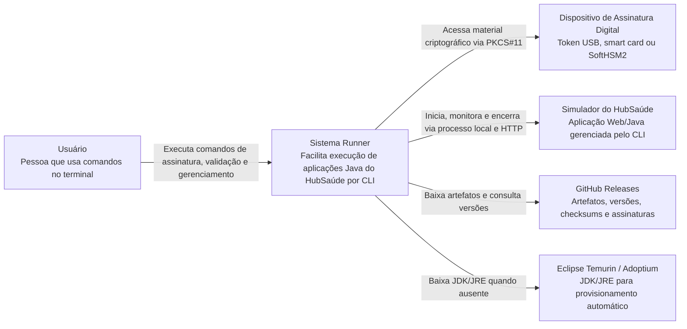
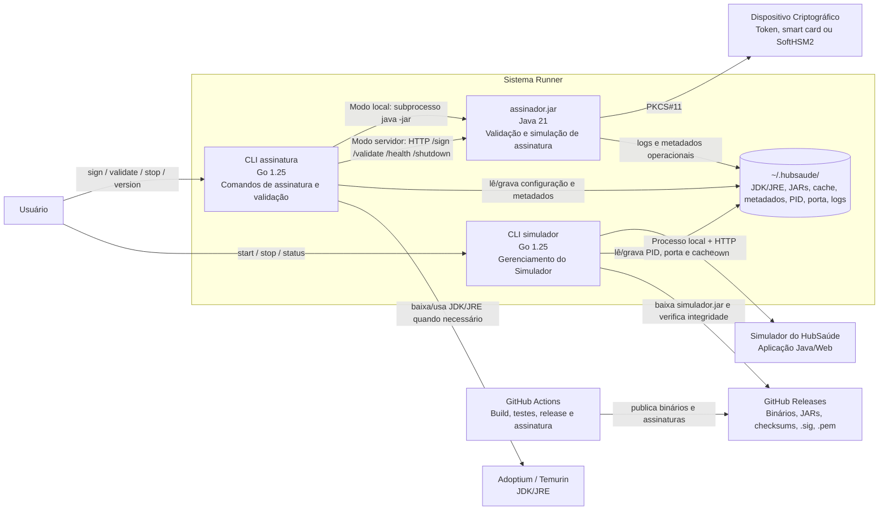
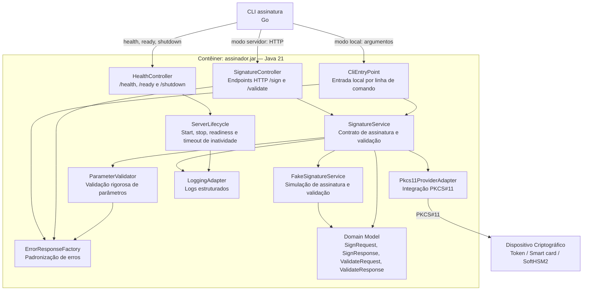
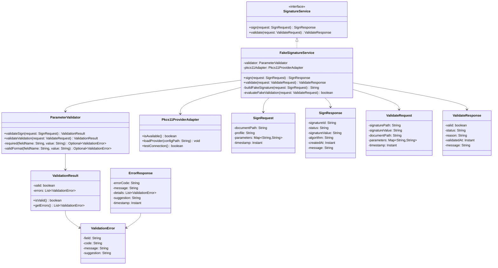

# 1. Identificação do documento

**Documento:** Modelo C4 de Software  
**Sistema:** Sistema Runner  
**Disciplina:** Implementação e Integração de Software  
**Curso:** Engenharia de Software  
**Contexto institucional:** Trabalho prático relacionado à Plataforma HubSaúde, iniciativa de interesse da Secretaria de Estado da Saúde de Goiás (SES-GO) e da Universidade Federal de Goiás (UFG).  
**Tipo de documento:** Documento de Modelo C4 de Software  
**Versão:** 1.0  
**Data:** 07/06/2026  
**Status:** Versão inicial consolidada a partir da especificação do trabalho prático, documento de design, critérios de qualidade, plano revisado, tarefas operacionais, Especificação de Requisitos de Software, Especificação de Arquitetura de Software e Especificação do Projeto Detalhado de Software.  
**Autores:** Equipe do Sistema Runner  

---

# 2. Histórico de versões

| Versão | Data | Autor(es) | Descrição da alteração |
|---|---:|---|---|
| 1.0 | 07/06/2026 | Equipe do Sistema Runner | Criação da versão inicial do documento de Modelo C4 de Software, consolidando visão de contexto, visão de contêineres, visão de componentes, visão de código, decisões arquiteturais, tecnologias, requisitos de qualidade, riscos e limitações arquiteturais. |

---

# 3. Sumário

- [1. Identificação do documento](#1-identificação-do-documento)
- [2. Histórico de versões](#2-histórico-de-versões)
- [3. Sumário](#3-sumário)
- [4. Objetivo do documento](#4-objetivo-do-documento)
- [5. Visão geral do sistema](#5-visão-geral-do-sistema)
- [6. Escopo do sistema](#6-escopo-do-sistema)
- [7. Atores e sistemas externos](#7-atores-e-sistemas-externos)
- [8. Diagrama C4 — Nível 1: Contexto](#8-diagrama-c4--nível-1-contexto)
  - [8.1 Diagrama](#81-diagrama)
  - [8.2 Descrição do diagrama](#82-descrição-do-diagrama)
  - [8.3 Principais relações](#83-principais-relações)
- [9. Diagrama C4 — Nível 2: Contêineres](#9-diagrama-c4--nível-2-contêineres)
  - [9.1 Diagrama](#91-diagrama)
  - [9.2 Descrição dos contêineres](#92-descrição-dos-contêineres)
  - [9.3 Comunicação entre contêineres](#93-comunicação-entre-contêineres)
- [10. Diagrama C4 — Nível 3: Componentes](#10-diagrama-c4--nível-3-componentes)
  - [10.1 Contêiner escolhido](#101-contêiner-escolhido)
  - [10.2 Diagrama](#102-diagrama)
  - [10.3 Descrição dos componentes](#103-descrição-dos-componentes)
- [11. Diagrama C4 — Nível 4: Código](#11-diagrama-c4--nível-4-código)
  - [11.1 Componente escolhido](#111-componente-escolhido)
  - [11.2 Diagrama de classes ou estrutura de código](#112-diagrama-de-classes-ou-estrutura-de-código)
  - [11.3 Descrição das classes principais](#113-descrição-das-classes-principais)
- [12. Tecnologias utilizadas](#12-tecnologias-utilizadas)
- [13. Principais decisões arquiteturais](#13-principais-decisões-arquiteturais)
- [14. Requisitos de qualidade relacionados à arquitetura](#14-requisitos-de-qualidade-relacionados-à-arquitetura)
- [15. Riscos e limitações arquiteturais](#15-riscos-e-limitações-arquiteturais)
- [16. Glossário](#16-glossário)
- [17. Referências](#17-referências)

---

# 4. Objetivo do documento

Este documento tem como objetivo apresentar o **Modelo C4 de Software** do **Sistema Runner**, descrevendo o sistema em diferentes níveis de abstração arquitetural: **Contexto**, **Contêineres**, **Componentes** e **Código**.

O Modelo C4 foi adotado para facilitar a comunicação da arquitetura entre desenvolvedores, avaliadores, mantenedores e usuários técnicos. Ele permite visualizar o sistema de forma progressiva: primeiro mostrando o sistema em seu ambiente, depois suas partes executáveis, em seguida os componentes internos de um contêiner e, por fim, uma visão de código de um componente selecionado.

Este documento deve servir como referência para:

- comunicar a arquitetura do Sistema Runner de forma clara e organizada;
- orientar a implementação dos componentes previstos;
- manter coerência com a Especificação de Requisitos de Software, a Especificação de Arquitetura de Software e a Especificação do Projeto Detalhado;
- apoiar a criação e manutenção dos diagramas arquiteturais do projeto;
- preservar rastreabilidade entre requisitos, decisões arquiteturais, componentes, código e testes;
- apoiar a avaliação acadêmica do trabalho prático de Implementação e Integração de Software.

---

# 5. Visão geral do sistema

O **Sistema Runner** é um sistema de linha de comando cujo propósito é facilitar a execução de aplicações Java relacionadas à Plataforma HubSaúde. Ele atua como uma camada de integração e conveniência entre o usuário e componentes Java, evitando que o usuário precise lidar diretamente com comandos como `java -jar`, configuração manual de JDK/JRE, portas HTTP, processos em segundo plano, arquivos `.jar`, endpoints e detalhes de integração com dispositivos criptográficos.

O sistema é composto por dois CLIs principais e por aplicações Java associadas:

- **CLI `assinatura`**, responsável por receber comandos de criação e validação de assinatura digital simulada;
- **`assinador.jar`**, aplicação Java responsável por validar parâmetros, simular criação de assinatura, simular validação de assinatura, expor endpoints HTTP no modo servidor e, quando aplicável, interagir com dispositivo criptográfico via PKCS#11;
- **CLI `simulador`**, responsável por iniciar, parar e consultar o status do Simulador do HubSaúde;
- **Simulador do HubSaúde**, aplicação Java/Web gerenciada pelo CLI `simulador`;
- **diretório local gerenciado**, preferencialmente `~/.hubsaude/`, usado para armazenar JDK/JRE provisionado, JARs, metadados, versões, PID, porta, cache e logs;
- **pipeline de CI/CD**, responsável por validar, testar, compilar, publicar releases, gerar checksums e assinar artefatos.

A arquitetura valoriza **portabilidade**, **reprodutibilidade**, **rastreabilidade**, **segurança da cadeia de suprimentos**, **testabilidade**, **separação de responsabilidades** e **falha controlada**.

---

# 6. Escopo do sistema

## 6.1 Está no escopo

O Modelo C4 cobre os seguintes elementos do Sistema Runner:

- execução de operações de assinatura digital simulada via CLI;
- execução de operações de validação de assinatura digital simulada via CLI;
- invocação local do `assinador.jar` por subprocesso;
- invocação HTTP do `assinador.jar` em modo servidor;
- gerenciamento do ciclo de vida do `assinador.jar` em modo servidor;
- validação rigorosa de parâmetros dentro do `assinador.jar`;
- integração do `assinador.jar` com PKCS#11, token, smart card ou simulador equivalente;
- gerenciamento do ciclo de vida do Simulador do HubSaúde;
- download dinâmico do `simulador.jar`;
- detecção e provisionamento automático de JDK/JRE;
- uso de cache e metadados em diretório local gerenciado;
- geração de binários multiplataforma;
- publicação de releases com SemVer, checksums SHA256 e assinatura Cosign/Sigstore;
- organização modular do código-fonte;
- CI/CD com validação em múltiplas plataformas.

## 6.2 Não está no escopo

Não fazem parte do escopo arquitetural deste modelo:

- implementação real de assinatura digital criptográfica;
- implementação real de validação criptográfica;
- integração real com autoridades certificadoras;
- autenticação de usuários;
- cadastro de usuários;
- armazenamento persistente de assinaturas como dado de negócio;
- interface gráfica;
- modelagem de banco de dados relacional;
- implantação em nuvem como serviço distribuído de produção.

O projeto simula a criação e validação de assinaturas, mas mantém contratos, validações, fluxos e integrações compatíveis com um cenário real de implementação e integração de software.

---

# 7. Atores e sistemas externos

| Elemento | Tipo | Descrição | Relação com o Sistema Runner |
|---|---|---|---|
| Usuário | Ator humano | Pessoa que interage com o sistema por linha de comando. Pode ser integrador, estudante, avaliador ou desenvolvedor. | Executa comandos nos CLIs `assinatura` e `simulador`. |
| Dispositivo de Assinatura Digital | Sistema externo | Hardware criptográfico, como token USB ou smart card, ou simulador compatível, como SoftHSM2. | É acessado pelo `assinador.jar` por meio da interface PKCS#11. |
| Simulador do HubSaúde | Sistema externo/gerenciado | Aplicação Java/Web usada para simular parte do ambiente HubSaúde. | É iniciado, parado e monitorado pelo CLI `simulador` por processo local e HTTP. |
| GitHub Releases | Serviço externo | Canal de publicação de binários, JARs, checksums, assinaturas e certificados. | Fornece artefatos distribuíveis e versões publicadas. |
| Eclipse Temurin/Adoptium | Serviço externo | Fonte para download de JDK/JRE compatível, quando ausente localmente. | Usado pelo componente de provisionamento de Java. |
| GitHub Actions | Serviço externo de automação | Plataforma de CI/CD usada para build, testes e releases. | Valida o projeto, gera binários e publica artefatos. |

---

# 8. Diagrama C4 — Nível 1: Contexto

## 8.1 Diagrama

## 8.2 Descrição do diagrama

O diagrama de contexto apresenta o Sistema Runner como uma solução intermediária entre o usuário e os sistemas externos necessários para executar funcionalidades associadas à Plataforma HubSaúde.

O usuário não interage diretamente com `assinador.jar`, `simulador.jar`, comandos Java, endpoints HTTP ou dispositivos criptográficos. Em vez disso, ele utiliza comandos de terminal fornecidos pelos CLIs do Runner. O Runner orquestra as interações técnicas necessárias, como execução de JARs, download de artefatos, verificação de versão, gerenciamento de processos e chamadas HTTP.

O Sistema Runner também se relaciona com serviços externos de distribuição e provisionamento, como GitHub Releases e Eclipse Temurin/Adoptium, para obter binários, JARs e JDK/JRE quando necessário.

## 8.3 Principais relações

| Origem | Destino | Tipo de relação | Descrição |
|---|---|---|---|
| Usuário | Sistema Runner | CLI | O usuário executa comandos como `assinatura sign`, `assinatura validate`, `simulador start`, `simulador stop` e `simulador status`. |
| Sistema Runner | Dispositivo de Assinatura Digital | PKCS#11 | O `assinador.jar` acessa token, smart card ou simulador compatível para testar integração com material criptográfico. |
| Sistema Runner | Simulador do HubSaúde | Processo local + HTTP | O CLI `simulador` inicia, monitora e encerra o Simulador do HubSaúde. |
| Sistema Runner | GitHub Releases | HTTP/download | O sistema baixa artefatos, consulta versões, obtém checksums e distribui binários. |
| Sistema Runner | Eclipse Temurin/Adoptium | HTTP/download | O sistema obtém JDK/JRE compatível quando não há Java adequado disponível localmente. |

---

# 9. Diagrama C4 — Nível 2: Contêineres

## 9.1 Diagrama

## 9.2 Descrição dos contêineres

| Contêiner | Tecnologia | Responsabilidade | Observações |
|---|---|---|---|
| CLI `assinatura` | Go 1.25 | Recebe comandos de criação e validação de assinatura, decide modo de execução, invoca o `assinador.jar`, exibe resultados e trata erros. | Deve usar modo servidor por padrão e modo local quando solicitado explicitamente. |
| `assinador.jar` | Java 21 | Valida parâmetros, simula criação de assinatura, simula validação de assinatura, expõe endpoints HTTP e integra com PKCS#11 quando aplicável. | Deve ser autoridade única de validação de parâmetros. |
| CLI `simulador` | Go 1.25 | Inicia, para e consulta o status do Simulador do HubSaúde. Também baixa o `simulador.jar` quando necessário. | Deve diferenciar processo iniciado de serviço pronto para receber requisições. |
| Simulador do HubSaúde | Java/Web | Simula ambiente do HubSaúde e responde a endpoints como `/api/info` e `/shutdown`. | É gerenciado pelo CLI `simulador`. |
| Diretório `~/.hubsaude/` | Sistema de arquivos | Armazena JDK/JRE provisionado, JARs, metadados, PID, porta, cache e logs. | Não é banco de dados de negócio; guarda dados operacionais. |
| GitHub Releases | Serviço externo | Hospeda binários, JARs, checksums e assinaturas. | Usado para distribuição e download dinâmico. |
| Eclipse Temurin/Adoptium | Serviço externo | Fornece JDK/JRE compatível. | Usado quando Java compatível não está disponível localmente. |
| GitHub Actions | CI/CD | Executa lint, testes, build, release, checksums e assinatura Cosign. | Deve validar portabilidade e reprodutibilidade. |

## 9.3 Comunicação entre contêineres

| Origem | Destino | Protocolo/Mecanismo | Descrição |
|---|---|---|---|
| Usuário | CLI `assinatura` | CLI | Comandos de assinatura, validação, parada e versão digitados no terminal. |
| Usuário | CLI `simulador` | CLI | Comandos de início, parada e status do Simulador do HubSaúde. |
| CLI `assinatura` | `assinador.jar` | Subprocesso | Invocação local por `java -jar`, preservando argumentos, `stdout`, `stderr` e exit code. |
| CLI `assinatura` | `assinador.jar` | HTTP | Invocação em modo servidor para `/sign`, `/validate`, `/health` e `/shutdown`. |
| `assinador.jar` | Dispositivo Criptográfico | PKCS#11 | Comunicação com token, smart card ou SoftHSM2. |
| CLI `simulador` | Simulador do HubSaúde | Processo local + HTTP | Início de processo, consulta `/api/info` e encerramento por `/shutdown`. |
| CLIs | `~/.hubsaude/` | Sistema de arquivos | Persistência operacional de metadados, JDK/JRE, JARs, PID, porta e logs. |
| CLI `simulador` | GitHub Releases | HTTP/download | Download de `simulador.jar`, versão e checksum. |
| CLI `assinatura`/`simulador` | Adoptium/Temurin | HTTP/download | Download de JDK/JRE compatível quando ausente. |
| GitHub Actions | GitHub Releases | API GitHub | Publicação de binários, checksums, assinaturas e certificados. |

---

# 10. Diagrama C4 — Nível 3: Componentes

## 10.1 Contêiner escolhido

O contêiner escolhido para detalhamento em nível de componentes é o **`assinador.jar`**, pois ele concentra a lógica principal de validação de parâmetros, simulação de assinatura, simulação de validação, exposição de endpoints HTTP, entrada local por CLI e integração com PKCS#11.

Essa escolha é coerente com a regra arquitetural de que o `assinador.jar` deve ser a **autoridade única de validação** dos parâmetros de assinatura e validação. O CLI pode realizar validações básicas de presença e usabilidade, mas a validação rigorosa pertence ao componente Java.

## 10.2 Diagrama

## 10.3 Descrição dos componentes

| Componente | Responsabilidade | Entradas | Saídas |
|---|---|---|---|
| `CliEntryPoint` | Receber invocações locais do `assinador.jar` por linha de comando. | Argumentos de comando e parâmetros de assinatura/validação. | `stdout`, `stderr` e código de saída. |
| `SignatureController` | Expor endpoints HTTP para criação e validação de assinatura simulada. | Requisições HTTP `POST /sign` e `POST /validate`. | Respostas HTTP de sucesso ou erro. |
| `HealthController` | Expor endpoints de health check, readiness e shutdown. | Requisições HTTP de status e encerramento. | Status do serviço ou confirmação de encerramento. |
| `ServerLifecycle` | Controlar início, parada, readiness e timeout de inatividade do servidor. | Porta, timeout, sinais de requisição e comandos de shutdown. | Estado do servidor e encerramento controlado. |
| `SignatureService` | Definir o contrato de criação e validação de assinaturas. | `SignRequest` e `ValidateRequest`. | `SignResponse` e `ValidateResponse`. |
| `FakeSignatureService` | Implementar a simulação de criação e validação. | Requisições já validadas. | Respostas simuladas pré-construídas ou baseadas em critérios simples. |
| `ParameterValidator` | Validar parâmetros obrigatórios, formatos e consistência. | Dados de assinatura ou validação. | `ValidationResult` com erros ou sucesso. |
| `Pkcs11ProviderAdapter` | Isolar acesso a PKCS#11. | Configuração de provider, token, smart card ou simulador. | Estado de disponibilidade ou erro controlado. |
| `ErrorResponseFactory` | Criar respostas padronizadas de erro. | Erros de validação, exceções e falhas de sistema. | `ErrorResponse` ou mensagens estruturadas. |
| `LoggingAdapter` | Centralizar logs estruturados e níveis de log. | Eventos de execução, erros e diagnósticos. | Logs operacionais. |
| `Domain Model` | Representar os dados de entrada, saída e erro. | Campos de domínio e metadados. | Objetos usados entre serviços, controllers e CLI. |

---

# 11. Diagrama C4 — Nível 4: Código

## 11.1 Componente escolhido

O componente escolhido para detalhamento em nível de código é o **serviço de assinatura e validação simulada** do `assinador.jar`, formado principalmente por:

- `SignatureService`;
- `FakeSignatureService`;
- `ParameterValidator`;
- `ValidationResult`;
- `SignRequest`;
- `SignResponse`;
- `ValidateRequest`;
- `ValidateResponse`;
- `ErrorResponse`;
- `Pkcs11ProviderAdapter`.

Esse componente foi escolhido porque representa o núcleo funcional do sistema: ele recebe dados, valida parâmetros, simula criação ou validação de assinatura e retorna respostas ou erros padronizados.

## 11.2 Diagrama de classes ou estrutura de código

## 11.3 Descrição das classes principais

| Classe/Interface | Tipo | Responsabilidade | Observações de projeto |
|---|---|---|---|
| `SignatureService` | Interface Java | Define o contrato de criação e validação de assinatura. | Permite trocar a implementação simulada por implementação real no futuro, se houver novo escopo. |
| `FakeSignatureService` | Serviço Java | Implementa a simulação de assinatura e validação. | Deve reutilizar o `ParameterValidator` e retornar respostas pré-construídas ou baseadas em critérios simples. |
| `ParameterValidator` | Serviço de validação Java | Valida parâmetros obrigatórios, formatos e consistência. | Deve ser a autoridade única de validação rigorosa, evitando duplicação no CLI. |
| `Pkcs11ProviderAdapter` | Adaptador Java | Isola comunicação com PKCS#11. | Deve tratar ausência de token, smart card, biblioteca nativa ou SoftHSM2 com erro claro. |
| `ValidationResult` | Entidade de validação | Representa sucesso ou falha na validação de parâmetros. | Deve permitir múltiplos erros, não apenas o primeiro erro encontrado. |
| `ValidationError` | Entidade de erro | Representa um erro específico de campo/parâmetro. | Deve conter campo, código, mensagem e sugestão de correção. |
| `SignRequest` | DTO/Entidade de entrada | Representa uma solicitação de assinatura simulada. | Pode ser preenchido por CLI local ou payload HTTP. |
| `SignResponse` | DTO/Entidade de saída | Representa uma assinatura simulada criada com sucesso. | Deve conter status, identificador, valor simulado e metadados. |
| `ValidateRequest` | DTO/Entidade de entrada | Representa uma solicitação de validação simulada. | Pode conter caminho da assinatura, valor da assinatura e documento associado. |
| `ValidateResponse` | DTO/Entidade de saída | Representa resultado simulado de validação. | Deve indicar claramente se a assinatura foi considerada válida ou inválida. |
| `ErrorResponse` | DTO de erro | Representa erro padronizado em HTTP ou CLI. | Deve distinguir erro de usuário e erro de sistema quando aplicável. |

---

# 12. Tecnologias utilizadas

| Tecnologia | Uso no Sistema Runner | Justificativa |
|---|---|---|
| Go 1.25 | Desenvolvimento dos CLIs `assinatura` e `simulador`. | Facilita geração de binários multiplataforma e possui boa biblioteca padrão para HTTP, subprocessos e arquivos. |
| Cobra | Estruturação de comandos, subcomandos e flags dos CLIs. | Facilita criação de CLIs com ajuda, versão e comandos organizados. |
| Java 21 | Desenvolvimento do `assinador.jar`. | Restrição do projeto e linguagem adequada para aplicação Java empacotada em JAR. |
| Maven | Build e empacotamento do projeto Java. | Facilita organização do projeto, testes e geração de JAR com `Main-Class`. |
| HTTP | Comunicação entre CLI e `assinador.jar` em modo servidor; comunicação com Simulador do HubSaúde. | Protocolo simples, adequado para integração local e testável. |
| PKCS#11 | Integração com token, smart card ou simulador criptográfico. | Padrão de comunicação com dispositivos criptográficos. |
| SoftHSM2 | Simulador de dispositivo criptográfico para testes. | Permite testar integração PKCS#11 sem hardware físico. |
| GitHub Actions | CI/CD para lint, testes, build, release e assinatura de artefatos. | Garante reprodutibilidade e validação multiplataforma. |
| GitHub Releases | Publicação de binários, JARs, checksums e assinaturas. | Canal de distribuição dos artefatos do projeto. |
| SHA256 | Verificação de integridade dos artefatos. | Permite detectar corrupção ou adulteração de arquivos. |
| Cosign/Sigstore | Assinatura e verificação de artefatos. | Aumenta segurança da cadeia de suprimentos de software. |
| Eclipse Temurin/Adoptium | Fonte de JDK/JRE compatível. | Permite provisionamento automático de Java quando ausente. |
| PlantUML | Geração dos diagramas versionados no repositório. | Mantém diagramas como texto e facilita automação. |
| Mermaid | Representação textual dos diagramas neste documento Markdown. | Facilita visualização direta em ambientes que suportam Mermaid. |
| Git | Controle de versão. | Permite rastreabilidade por commits, tags, branches e PRs. |

---

# 13. Principais decisões arquiteturais

| ID | Decisão | Justificativa | Impacto |
|---|---|---|---|
| DA-01 | Desenvolver os CLIs em Go 1.25. | Go facilita cross-compilation para Windows, Linux e macOS. | Reduz complexidade de distribuição, mas exige domínio de Go pela equipe. |
| DA-02 | Desenvolver o `assinador.jar` em Java 21. | O projeto exige aplicação Java e integração com ambiente JVM. | Exige JDK/JRE compatível e empacotamento correto do JAR. |
| DA-03 | Usar o modo servidor como padrão para o `assinador.jar`. | Reduz o custo de inicialização da JVM em execuções repetidas. | Exige gerenciamento de processo, health check, readiness e shutdown. |
| DA-04 | Manter modo local por ativação explícita. | Atende execuções simples e scripts que desejam invocação direta. | Cada execução sofre cold start da JVM. |
| DA-05 | Centralizar validação rigorosa no `assinador.jar`. | Evita duplicação de regras entre CLI e Java. | CLI deve repassar dados corretamente e interpretar erros retornados. |
| DA-06 | Tratar CLI ↔ JAR como contrato/API. | Parâmetros, respostas e códigos de erro precisam ser estáveis e testáveis. | Exige testes de contrato e documentação. |
| DA-07 | Usar health check e readiness. | Porta ocupada não garante que o serviço é uma instância válida do `assinador.jar` ou do simulador. | Exige endpoints de status e lógica de espera. |
| DA-08 | Usar `~/.hubsaude/` como diretório local gerenciado. | Centraliza cache, JDK/JRE, JARs, PID, porta e logs. | Exige cuidado com permissões e compatibilidade multiplataforma. |
| DA-09 | Baixar JDK/JRE automaticamente quando ausente. | Reduz barreira de uso para usuários sem Java configurado. | Exige verificação de versão, download e tratamento de falha de rede. |
| DA-10 | Publicar releases com SHA256 e Cosign. | Garante integridade e autenticidade dos artefatos. | Exige automação no pipeline de release. |
| DA-11 | Organizar o repositório como multi-módulo. | CLIs Go e aplicação Java precisam conviver no mesmo projeto com CI unificada. | Exige estrutura clara de pastas e workflows. |
| DA-12 | Usar C4 para documentação arquitetural. | O modelo facilita comunicação por níveis de abstração. | Exige manutenção de diagramas e coerência com código. |
| DA-13 | Isolar integração PKCS#11 no `assinador.jar`. | Evita expor detalhes criptográficos aos CLIs. | Requer testes de integração com SoftHSM2 ou ambiente equivalente. |
| DA-14 | Evitar comandos por concatenação de strings em shell. | Preserva espaços, acentos e aspas e reduz risco de execução insegura. | Exige uso correto das APIs de subprocesso. |
| DA-15 | Tratar cenários negativos como parte central dos testes. | O sistema precisa falhar bem e fornecer mensagens claras. | Exige testes para JAR ausente, Java ausente, porta ocupada, timeout, payload inválido e resposta malformada. |

---

# 14. Requisitos de qualidade relacionados à arquitetura

| Atributo de qualidade | Requisito relacionado | Estratégia arquitetural |
|---|---|---|
| Portabilidade | O sistema deve funcionar em Windows, Linux e macOS `amd64`. | CLIs em Go, cross-compilation, CI em múltiplas plataformas e testes nativos. |
| Reprodutibilidade | Qualquer pessoa deve clonar, compilar e testar o projeto seguindo a documentação. | GitHub Actions, README como contrato, workflows de build e release. |
| Rastreabilidade | Requisito, issue, PR, commit, código e teste devem estar relacionados. | Histórias de usuário, critérios de aceitação, matriz de rastreabilidade e commits atômicos. |
| Manutenibilidade | Responsabilidades devem estar separadas. | Módulos distintos para CLI, invocação, HTTP, processo, JDK, release, domínio e validação. |
| Segurança | Artefatos devem ser verificáveis. | Checksums SHA256, Cosign/Sigstore, `.sig`, `.pem` e pipeline automatizado. |
| Confiabilidade | O sistema deve falhar de forma clara e controlada. | Modelo estruturado de erros, exit codes coerentes, health check, readiness e tratamento de exceções. |
| Usabilidade | O usuário não deve conhecer detalhes de Java ou HTTP. | CLIs com ajuda, versão, mensagens claras, resultados legíveis e comandos consistentes. |
| Testabilidade | Deve haver testes unitários, integração, contrato e aceitação. | Separação entre serviços, controllers, invokers, clients HTTP e repositórios locais. |
| Desempenho | Chamadas repetidas não devem reiniciar a JVM sempre. | Modo servidor padrão, reutilização de instância viva e cache local de dependências. |
| Operabilidade | Start/stop/status devem refletir o estado real do processo. | Registro de PID/porta, health check, readiness e shutdown controlado. |

---

# 15. Riscos e limitações arquiteturais

## 15.1 Riscos arquiteturais

| ID | Risco | Impacto | Mitigação |
|---|---|---|---|
| R-01 | Divergência entre CLI e `assinador.jar`. | Quebra de integração e erros em runtime. | Definir contrato CLI ↔ JAR, documentar payloads e criar testes de contrato. |
| R-02 | Porta ocupada ser confundida com serviço válido. | CLI pode reutilizar processo incorreto. | Usar health check e readiness, não apenas verificação de porta. |
| R-03 | Diferenças entre Windows, Linux e macOS no gerenciamento de processos. | Comandos `start`, `stop` e `status` podem falhar em alguma plataforma. | Testar em CI multiplataforma e isolar lógica de processo. |
| R-04 | Falha de rede durante download de JDK/JRE ou JARs. | Usuário pode não conseguir executar o sistema. | Cache local, mensagens claras, retries controlados e documentação de alternativa manual. |
| R-05 | PKCS#11 exigir configuração nativa específica. | Testes e execução podem depender do ambiente. | Usar SoftHSM2 em testes e documentar setup. |
| R-06 | Assinatura de artefatos não ser executada corretamente. | Risco de cadeia de suprimentos e não conformidade com requisitos. | Automatizar Cosign no pipeline de release e validar arquivos `.sig` e `.pem`. |
| R-07 | Excesso de lógica no CLI. | Duplicação de validação e maior acoplamento. | Manter validação rigorosa no `assinador.jar` e CLI como orquestrador. |
| R-08 | Testes de processo e porta se tornarem instáveis. | CI pode ficar intermitente. | Usar portas configuráveis, timeouts claros e isolamento de testes. |
| R-09 | Documentação e diagramas ficarem desatualizados. | Perda de rastreabilidade e compreensão arquitetural. | Atualizar documentos e diagramas a cada mudança relevante. |
| R-10 | Dependência de serviços externos para download. | Falha em cenários offline ou com indisponibilidade externa. | Cache local, verificação de versões e mensagens de erro orientativas. |

## 15.2 Limitações arquiteturais

| ID | Limitação | Descrição |
|---|---|---|
| L-01 | Assinatura digital é simulada. | O sistema não implementa assinatura criptográfica real. |
| L-02 | Validação de assinatura é simulada. | O resultado é pré-determinado ou baseado em critérios simples. |
| L-03 | Não há interface gráfica. | Toda interação ocorre por linha de comando. |
| L-04 | Não há autenticação de usuários. | O sistema não possui login, sessão ou controle de perfis. |
| L-05 | Não há banco de dados de negócio. | O sistema persiste apenas dados operacionais em arquivos locais. |
| L-06 | O funcionamento completo pode depender de internet. | Downloads de JDK/JRE, JARs e releases exigem rede quando não há cache. |
| L-07 | A escalabilidade é local. | O sistema melhora uso repetido local por modo servidor, mas não é uma plataforma distribuída. |
| L-08 | PKCS#11 depende de ambiente. | Tokens, smart cards ou SoftHSM2 podem exigir configuração específica. |
| L-09 | O Nível 4 representa uma proposta de estrutura. | A implementação pode ajustar nomes e detalhes, desde que preserve responsabilidades e contratos. |

---

# 16. Glossário

| Termo | Definição |
|---|---|
| ADR | *Architecture Decision Record*. Registro curto de uma decisão arquitetural relevante. |
| Artefato | Arquivo produzido e distribuído pelo projeto, como binário, JAR, checksum, assinatura ou certificado. |
| Assinador | Aplicação Java `assinador.jar`, responsável por validar parâmetros e simular assinatura/validação. |
| Assinatura simulada | Resposta fictícia usada para testar integração sem realizar criptografia real. |
| C4 | Modelo de documentação arquitetural em quatro níveis: Contexto, Contêineres, Componentes e Código. |
| CLI | *Command Line Interface*. Interface de linha de comando executada no terminal. |
| Cold start | Inicialização completa da JVM e da aplicação Java a cada chamada. |
| Cosign | Ferramenta do ecossistema Sigstore usada para assinar e verificar artefatos. |
| Health check | Verificação que confirma se um serviço está vivo e respondendo. |
| Readiness | Verificação que confirma se um serviço está pronto para receber requisições. |
| JAR | Arquivo Java empacotado, normalmente executado com `java -jar`. |
| JDK | *Java Development Kit*. Kit de desenvolvimento Java. |
| JRE | *Java Runtime Environment*. Ambiente de execução Java. |
| JVM | *Java Virtual Machine*. Máquina virtual usada para executar aplicações Java. |
| Modo local | Modo em que o CLI executa diretamente o `assinador.jar` via subprocesso. |
| Modo servidor | Modo em que o `assinador.jar` permanece em execução e recebe requisições HTTP. |
| PKCS#11 | Padrão de interface para comunicação com dispositivos criptográficos. |
| SemVer | Versionamento semântico no formato `MAJOR.MINOR.PATCH`. |
| SHA256 | Algoritmo de hash usado para verificação de integridade. |
| Sigstore | Ecossistema para assinatura, verificação e transparência de artefatos. |
| SoftHSM2 | Software que simula um HSM/dispositivo criptográfico, útil em testes com PKCS#11. |
| stdout | Saída padrão de um processo, usada para resultados esperados. |
| stderr | Saída de erro de um processo, usada para diagnósticos. |
| Warm start | Uso de aplicação Java já inicializada, geralmente em modo servidor. |

---

# 17. Referências

1. Documento de especificação do trabalho prático do Sistema Runner.
2. Documento de design do Sistema Runner, contendo visão C4 de contexto e contêineres.
3. Documento de critérios de qualidade e orientações básicas do projeto.
4. Plano revisado do Sistema Runner, contendo histórias derivadas, sprints e critérios de aceitação.
5. Documento de tarefas operacionais, decisões técnicas e layout de pacotes.
6. Especificação de Requisitos de Software do Sistema Runner.
7. Especificação de Arquitetura de Software do Sistema Runner.
8. Especificação do Projeto Detalhado de Software do Sistema Runner.
9. Modelo C4 — documentação conceitual de arquitetura em níveis.
10. PlantUML — ferramenta prevista para geração dos diagramas versionados do projeto.
11. Mermaid — notação textual utilizada neste documento para representar diagramas diretamente em Markdown.
12. GitHub Actions — plataforma de automação de CI/CD.
13. GitHub Releases — mecanismo de publicação dos artefatos do projeto.
14. Sigstore/Cosign — ferramentas para assinatura e verificação de artefatos.
15. Eclipse Temurin/Adoptium — distribuição de JDK/JRE utilizada para provisionamento automático.

---

**Fim do documento.**
