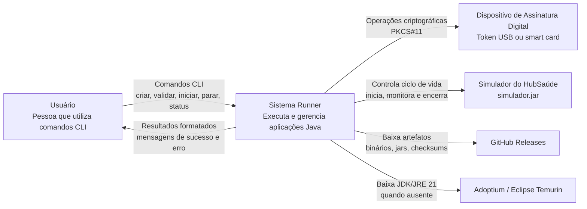
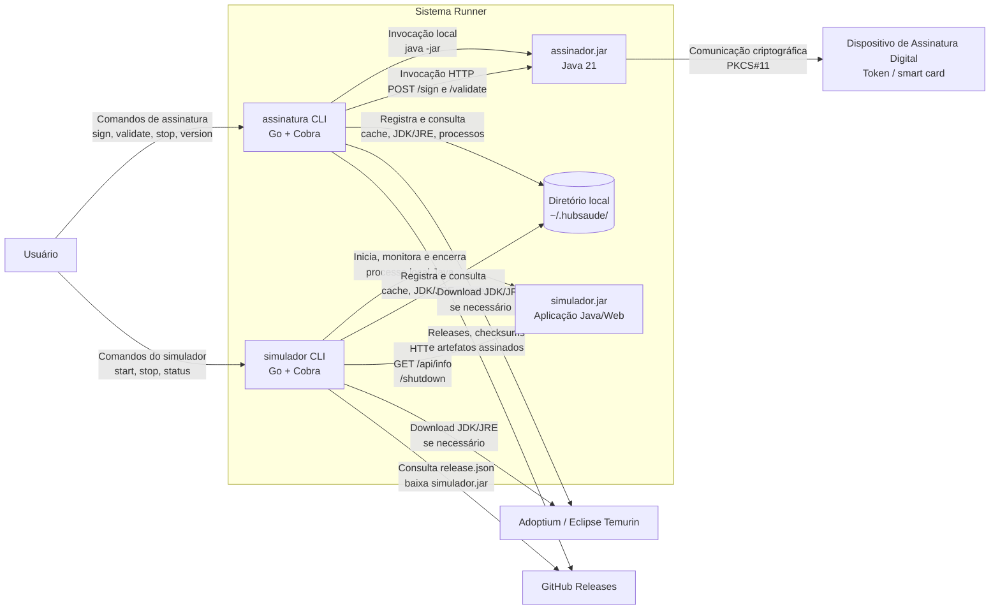
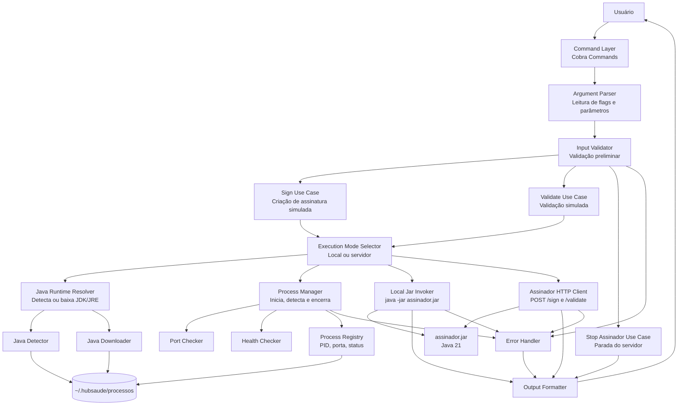
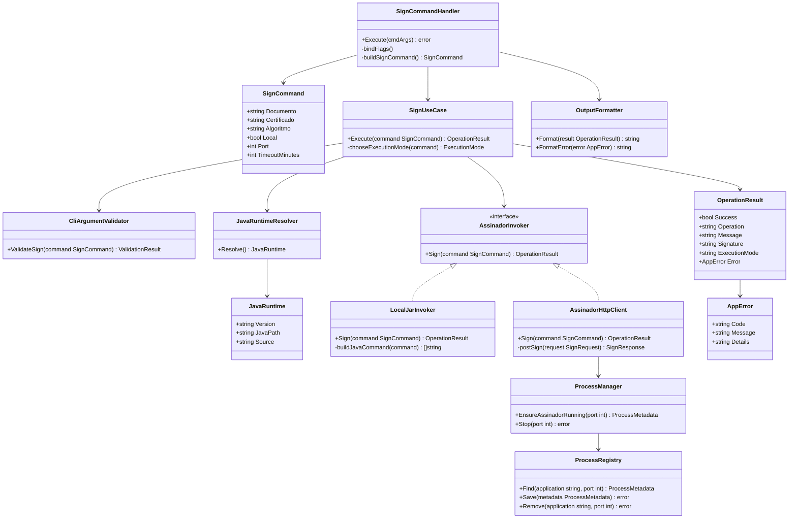

# Documento de Modelo C4 de Software — Sistema Runner

## 1. Identificação do documento

| Campo | Informação |
|---|---|
| **Nome do sistema** | Sistema Runner |
| **Nome do documento** | Documento de Modelo C4 de Software |
| **Versão do documento** | 1.0 |
| **Data de elaboração** | 07/05/2026 |
| **Responsável pela elaboração** | Equipe do projeto / Disciplina de Implementação e Integração de Software |
| **Instituição / contexto acadêmico** | Bacharelado em Engenharia de Software — Universidade Federal de Goiás (UFG) |
| **Contexto de aplicação** | Plataforma HubSaúde — interoperabilidade de dados em saúde |
| **Documentos relacionados** | Especificação de Requisitos de Software; Documento de Arquitetura de Software; Documento de Projeto Detalhado de Software; Plano Revisado #2; Documento de Design C4 |
| **Tipo de sistema** | Ferramenta de linha de comandos, integração com aplicações Java, gerenciamento de processos, provisionamento de JDK/JRE e simulação de assinatura digital |

---

## 2. Histórico de versões

| Versão | Data | Autor / Responsável | Descrição da alteração |
|---|---|---|---|
| 1.0 | 07/05/2026 | Equipe do projeto | Elaboração inicial do Documento de Modelo C4 de Software do Sistema Runner, com base nos arquivos de especificação, plano revisitado, design arquitetural C4, documento de requisitos, documento de arquitetura e documento de projeto detalhado previamente elaborados. |

---

## 3. Sumário

1. [Identificação do documento](#1-identificação-do-documento)  
2. [Histórico de versões](#2-histórico-de-versões)  
3. [Sumário](#3-sumário)  
4. [Objetivo do documento](#4-objetivo-do-documento)  
5. [Visão geral do sistema](#5-visão-geral-do-sistema)  
6. [Escopo do sistema](#6-escopo-do-sistema)  
7. [Atores e sistemas externos](#7-atores-e-sistemas-externos)  
8. [Diagrama C4 — Nível 1: Contexto](#8-diagrama-c4--nível-1-contexto)  
   8.1 [Diagrama](#81-diagrama)  
   8.2 [Descrição do diagrama](#82-descrição-do-diagrama)  
   8.3 [Principais relações](#83-principais-relações)  
9. [Diagrama C4 — Nível 2: Contêineres](#9-diagrama-c4--nível-2-contêineres)  
   9.1 [Diagrama](#91-diagrama)  
   9.2 [Descrição dos contêineres](#92-descrição-dos-contêineres)  
   9.3 [Comunicação entre contêineres](#93-comunicação-entre-contêineres)  
10. [Diagrama C4 — Nível 3: Componentes](#10-diagrama-c4--nível-3-componentes)  
   10.1 [Contêiner escolhido](#101-contêiner-escolhido)  
   10.2 [Diagrama](#102-diagrama)  
   10.3 [Descrição dos componentes](#103-descrição-dos-componentes)  
11. [Diagrama C4 — Nível 4: Código](#11-diagrama-c4--nível-4-código)  
   11.1 [Componente escolhido](#111-componente-escolhido)  
   11.2 [Diagrama de classes ou estrutura de código](#112-diagrama-de-classes-ou-estrutura-de-código)  
   11.3 [Descrição das classes principais](#113-descrição-das-classes-principais)  
12. [Tecnologias utilizadas](#12-tecnologias-utilizadas)  
13. [Principais decisões arquiteturais](#13-principais-decisões-arquiteturais)  
14. [Requisitos de qualidade relacionados à arquitetura](#14-requisitos-de-qualidade-relacionados-à-arquitetura)  
15. [Riscos e limitações arquiteturais](#15-riscos-e-limitações-arquiteturais)  
16. [Glossário](#16-glossário)  
17. [Referências](#17-referências)  

---

## 4. Objetivo do documento

O objetivo deste documento é apresentar o **Modelo C4 de Software do Sistema Runner**, descrevendo a solução em quatro níveis complementares de abstração:

1. **Nível 1 — Contexto:** mostra o Sistema Runner em relação ao usuário e aos sistemas externos.
2. **Nível 2 — Contêineres:** mostra as principais unidades executáveis ou aplicações que compõem o sistema.
3. **Nível 3 — Componentes:** detalha a estrutura interna de um contêiner escolhido.
4. **Nível 4 — Código:** detalha a estrutura de código de um componente escolhido.

Este documento deve apoiar a compreensão, implementação, manutenção e avaliação do Sistema Runner, oferecendo uma visão progressiva da arquitetura: do contexto mais amplo até a organização interna de classes, estruturas e serviços.

O documento também tem como finalidade manter rastreabilidade com os demais artefatos já elaborados: especificação de requisitos, documento de arquitetura, projeto detalhado e plano revisitado.

---

## 5. Visão geral do sistema

O **Sistema Runner** é uma solução de software voltada para facilitar a execução e o gerenciamento de aplicações Java por meio de interfaces de linha de comandos. O sistema está relacionado à Plataforma HubSaúde, contexto em que aplicações Java precisam ser executadas por usuários, integradores ou operadores técnicos sem que esses usuários precisem conhecer detalhes de instalação do Java, comandos `java -jar`, configuração de portas, controle de processos ou parâmetros internos.

A solução é composta principalmente por:

| Parte do sistema | Descrição |
|---|---|
| **`assinatura`** | CLI desenvolvido em Go, responsável por receber comandos de criação e validação de assinatura e invocar o `assinador.jar`. |
| **`assinador.jar`** | Aplicação Java 21 responsável por validar parâmetros e simular operações de criação e validação de assinatura digital. |
| **`simulador`** | CLI desenvolvido em Go, responsável por iniciar, parar, monitorar e baixar dinamicamente o Simulador do HubSaúde. |
| **`simulador.jar`** | Aplicação Java/Web do Simulador do HubSaúde, gerenciada pelo CLI `simulador`. |
| **Diretório `~/.hubsaude/`** | Diretório local gerenciado para armazenar JDK/JRE, arquivos `.jar`, cache, metadados, registros de processo e logs. |
| **Pipeline CI/CD** | Automação de build, testes, geração de binários, checksums SHA256 e assinaturas Cosign. |

O funcionamento geral do sistema pode ser resumido da seguinte forma:

```text
Usuário
  ↓
Comandos CLI
  ↓
Sistema Runner
  ↓
Execução e gerenciamento de aplicações Java
  ↓
Resultados formatados ao usuário
```

O Sistema Runner não realiza assinatura digital criptográfica real. No escopo atual, ele simula a criação e validação de assinatura, com foco em integração, validação de parâmetros, gerenciamento de aplicações Java, testes, distribuição multiplataforma e boas práticas de engenharia de software.

---

## 6. Escopo do sistema

### 6.1 Está no escopo

O Sistema Runner deve contemplar:

- desenvolvimento do CLI `assinatura`;
- desenvolvimento do `assinador.jar`;
- integração entre o CLI `assinatura` e o `assinador.jar`;
- invocação local do `assinador.jar` via `java -jar`;
- invocação do `assinador.jar` via HTTP em modo servidor;
- validação rigorosa de parâmetros de assinatura e validação;
- simulação de criação de assinatura digital;
- simulação de validação de assinatura digital;
- tratamento de erros de parâmetros, execução, download, processos e comunicação;
- suporte arquitetural à interação com dispositivo criptográfico via PKCS#11;
- desenvolvimento do CLI `simulador`;
- gerenciamento do ciclo de vida do Simulador do HubSaúde;
- comandos para iniciar, parar e consultar status do simulador;
- download dinâmico do `simulador.jar`;
- provisionamento automático de JDK/JRE compatível;
- armazenamento local de arquivos e metadados em `~/.hubsaude/`;
- geração de binários para Windows, Linux e macOS;
- publicação por GitHub Releases;
- geração de checksums SHA256;
- assinatura de artefatos com Cosign;
- testes unitários, de integração, de aceitação e multiplataforma;
- documentação técnica e documentação de uso.

### 6.2 Não está no escopo

Não fazem parte do escopo do Sistema Runner:

- implementação real de assinatura digital criptográfica;
- implementação real de validação criptográfica de assinatura digital;
- integração real com autoridades certificadoras;
- geração de certificados digitais;
- autenticação de usuários;
- armazenamento persistente de assinaturas digitais;
- interface gráfica;
- substituição do Simulador do HubSaúde por uma nova aplicação de negócio;
- implantação distribuída em ambiente de produção;
- garantia jurídica de validade de assinatura digital.

---

## 7. Atores e sistemas externos

| Elemento | Tipo | Descrição | Relação com o Sistema Runner |
|---|---|---|---|
| **Usuário** | Ator | Pessoa que interage com o sistema por linha de comandos. | Envia comandos de assinatura, validação, início, parada e status. |
| **Integrador da Plataforma HubSaúde** | Ator especializado | Usuário técnico que utiliza o Runner para integrar e testar aplicações associadas ao HubSaúde. | Utiliza os CLIs para automatizar execução e testes. |
| **Dispositivo de Assinatura Digital** | Sistema externo | Token USB ou smart card compatível com PKCS#11. | Pode ser acessado pelo `assinador.jar` para operações criptográficas reais ou simuladas. |
| **Simulador do HubSaúde** | Sistema externo / aplicação Java | Aplicação Java/Web representada por `simulador.jar`. | É iniciada, monitorada e encerrada pelo CLI `simulador`. |
| **GitHub Releases** | Sistema externo | Plataforma para publicação de binários, `.jar`, checksums e assinaturas. | Fornece artefatos distribuíveis e versões do sistema. |
| **Adoptium / Eclipse Temurin** | Sistema externo | Fonte para download de JDK/JRE compatível. | Permite provisionamento automático do ambiente Java. |
| **Sigstore / Cosign** | Sistema externo / ferramenta de segurança | Ecossistema usado para assinatura e verificação de artefatos. | Garante autenticidade e integridade dos binários publicados. |

---

## 8. Diagrama C4 — Nível 1: Contexto

### 8.1 Diagrama



### 8.2 Descrição do diagrama

O diagrama de contexto apresenta o Sistema Runner como o sistema central que simplifica a interação entre o usuário e aplicações Java associadas ao HubSaúde.

O usuário interage exclusivamente por linha de comandos. Ele não precisa executar manualmente comandos Java, procurar arquivos `.jar`, configurar JDK/JRE, verificar processos em execução ou chamar endpoints HTTP diretamente. O Sistema Runner recebe os comandos, interpreta a intenção do usuário e executa as operações necessárias.

O Sistema Runner se relaciona com três grupos principais de sistemas externos:

1. **Dispositivo de Assinatura Digital**, utilizado via PKCS#11.
2. **Simulador do HubSaúde**, que é iniciado, monitorado e encerrado pelo Runner.
3. **Serviços de distribuição e provisionamento**, como GitHub Releases, Adoptium/Eclipse Temurin e Cosign/Sigstore.

### 8.3 Principais relações

| Origem | Destino | Relação | Descrição |
|---|---|---|---|
| Usuário | Sistema Runner | Comandos CLI | O usuário solicita criação/validação de assinatura ou gerenciamento do simulador. |
| Sistema Runner | Usuário | Resultados formatados | O sistema apresenta respostas legíveis, mensagens de erro e orientações. |
| Sistema Runner | Dispositivo de Assinatura Digital | PKCS#11 | O sistema pode interagir com token ou smart card por meio do `assinador.jar`. |
| Sistema Runner | Simulador do HubSaúde | Controle de ciclo de vida | O sistema inicia, consulta status e encerra o simulador. |
| Sistema Runner | GitHub Releases | Download de artefatos | O sistema obtém binários, `.jar`, checksums e arquivos de assinatura. |
| Sistema Runner | Adoptium / Eclipse Temurin | Download de JDK/JRE | O sistema baixa runtime Java compatível quando necessário. |

---

## 9. Diagrama C4 — Nível 2: Contêineres

### 9.1 Diagrama



### 9.2 Descrição dos contêineres

| Contêiner / sistema | Tipo | Tecnologia | Responsabilidade |
|---|---|---|---|
| **`assinatura CLI`** | Contêiner interno | Go 1.25 + Cobra | Receber comandos de assinatura e validação, invocar o `assinador.jar`, formatar resultados e gerenciar o modo servidor do assinador. |
| **`simulador CLI`** | Contêiner interno | Go 1.25 + Cobra | Iniciar, parar, consultar status e obter dinamicamente o `simulador.jar`. |
| **`assinador.jar`** | Contêiner interno | Java 21 | Validar parâmetros e simular criação/validação de assinatura digital; expor endpoints HTTP em modo servidor. |
| **`simulador.jar`** | Sistema externo gerenciado | Java / aplicação web | Simulador do HubSaúde controlado pelo CLI `simulador`. |
| **Diretório `~/.hubsaude/`** | Armazenamento local | Sistema de arquivos | Armazenar JDK/JRE, `.jar`, cache, metadados, registros de processos e logs. |
| **Dispositivo de Assinatura Digital** | Sistema externo | Hardware + PKCS#11 | Token ou smart card utilizado para operações criptográficas reais ou simuladas. |
| **GitHub Releases** | Sistema externo | Plataforma de distribuição | Publicar e disponibilizar binários, `.jar`, checksums SHA256, arquivos `.sig` e `.pem`. |
| **Adoptium / Eclipse Temurin** | Sistema externo | Serviço de download | Fornecer JDK/JRE compatível com Java 21. |

### 9.3 Comunicação entre contêineres

| Origem | Destino | Protocolo / mecanismo | Descrição |
|---|---|---|---|
| Usuário | `assinatura CLI` | CLI | Comandos `sign`, `validate`, `stop`, `version` e `--help`. |
| Usuário | `simulador CLI` | CLI | Comandos `start`, `stop`, `status` e `--help`. |
| `assinatura CLI` | `assinador.jar` | Processo local / `java -jar` | Invocação direta em modo local. |
| `assinatura CLI` | `assinador.jar` | HTTP | Invocação em modo servidor, usando `/sign` e `/validate`. |
| `assinador.jar` | Dispositivo de Assinatura Digital | PKCS#11 | Comunicação com token USB ou smart card. |
| `simulador CLI` | `simulador.jar` | Processo local | Inicialização e controle do processo Java. |
| `simulador CLI` | `simulador.jar` | HTTP | Consulta de status por `/api/info` e parada por `/shutdown`. |
| CLIs | `~/.hubsaude/` | Sistema de arquivos | Leitura e escrita de cache, metadados, JDK/JRE e registros de processo. |
| CLIs | GitHub Releases | HTTPS | Download de artefatos e consulta de versões. |
| CLIs | Adoptium / Eclipse Temurin | HTTPS | Download de JDK/JRE quando ausente. |
| Pipeline CI/CD | GitHub Releases | GitHub Actions | Publicação de binários, checksums e assinaturas Cosign. |

---

## 10. Diagrama C4 — Nível 3: Componentes

### 10.1 Contêiner escolhido

O contêiner escolhido para detalhamento no Nível 3 é o **`assinatura CLI`**, por ser a principal porta de entrada do usuário para o fluxo de assinatura e validação. Esse contêiner é responsável por receber comandos, validar parâmetros básicos, resolver o ambiente Java, decidir entre modo local e modo servidor, invocar o `assinador.jar`, tratar erros e formatar a resposta ao usuário.

### 10.2 Diagrama



### 10.3 Descrição dos componentes

| Componente | Responsabilidade |
|---|---|
| **Command Layer** | Define os comandos `sign`, `validate`, `stop`, `version` e ajuda integrada do CLI. |
| **Argument Parser** | Lê flags e argumentos informados pelo usuário, como documento, assinatura, porta, modo local e timeout. |
| **Input Validator** | Realiza validações preliminares dos parâmetros antes de acionar os casos de uso. |
| **Sign Use Case** | Orquestra o fluxo de criação de assinatura simulada. |
| **Validate Use Case** | Orquestra o fluxo de validação de assinatura simulada. |
| **Stop Assinador Use Case** | Orquestra a interrupção do `assinador.jar` em modo servidor. |
| **Execution Mode Selector** | Decide se a operação será realizada por modo local ou por modo servidor HTTP. |
| **Java Runtime Resolver** | Obtém um JDK/JRE compatível, detectando instalação existente ou acionando download automático. |
| **Java Detector** | Procura Java compatível no `PATH` ou no diretório `~/.hubsaude/`. |
| **Java Downloader** | Baixa JDK/JRE compatível quando não encontrado localmente. |
| **Process Manager** | Inicia, detecta, reutiliza e encerra processos Java. |
| **Port Checker** | Verifica se a porta informada está disponível antes de iniciar serviços. |
| **Health Checker** | Confirma se uma instância registrada realmente está respondendo. |
| **Process Registry** | Salva e consulta metadados de processo, como PID, porta, modo e status. |
| **Local Jar Invoker** | Executa o `assinador.jar` via `java -jar` em modo local. |
| **Assinador HTTP Client** | Envia requisições HTTP para `/sign` e `/validate`. |
| **Output Formatter** | Converte respostas internas em mensagens legíveis no terminal. |
| **Error Handler** | Padroniza erros técnicos e de negócio em mensagens compreensíveis. |

### 10.4 Observações de projeto

A separação em componentes permite que o CLI seja testável, manutenível e extensível. A lógica de comando não deve conter diretamente regras de download, processo, HTTP ou formatação complexa. Cada responsabilidade deve permanecer isolada em um componente próprio.

Essa organização também permite reutilizar componentes no CLI `simulador`, especialmente:

- `Java Runtime Resolver`;
- `Process Manager`;
- `Process Registry`;
- `Port Checker`;
- `Artifact Downloader`;
- `Checksum Verifier`;
- `Error Handler`;
- `Output Formatter`.

---

## 11. Diagrama C4 — Nível 4: Código

### 11.1 Componente escolhido

O componente escolhido para o Nível 4 é o **Sign Use Case**, responsável por coordenar a criação de uma assinatura digital simulada a partir do comando `assinatura sign`.

Esse componente foi escolhido porque representa um fluxo central do sistema, integrando:

- leitura de parâmetros do usuário;
- validação inicial;
- escolha do modo de execução;
- resolução do ambiente Java;
- invocação local ou HTTP do `assinador.jar`;
- tratamento de erro;
- formatação da resposta.

### 11.2 Diagrama de classes ou estrutura de código



### 11.3 Descrição das classes principais

> Observação: no código Go, essas “classes” serão representadas principalmente por `structs`, `interfaces`, funções e pacotes. O diagrama usa notação de classes para facilitar a visualização do projeto no Nível 4 do C4.

| Classe / estrutura | Tipo | Responsabilidade |
|---|---|---|
| **`SignCommandHandler`** | Controlador CLI | Recebe o comando `assinatura sign`, lê flags, monta o objeto `SignCommand` e chama o caso de uso. |
| **`SignCommand`** | Entidade / DTO | Representa os parâmetros de entrada do comando de assinatura. |
| **`SignUseCase`** | Serviço de aplicação | Coordena o fluxo de criação de assinatura simulada. |
| **`CliArgumentValidator`** | Serviço de validação | Verifica parâmetros obrigatórios e formatos básicos antes da invocação do assinador. |
| **`JavaRuntimeResolver`** | Serviço de infraestrutura | Localiza ou provisiona JDK/JRE compatível. |
| **`JavaRuntime`** | Entidade / DTO | Representa informações sobre o Java resolvido, como versão e caminho. |
| **`AssinadorInvoker`** | Interface | Define contrato comum para invocação do `assinador.jar`. |
| **`LocalJarInvoker`** | Implementação de infraestrutura | Invoca o `assinador.jar` em modo local por `java -jar`. |
| **`AssinadorHttpClient`** | Implementação de infraestrutura | Invoca o `assinador.jar` por HTTP em modo servidor. |
| **`ProcessManager`** | Serviço de infraestrutura | Garante que o `assinador.jar` esteja em execução quando o modo servidor for usado. |
| **`ProcessRegistry`** | Repositório local | Persiste e consulta metadados de processo em `~/.hubsaude/processos/`. |
| **`OperationResult`** | Entidade / DTO | Representa o resultado da operação, incluindo status, mensagem, assinatura simulada e modo de execução. |
| **`OutputFormatter`** | Serviço de apresentação | Formata o resultado ou erro para exibição no terminal. |
| **`AppError`** | Entidade de erro | Representa erro padronizado com código, mensagem e detalhes. |

### 11.4 Pseudofluxo do método principal

```text
SignUseCase.Execute(command):

1. Validar parâmetros com CliArgumentValidator.
2. Se inválido, retornar OperationResult com AppError.
3. Resolver Java compatível com JavaRuntimeResolver.
4. Definir modo de execução:
   4.1 Se --local foi informado, usar LocalJarInvoker.
   4.2 Caso contrário, verificar servidor ativo.
   4.3 Se servidor ativo, usar AssinadorHttpClient.
   4.4 Se servidor indisponível, iniciar servidor ou usar fallback local conforme configuração.
5. Invocar o assinador.jar.
6. Receber resposta simulada.
7. Retornar OperationResult para o handler.
8. Handler usa OutputFormatter para apresentar resultado ao usuário.
```

---

## 12. Tecnologias utilizadas

| Tecnologia | Uso no sistema | Justificativa |
|---|---|---|
| **Go 1.25** | Desenvolvimento dos CLIs `assinatura` e `simulador`. | Facilita criação de binários multiplataforma e reduz dependências para o usuário final. |
| **Cobra** | Organização dos comandos CLI. | Fornece comandos, subcomandos, flags e ajuda integrada. |
| **Java 21** | Desenvolvimento e execução do `assinador.jar`. | Atende à restrição técnica definida para o projeto. |
| **HTTP** | Comunicação entre CLI e `assinador.jar` em modo servidor; comunicação com o simulador. | Protocolo simples, padronizado e adequado para integração local. |
| **PKCS#11** | Comunicação com token USB ou smart card. | Padrão para interação com dispositivos criptográficos. |
| **SoftHSM2 ou simulador equivalente** | Testes de integração com PKCS#11. | Permite validar cenários de dispositivo criptográfico sem depender de hardware real. |
| **Sistema de arquivos local** | Persistência em `~/.hubsaude/`. | Simples e suficiente para cache, metadados e registros de processo. |
| **GitHub Actions** | Pipeline CI/CD. | Automatiza build, testes, geração de binários e releases. |
| **GitHub Releases** | Publicação dos artefatos. | Permite distribuir versões executáveis do sistema. |
| **SHA256** | Verificação de integridade. | Permite detectar corrupção ou alteração de artefatos. |
| **Cosign / Sigstore** | Assinatura de artefatos. | Aumenta a confiança na origem e integridade dos binários. |
| **OIDC** | Identidade para assinatura com Cosign. | Evita uso de chaves estáticas e melhora rastreabilidade. |
| **Adoptium / Eclipse Temurin** | Download do JDK/JRE. | Fonte confiável para runtime Java compatível. |
| **PlantUML / Mermaid** | Representação dos diagramas. | Apoia documentação visual do Modelo C4. |

---

## 13. Principais decisões arquiteturais

| ID | Decisão | Justificativa |
|---|---|---|
| DA-001 | Utilizar Go para os CLIs. | Go facilita a geração de binários multiplataforma para Windows, Linux e macOS. |
| DA-002 | Utilizar Cobra para comandos CLI. | Cobra organiza comandos, subcomandos, flags e ajuda integrada. |
| DA-003 | Desenvolver `assinador.jar` em Java 21. | Java 21 é uma restrição do projeto e padroniza a execução do componente Java. |
| DA-004 | Separar `assinatura CLI` e `simulador CLI`. | Cada CLI possui responsabilidade própria, reduzindo acoplamento e melhorando usabilidade. |
| DA-005 | Permitir modo local e modo servidor para o `assinador.jar`. | O modo local é simples; o modo servidor reduz o custo de inicialização da JVM em múltiplas chamadas. |
| DA-006 | Usar HTTP para o modo servidor. | HTTP simplifica a integração entre CLI e aplicação Java. |
| DA-007 | Usar `~/.hubsaude/` como diretório gerenciado. | Centraliza JDK/JRE, `.jar`, cache, metadados, logs e registros de processo. |
| DA-008 | Registrar PID, porta e metadados de processo. | Permite detectar, reutilizar e encerrar processos iniciados pelo Runner. |
| DA-009 | Confirmar processo por health check. | Evita confiar apenas em registros locais desatualizados. |
| DA-010 | Provisionar JDK/JRE automaticamente. | Atende ao objetivo de ocultar a complexidade da instalação Java. |
| DA-011 | Baixar `simulador.jar` dinamicamente. | Permite manter o simulador atualizado sem download manual. |
| DA-012 | Verificar checksum dos artefatos baixados. | Reduz risco de execução de arquivos corrompidos ou alterados. |
| DA-013 | Assinar releases com Cosign. | Aumenta segurança da cadeia de suprimentos de software. |
| DA-014 | Isolar PKCS#11 em adaptador. | Evita espalhar complexidade criptográfica pelo sistema e facilita testes com simulador. |
| DA-015 | Manter assinatura e validação como simulações. | Mantém o sistema coerente com o escopo acadêmico e com os documentos de requisitos. |

---

## 14. Requisitos de qualidade relacionados à arquitetura

| Categoria | Requisito de qualidade | Decisão arquitetural associada |
|---|---|---|
| **Segurança** | Artefatos distribuídos devem permitir verificação de integridade e autenticidade. | Uso de SHA256, Cosign, `.sig`, `.pem` e GitHub Releases. |
| **Segurança** | O sistema não deve persistir assinaturas digitais nem dados sensíveis. | Persistência limitada a cache, metadados, JDK/JRE, `.jar` e registros de processo. |
| **Desempenho** | Múltiplas operações de assinatura devem evitar reinicialização repetida da JVM. | Modo servidor HTTP com reutilização de instância ativa. |
| **Manutenibilidade** | O sistema deve ser modular e de fácil evolução. | Separação entre CLI, casos de uso, infraestrutura, HTTP, processo e persistência. |
| **Usabilidade** | Usuário não deve precisar conhecer comandos Java. | CLIs `assinatura` e `simulador` encapsulam execução Java e fornecem ajuda integrada. |
| **Confiabilidade** | O sistema deve tratar falhas de portas, processos, downloads e Java ausente. | Componentes `PortChecker`, `HealthChecker`, `ProcessManager`, `JavaRuntimeResolver` e `ErrorHandler`. |
| **Portabilidade** | O sistema deve funcionar em Windows, Linux e macOS. | Go, cross-compilation e pipeline CI/CD multiplataforma. |
| **Testabilidade** | Funcionalidades principais devem ser testáveis isoladamente. | Uso de interfaces, serviços separados, repositórios locais e adaptadores. |
| **Interoperabilidade** | O sistema deve interagir com aplicações Java, HTTP e PKCS#11. | Uso de `java -jar`, endpoints HTTP e adaptador PKCS#11. |
| **Evolutividade** | Deve ser possível gerenciar novas aplicações Java no futuro. | Componentes reutilizáveis para runtime Java, processos, downloads e cache. |

### 14.1 Cenários de qualidade

#### Segurança de artefatos

| Campo | Descrição |
|---|---|
| Fonte | Usuário ou integrador |
| Estímulo | Baixa um binário publicado em release |
| Ambiente | Máquina local Windows, Linux ou macOS |
| Artefato | Binário `assinatura` ou `simulador` |
| Resposta | Usuário verifica SHA256 e assinatura Cosign |
| Medida | Verificação deve confirmar integridade e autenticidade ou rejeitar o artefato |

#### Desempenho em múltiplas chamadas

| Campo | Descrição |
|---|---|
| Fonte | Usuário |
| Estímulo | Executa várias operações `assinatura sign` em sequência |
| Ambiente | `assinador.jar` já iniciado em modo servidor |
| Artefato | `assinatura CLI` e `assinador.jar` |
| Resposta | CLI reutiliza a instância ativa e envia requisições HTTP |
| Medida | A JVM não deve ser reiniciada a cada operação |

#### Confiabilidade no gerenciamento de processo

| Campo | Descrição |
|---|---|
| Fonte | CLI |
| Estímulo | Encontra registro local de processo |
| Ambiente | Processo pode estar ativo ou inativo |
| Artefato | `ProcessRegistry` e `HealthChecker` |
| Resposta | CLI confirma por health check antes de reutilizar |
| Medida | Registros desatualizados não devem causar falhas silenciosas |

---

## 15. Riscos e limitações arquiteturais

### 15.1 Riscos

| ID | Risco | Impacto | Mitigação |
|---|---|---|---|
| R-001 | Diferenças entre Windows, Linux e macOS. | Falhas em caminhos, permissões ou processos. | Criar abstrações de sistema operacional e validar no CI/CD. |
| R-002 | Falha ao baixar JDK/JRE. | Usuário não consegue executar aplicações Java. | Permitir uso de Java instalado e exibir erro orientativo. |
| R-003 | Porta ocupada. | `assinador.jar` ou `simulador.jar` não inicia. | Verificar porta antes de iniciar e permitir `--port`. |
| R-004 | Registro de PID desatualizado. | CLI pode tentar reutilizar processo inexistente. | Confirmar estado com health check. |
| R-005 | Download de artefato corrompido. | Risco de execução de arquivo inválido. | Validar checksum antes do uso. |
| R-006 | Complexidade do PKCS#11. | Tokens e bibliotecas podem variar entre ambientes. | Isolar integração em adaptador e testar com SoftHSM2. |
| R-007 | Confusão entre simulação e assinatura real. | Usuário pode interpretar resultado como assinatura válida juridicamente. | Documentar claramente que o sistema simula assinatura e validação. |
| R-008 | Falha de assinatura na release. | Artefatos podem ser publicados sem verificação de origem. | Automatizar Cosign e validar presença de `.sig` e `.pem`. |
| R-009 | Mudança em URLs externas. | Download de `simulador.jar` ou JDK/JRE pode falhar. | Usar `release.json`, configuração externa e opção `--source`. |
| R-010 | Baixa cobertura de testes de integração. | Erros podem surgir apenas em ambiente real. | Criar testes unitários, integração local, HTTP, processos e multiplataforma. |

### 15.2 Limitações

- O sistema não realiza assinatura digital criptográfica real.
- O sistema não realiza validação criptográfica real.
- O sistema não gera certificados digitais.
- O sistema não integra com autoridades certificadoras.
- O sistema não oferece interface gráfica.
- O sistema depende de terminal para uso.
- O sistema depende de acesso à internet para downloads automáticos quando dependências não estiverem instaladas.
- A compatibilidade inicial prevista é para arquitetura amd64.
- O suporte a PKCS#11 pode depender de configuração específica do dispositivo criptográfico.
- O `simulador.jar` depende de disponibilidade em repositório ou URL configurada.
- O modo servidor depende de portas livres e de correto gerenciamento de processos locais.
- A persistência é baseada em arquivos locais, não em banco de dados.
- O modelo C4 detalha uma proposta coerente com os documentos atuais, podendo ser refinado conforme a implementação evoluir.

---

## 16. Glossário

| Termo | Definição |
|---|---|
| **Modelo C4** | Modelo de documentação arquitetural que descreve um sistema em níveis: Contexto, Contêineres, Componentes e Código. |
| **Contexto** | Nível do C4 que mostra o sistema e suas relações com usuários e sistemas externos. |
| **Contêiner** | Unidade executável ou implantável do sistema, como CLI, aplicação Java, serviço ou armazenamento. |
| **Componente** | Parte interna de um contêiner com responsabilidade específica. |
| **Código** | Nível mais detalhado do C4, mostrando classes, estruturas, métodos ou organização interna de um componente. |
| **CLI** | Command Line Interface, ou interface de linha de comandos. |
| **Runner** | Sistema que facilita a execução e o gerenciamento de aplicações Java por comandos simples. |
| **`assinatura`** | CLI responsável por comandos de criação e validação de assinatura simulada. |
| **`assinador.jar`** | Aplicação Java responsável por validar parâmetros e simular operações de assinatura e validação. |
| **`simulador`** | CLI responsável por iniciar, parar e consultar o status do Simulador do HubSaúde. |
| **`simulador.jar`** | Aplicação Java/Web do Simulador do HubSaúde. |
| **JDK** | Java Development Kit, conjunto de ferramentas para desenvolvimento e execução Java. |
| **JRE** | Java Runtime Environment, ambiente necessário para executar aplicações Java. |
| **HTTP** | Protocolo de comunicação utilizado no modo servidor. |
| **Endpoint** | Rota HTTP de uma aplicação, como `/sign`, `/validate`, `/api/info` ou `/shutdown`. |
| **PKCS#11** | Padrão de interface para comunicação com dispositivos criptográficos. |
| **Token USB** | Dispositivo físico usado para armazenar certificados e executar operações criptográficas. |
| **Smart card** | Cartão físico usado em operações criptográficas. |
| **Cosign** | Ferramenta usada para assinar e verificar artefatos de software. |
| **Sigstore** | Ecossistema de segurança para assinatura e verificação de artefatos. |
| **SHA256** | Algoritmo usado para gerar checksum de verificação de integridade. |
| **SemVer** | Versionamento semântico no formato `MAJOR.MINOR.PATCH`. |
| **Cold start** | Execução em que a JVM é iniciada do zero a cada comando. |
| **Warm start** | Execução em que a aplicação Java já está em execução, reduzindo latência. |
| **Health check** | Verificação para confirmar se um serviço está ativo e respondendo. |
| **PID** | Identificador de processo no sistema operacional. |
| **Cache local** | Armazenamento local usado para evitar downloads repetidos. |
| **Artefato** | Arquivo produzido pelo processo de desenvolvimento, como binário, `.jar`, checksum ou assinatura. |

---

## 17. Referências

- Especificação original do Sistema Runner — Trabalho Prático.
- Plano Revisado #2 do Sistema Runner.
- Documento de Design do Sistema Runner baseado no Modelo C4.
- Especificação de Requisitos de Software — Sistema Runner.
- Documento de Arquitetura de Software — Sistema Runner.
- Documento de Projeto Detalhado de Software — Sistema Runner.
- Diagramas de Contexto e Contêineres fornecidos nos arquivos do projeto.
- Modelo C4 para documentação arquitetural de software.
- Boas práticas de Engenharia de Software para documentação, modularidade, rastreabilidade, integração, testes, segurança de artefatos e manutenção de sistemas.
