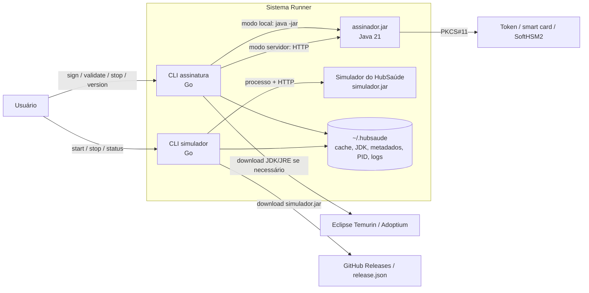
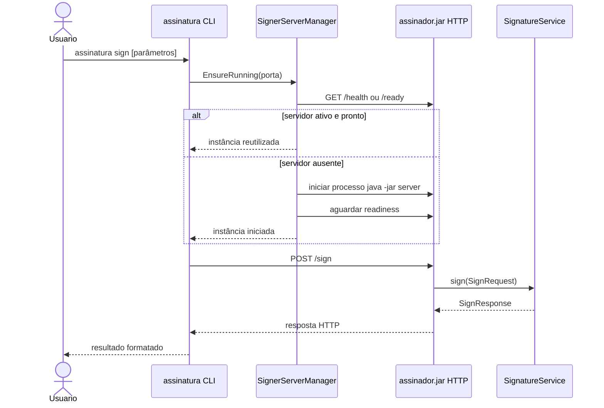

# 1. Identificação do documento

**Documento:** Especificação do Projeto Detalhado de Software  
**Sistema:** Sistema Runner  
**Disciplina:** Implementação e Integração de Software  
**Curso:** Engenharia de Software  
**Contexto institucional:** Trabalho prático relacionado à Plataforma HubSaúde, iniciativa de interesse da Secretaria de Estado da Saúde de Goiás (SES-GO) e da Universidade Federal de Goiás (UFG).  
**Tipo de documento:** Especificação do Projeto Detalhado de Software (EPDS)  
**Versão:** 1.0  
**Data:** 07/06/2026  
**Status:** Versão inicial consolidada a partir da especificação do trabalho prático, dos diagramas C4, dos critérios de qualidade, do plano revisado, das tarefas operacionais, da Especificação de Requisitos de Software e da Especificação de Arquitetura de Software.  
**Autores:** Equipe do Sistema Runner  

---

# 2. Histórico de versões

| Versão | Data | Autor(es) | Descrição da alteração |
|---|---:|---|---|
| 1.0 | 07/06/2026 | Equipe do Sistema Runner | Criação da versão inicial da especificação do projeto detalhado de software, consolidando módulos, estrutura de pastas, classes/structs principais, métodos, dados, interfaces, fluxos, regras, tratamento de erros, segurança, persistência, testes, rastreabilidade e decisões técnicas. |

---

# 3. Sumário

- [1. Identificação do documento](#1-identificação-do-documento)
- [2. Histórico de versões](#2-histórico-de-versões)
- [3. Sumário](#3-sumário)
- [4. Introdução](#4-introdução)
  - [4.1 Objetivo do documento](#41-objetivo-do-documento)
  - [4.2 Contexto do sistema](#42-contexto-do-sistema)
- [5. Escopo do projeto detalhado](#5-escopo-do-projeto-detalhado)
- [6. Visão geral da solução](#6-visão-geral-da-solução)
- [7. Organização de módulos](#7-organização-de-módulos)
- [8. Organização de pastas e arquivos](#8-organização-de-pastas-e-arquivos)
- [9. Projeto das classes principais](#9-projeto-das-classes-principais)
  - [9.1 Classes de entidade](#91-classes-de-entidade)
  - [9.2 Classes de serviço](#92-classes-de-serviço)
  - [9.3 Classes de repositório](#93-classes-de-repositório)
  - [9.4 Classes de controle](#94-classes-de-controle)
- [10. Projeto dos métodos principais](#10-projeto-dos-métodos-principais)
- [11. Projeto dos dados](#11-projeto-dos-dados)
  - [11.1 Entidades](#111-entidades)
  - [11.2 Campos](#112-campos)
  - [11.3 Relacionamentos](#113-relacionamentos)
  - [11.4 Restrições](#114-restrições)
- [12. Projeto das interfaces ou endpoints](#12-projeto-das-interfaces-ou-endpoints)
- [13. Fluxos principais do sistema](#13-fluxos-principais-do-sistema)
- [14. Regras de negócio detalhadas](#14-regras-de-negócio-detalhadas)
- [15. Tratamento de erros](#15-tratamento-de-erros)
- [16. Projeto de segurança](#16-projeto-de-segurança)
- [17. Projeto de persistência](#17-projeto-de-persistência)
- [18. Projeto de testes](#18-projeto-de-testes)
- [19. Rastreabilidade](#19-rastreabilidade)
- [20. Decisões técnicas principais](#20-decisões-técnicas-principais)

---

# 4. Introdução

## 4.1 Objetivo do documento

Este documento tem como objetivo especificar o **projeto detalhado de software** do **Sistema Runner**, descrevendo como a solução deve ser estruturada internamente para viabilizar a implementação, integração, testes, manutenção e evolução dos componentes previstos.

Enquanto a Especificação de Requisitos de Software define **o que** o sistema deve fazer e a Especificação de Arquitetura de Software define **como o sistema é organizado em alto nível**, este documento detalha **como os módulos, classes, métodos, dados, interfaces e fluxos devem ser projetados** para orientar a implementação do sistema.

Este documento deve servir como referência para:

- orientar a implementação dos CLIs `assinatura` e `simulador`;
- orientar a implementação do `assinador.jar` em Java;
- detalhar responsabilidades de módulos, classes, serviços e componentes;
- definir os principais métodos e contratos internos;
- especificar estruturas de dados, metadados e artefatos locais;
- detalhar os fluxos de execução dos casos de uso principais;
- estabelecer tratamento de erros, segurança, persistência e testes;
- preservar rastreabilidade entre requisitos, arquitetura, código, testes e entregáveis.

## 4.2 Contexto do sistema

O Sistema Runner é um sistema de linha de comando voltado para facilitar a execução de aplicações Java associadas à Plataforma HubSaúde. Seu objetivo é permitir que usuários executem operações de assinatura digital simulada, validação de assinatura simulada e gerenciamento do Simulador do HubSaúde sem precisar conhecer detalhes de Java, JVM, JARs, portas, endpoints HTTP, PKCS#11 ou comandos complexos de terminal.

O sistema é composto por:

- **CLI `assinatura`**, implementado em Go, responsável por receber comandos de criação e validação de assinatura e invocar o `assinador.jar` em modo local ou modo servidor;
- **`assinador.jar`**, implementado em Java 21, responsável por validar parâmetros, simular criação de assinatura, simular validação de assinatura e, quando aplicável, interagir com dispositivo criptográfico via PKCS#11;
- **CLI `simulador`**, implementado em Go, responsável por iniciar, parar e consultar o status do Simulador do HubSaúde;
- **Simulador do HubSaúde**, aplicação Java/Web gerenciada pelo CLI `simulador`;
- **diretório local gerenciado**, preferencialmente `~/.hubsaude/`, usado para armazenar JDK/JRE provisionado, JARs, cache, metadados de versão, PID, porta e logs operacionais;
- **pipeline de CI/CD**, responsável por validar, compilar, testar, gerar binários, publicar releases, gerar checksums e assinar artefatos.

---

# 5. Escopo do projeto detalhado

Este documento detalha os elementos necessários para transformar a arquitetura definida em uma implementação concreta e rastreável. Estão incluídos no escopo do projeto detalhado:

- organização dos módulos Go e Java;
- estrutura recomendada de pastas e arquivos;
- classes, structs, interfaces e componentes principais;
- métodos principais e suas responsabilidades;
- entidades de dados e metadados operacionais;
- contratos de CLI, subprocesso e HTTP;
- fluxos de assinatura, validação, servidor, simulador, provisionamento e release;
- regras de negócio detalhadas;
- tratamento de erros e códigos de saída;
- projeto de segurança da execução local e da cadeia de suprimentos;
- projeto de persistência operacional em sistema de arquivos;
- projeto de testes unitários, integração, contrato, aceitação e release;
- matriz de rastreabilidade entre requisitos, módulos e testes;
- decisões técnicas principais.

Não estão no escopo deste documento:

- implementação real de assinatura digital criptográfica;
- implementação real de validação criptográfica;
- integração real com autoridades certificadoras;
- autenticação de usuários;
- interface gráfica;
- persistência de assinaturas como dado de negócio;
- modelagem de banco de dados relacional;
- desenho de algoritmos criptográficos reais.

O projeto detalhado deve respeitar as restrições já estabelecidas: CLIs em Go 1.25, `assinador.jar` em Java 21, funcionamento multiplataforma em Windows/Linux/macOS `amd64`, modo servidor como padrão, modo local por ativação explícita, validação centralizada no `assinador.jar`, releases com SemVer, checksums SHA256 e assinatura Cosign/Sigstore.

---

# 6. Visão geral da solução

A solução é organizada como uma aplicação local multi-componente. O usuário interage com executáveis de linha de comando. Esses executáveis, por sua vez, orquestram aplicações Java, processos locais, chamadas HTTP, downloads, cache e verificações de integridade.

A visão lógica da solução pode ser representada da seguinte forma:



O **CLI `assinatura`** deve atuar como orquestrador das operações de assinatura e validação. Ele decide se usará o modo servidor ou modo local, garante que exista Java disponível, localiza ou inicia o `assinador.jar`, envia os parâmetros, interpreta a resposta e apresenta resultado legível ao usuário.

O **`assinador.jar`** deve concentrar as regras de validação de parâmetros e simulação. Ele deve possuir entrada por linha de comando para o modo local e endpoints HTTP para o modo servidor, reutilizando a mesma lógica interna de validação e simulação em ambos os modos.

O **CLI `simulador`** deve gerenciar o ciclo de vida do Simulador do HubSaúde. Ele deve verificar a porta, obter o `simulador.jar` quando necessário, iniciar o processo, aguardar readiness, consultar status e encerrar o serviço quando solicitado.

O **diretório `~/.hubsaude/`** deve funcionar como área local de trabalho do sistema, armazenando artefatos, versões, PID, porta, logs e JDK/JRE provisionado.

---

# 7. Organização de módulos

## 7.1 Módulos do projeto Go

| Módulo/Pacote | Responsabilidade principal | Usado por |
|---|---|---|
| `cmd/assinatura` | Ponto de entrada do binário `assinatura`. Inicializa o CLI e injeta versão. | Usuário final, CI/CD |
| `cmd/simulador` | Ponto de entrada do binário `simulador`. Inicializa comandos de ciclo de vida do simulador. | Usuário final, CI/CD |
| `internal/cli` | Define comandos, subcomandos, flags e ajuda dos CLIs. | `cmd/assinatura`, `cmd/simulador` |
| `internal/signature` | Orquestra casos de uso de assinatura e validação. | CLI `assinatura` |
| `internal/simulator` | Orquestra casos de uso do Simulador do HubSaúde. | CLI `simulador` |
| `internal/invoker` | Implementa invocação local por subprocesso e invocação HTTP. | `internal/signature` |
| `internal/process` | Gerencia PID, porta, health check, readiness, start, stop e status. | `signature`, `simulator` |
| `internal/jdk` | Detecta e provisiona JDK/JRE compatível. | `signature`, `simulator` |
| `internal/release` | Consulta releases, baixa artefatos e verifica integridade. | `simulator`, `jdk`, CI auxiliar |
| `internal/config` | Centraliza configurações, portas padrão, caminhos e variáveis de ambiente. | Todos os módulos Go |
| `internal/storage` | Lê e grava metadados operacionais no sistema de arquivos. | `process`, `release`, `jdk` |
| `internal/output` | Formata resultados, status e erros para terminal. | CLIs |
| `internal/errors` | Padroniza tipos de erro e códigos de saída. | Todos os módulos Go |
| `internal/logging` | Centraliza logs estruturados e níveis de log. | Todos os módulos Go |

## 7.2 Módulos do projeto Java

| Pacote Java sugerido | Responsabilidade principal |
|---|---|
| `br.ufg.hubsaude.runner.assinador` | Ponto de entrada e configuração geral do `assinador.jar`. |
| `br.ufg.hubsaude.runner.assinador.cli` | Entrada local por linha de comando. |
| `br.ufg.hubsaude.runner.assinador.http` | Controllers/endpoints HTTP. |
| `br.ufg.hubsaude.runner.assinador.domain` | Entidades de domínio da assinatura simulada. |
| `br.ufg.hubsaude.runner.assinador.service` | Serviços de assinatura, validação e simulação. |
| `br.ufg.hubsaude.runner.assinador.validation` | Validação de parâmetros de assinatura e validação. |
| `br.ufg.hubsaude.runner.assinador.pkcs11` | Adaptação para PKCS#11, token, smart card ou simulador. |
| `br.ufg.hubsaude.runner.assinador.server` | Ciclo de vida do servidor, health check, readiness, shutdown e timeout de inatividade. |
| `br.ufg.hubsaude.runner.assinador.error` | Modelo padronizado de erros e respostas. |
| `br.ufg.hubsaude.runner.assinador.logging` | Logs estruturados do `assinador.jar`. |

## 7.3 Módulos de automação e distribuição

| Módulo | Responsabilidade |
|---|---|
| `.github/workflows/build.yml` | Executar lint, vet, testes e build em push/PR para `main`. |
| `.github/workflows/release.yml` | Executar testes, gerar binários, gerar checksums, assinar artefatos e publicar release. |
| `docs/adr` | Armazenar decisões técnicas e arquiteturais relevantes. |
| `docs/diagramas` | Armazenar fontes PlantUML e imagens geradas dos diagramas C4. |
| `scripts/` | Scripts auxiliares de geração, verificação ou automação, quando necessários. |

---

# 8. Organização de pastas e arquivos

A estrutura sugerida do repositório deve favorecer separação de responsabilidades, rastreabilidade e CI/CD unificado.

```text
runner/
├── cmd/
│   ├── assinatura/
│   │   ├── main.go
│   │   └── version_test.go
│   └── simulador/
│       ├── main.go
│       └── version_test.go
├── internal/
│   ├── cli/
│   │   ├── assinatura_commands.go
│   │   ├── simulador_commands.go
│   │   └── help.go
│   ├── signature/
│   │   ├── command_handler.go
│   │   ├── mode_resolver.go
│   │   └── dto.go
│   ├── simulator/
│   │   ├── lifecycle_manager.go
│   │   ├── downloader.go
│   │   └── dto.go
│   ├── invoker/
│   │   ├── local_jar_invoker.go
│   │   ├── http_signer_client.go
│   │   └── invoker.go
│   ├── process/
│   │   ├── process_manager.go
│   │   ├── process_registry.go
│   │   ├── health_checker.go
│   │   └── port_checker.go
│   ├── jdk/
│   │   ├── detector.go
│   │   ├── provider.go
│   │   └── installer.go
│   ├── release/
│   │   ├── metadata_client.go
│   │   ├── downloader.go
│   │   └── artifact_verifier.go
│   ├── config/
│   │   ├── paths.go
│   │   ├── defaults.go
│   │   └── runtime_config.go
│   ├── storage/
│   │   ├── file_store.go
│   │   └── metadata_store.go
│   ├── output/
│   │   ├── formatter.go
│   │   └── terminal_writer.go
│   ├── errors/
│   │   ├── app_error.go
│   │   └── exit_codes.go
│   └── logging/
│       └── logger.go
├── assinador/
│   ├── pom.xml
│   └── src/
│       ├── main/
│       │   └── java/
│       │       └── br/ufg/hubsaude/runner/assinador/
│       │           ├── AssinadorApplication.java
│       │           ├── cli/
│       │           │   └── CliEntryPoint.java
│       │           ├── http/
│       │           │   └── SignatureController.java
│       │           ├── domain/
│       │           │   ├── SignRequest.java
│       │           │   ├── SignResponse.java
│       │           │   ├── ValidateRequest.java
│       │           │   ├── ValidateResponse.java
│       │           │   └── ErrorResponse.java
│       │           ├── service/
│       │           │   ├── SignatureService.java
│       │           │   └── FakeSignatureService.java
│       │           ├── validation/
│       │           │   ├── ParameterValidator.java
│       │           │   └── ValidationResult.java
│       │           ├── pkcs11/
│       │           │   └── Pkcs11ProviderAdapter.java
│       │           ├── server/
│       │           │   └── ServerLifecycle.java
│       │           └── error/
│       │               └── ErrorResponseFactory.java
│       └── test/
│           └── java/
├── docs/
│   ├── requisitos/
│   ├── arquitetura/
│   ├── projeto-detalhado/
│   ├── adr/
│   └── diagramas/
├── .github/
│   └── workflows/
│       ├── build.yml
│       └── release.yml
├── go.mod
├── go.sum
├── .gitignore
├── .gitattributes
├── LICENSE
└── README.md
```

## 8.1 Regras de organização

- O diretório `cmd/` deve conter apenas pontos de entrada dos binários.
- O diretório `internal/` deve conter pacotes Go não exportados para uso externo.
- A lógica de negócio e integração não deve ficar concentrada em `main.go`.
- O projeto Java deve ficar isolado em `assinador/`, com build próprio.
- Documentos de requisitos, arquitetura, projeto detalhado e ADRs devem ficar em `docs/`.
- Artefatos gerados, binários, `target/`, caches, logs, `.idea/`, `.DS_Store`, `__pycache__/` e similares não devem ser versionados.
- Caminhos e nomes de arquivos devem evitar espaços e acentos.
- O repositório deve possuir `.gitignore`, `.gitattributes`, `LICENSE` e `README.md`.

---

# 9. Projeto das classes principais

Neste documento, o termo “classe” é usado em sentido amplo para representar **classes Java**, **interfaces Java**, **structs Go**, **interfaces Go** e **componentes de controle**. Como o sistema usa Go e Java, a modelagem respeita as características de cada linguagem.

## 9.1 Classes de entidade

As classes de entidade representam dados de domínio ou dados operacionais trocados entre componentes.

### 9.1.1 Entidades do domínio de assinatura

| Classe/Struct | Linguagem | Responsabilidade | Principais campos |
|---|---|---|---|
| `SignRequest` | Java/Go DTO | Representa uma solicitação de criação de assinatura simulada. | `documentPath`, `profile`, `parameters`, `mode`, `timestamp` |
| `SignResponse` | Java/Go DTO | Representa a resposta de criação de assinatura simulada. | `signatureId`, `status`, `signatureValue`, `algorithm`, `createdAt`, `message` |
| `ValidateRequest` | Java/Go DTO | Representa uma solicitação de validação de assinatura simulada. | `signaturePath`, `signatureValue`, `documentPath`, `parameters`, `timestamp` |
| `ValidateResponse` | Java/Go DTO | Representa o resultado de validação simulada. | `valid`, `status`, `reason`, `validatedAt`, `message` |
| `ValidationResult` | Java | Representa o resultado da validação de parâmetros. | `valid`, `errors` |
| `ValidationError` | Java/Go DTO | Representa um erro específico de validação. | `field`, `code`, `message`, `suggestion` |

### 9.1.2 Entidades operacionais

| Classe/Struct | Linguagem | Responsabilidade | Principais campos |
|---|---|---|---|
| `RuntimeConfig` | Go | Representa configurações de execução dos CLIs. | `homeDir`, `defaultPort`, `timeout`, `verbose`, `quiet` |
| `ProcessInfo` | Go | Representa um processo gerenciado. | `name`, `pid`, `port`, `startedAt`, `command`, `status` |
| `ServerStatus` | Go | Representa estado de servidor local. | `running`, `ready`, `port`, `pid`, `version`, `message` |
| `ArtifactMetadata` | Go | Representa informações de artefato baixado ou publicado. | `name`, `version`, `url`, `sha256`, `localPath` |
| `JdkInfo` | Go | Representa uma instalação Java detectada ou provisionada. | `version`, `javaPath`, `home`, `source`, `valid` |
| `DownloadResult` | Go | Representa resultado de download. | `success`, `path`, `checksum`, `fromCache`, `error` |
| `AppError` | Go | Representa erro estruturado da aplicação. | `kind`, `code`, `message`, `cause`, `suggestion`, `exitCode` |
| `ErrorResponse` | Java/Go DTO | Representa resposta padronizada de erro em HTTP ou CLI. | `errorCode`, `message`, `details`, `suggestion`, `timestamp` |

## 9.2 Classes de serviço

As classes de serviço implementam lógica de aplicação e orquestração dos casos de uso.

### 9.2.1 Serviços em Go

| Classe/Struct/Interface | Responsabilidade | Métodos principais |
|---|---|---|
| `SignatureCommandHandler` | Orquestra comandos `sign` e `validate`. | `Sign(ctx, options)`, `Validate(ctx, options)` |
| `ModeResolver` | Decide modo de execução: servidor ou local. | `Resolve(ctx, options)`, `ShouldUseServer(options)` |
| `LocalJarInvoker` | Executa `assinador.jar` por subprocesso. | `Invoke(ctx, args)`, `BuildCommand(args)` |
| `HttpSignerClient` | Chama endpoints HTTP do `assinador.jar`. | `Sign(ctx, request)`, `Validate(ctx, request)`, `Health(ctx)` |
| `SignerServerManager` | Gerencia ciclo de vida do servidor `assinador.jar`. | `Start(ctx, port)`, `Stop(ctx, port)`, `Status(ctx, port)`, `EnsureRunning(ctx, port)` |
| `SimulatorLifecycleManager` | Gerencia ciclo de vida do Simulador do HubSaúde. | `Start(ctx, options)`, `Stop(ctx, port)`, `Status(ctx, port)` |
| `JdkProvider` | Detecta ou baixa JDK/JRE compatível. | `EnsureJava(ctx)`, `Detect()`, `Provision(ctx)` |
| `ReleaseService` | Consulta e baixa artefatos. | `GetLatest(ctx)`, `Download(ctx, metadata)`, `Verify(path, checksum)` |
| `OutputFormatter` | Converte respostas em mensagens legíveis. | `FormatSignResponse(resp)`, `FormatValidateResponse(resp)`, `FormatStatus(status)` |
| `ErrorMapper` | Converte exceções/erros internos em `AppError`. | `Map(err)`, `ExitCode(err)`, `UserMessage(err)` |

### 9.2.2 Serviços em Java

| Classe/Interface | Responsabilidade | Métodos principais |
|---|---|---|
| `SignatureService` | Define contrato de assinatura e validação. | `sign(SignRequest)`, `validate(ValidateRequest)` |
| `FakeSignatureService` | Implementa simulação de assinatura e validação. | `sign(request)`, `validate(request)` |
| `ParameterValidator` | Valida parâmetros obrigatórios e formatos. | `validateSign(request)`, `validateValidation(request)` |
| `Pkcs11ProviderAdapter` | Encapsula integração PKCS#11. | `isAvailable()`, `loadProvider(config)`, `testConnection()` |
| `ServerLifecycle` | Controla servidor HTTP. | `start(port)`, `stop()`, `health()`, `ready()`, `resetIdleTimer()` |
| `ErrorResponseFactory` | Padroniza respostas de erro. | `fromValidation(errors)`, `fromException(ex)`, `systemError(ex)` |

## 9.3 Classes de repositório

O sistema não possui banco de dados. Portanto, os “repositórios” são abstrações de acesso ao sistema de arquivos e metadados locais.

| Classe/Struct | Linguagem | Responsabilidade | Métodos principais |
|---|---|---|---|
| `ProcessRegistry` | Go | Lê e grava informações de processos gerenciados. | `Save(info)`, `Find(name, port)`, `Delete(name, port)`, `List()` |
| `MetadataStore` | Go | Armazena versões, checksums e metadados de artefatos. | `SaveArtifact(metadata)`, `GetArtifact(name)`, `IsCurrent(name, version)` |
| `FileStore` | Go | Manipula diretórios e arquivos locais. | `EnsureDir(path)`, `Exists(path)`, `WriteAtomic(path, data)`, `Read(path)` |
| `JdkStore` | Go | Controla instalação local do JDK/JRE. | `FindManagedJdk()`, `SaveJdkInfo(info)`, `GetJavaPath()` |
| `LogStore` | Go/Java | Armazena logs operacionais quando necessário. | `OpenLog(name)`, `RotateIfNeeded()`, `Write(entry)` |

## 9.4 Classes de controle

As classes de controle recebem comandos, requisições ou eventos externos e encaminham para serviços apropriados.

### 9.4.1 Controles em Go

| Classe/Componente | Responsabilidade |
|---|---|
| `AssinaturaRootCommand` | Define comando raiz do CLI `assinatura`. |
| `SignCommand` | Recebe parâmetros do usuário para criar assinatura simulada. |
| `ValidateCommand` | Recebe parâmetros do usuário para validar assinatura simulada. |
| `AssinaturaStopCommand` | Recebe comando para encerrar `assinador.jar` em modo servidor. |
| `AssinaturaVersionCommand` | Exibe versão atual do CLI. |
| `SimuladorRootCommand` | Define comando raiz do CLI `simulador`. |
| `SimulatorStartCommand` | Recebe comando para iniciar o Simulador do HubSaúde. |
| `SimulatorStopCommand` | Recebe comando para parar o Simulador do HubSaúde. |
| `SimulatorStatusCommand` | Recebe comando para consultar status do Simulador do HubSaúde. |

### 9.4.2 Controles em Java

| Classe | Responsabilidade |
|---|---|
| `CliEntryPoint` | Recebe argumentos de modo local e aciona serviços de assinatura/validação. |
| `SignatureController` | Expõe endpoints HTTP `/sign` e `/validate`. |
| `HealthController` ou equivalente | Expõe endpoints de health/readiness. |
| `ShutdownController` ou equivalente | Expõe endpoint de encerramento controlado do servidor. |

---

# 10. Projeto dos métodos principais

## 10.1 Métodos principais do CLI `assinatura`

| Método | Entrada | Saída | Responsabilidade | Erros tratados |
|---|---|---|---|---|
| `main()` | Argumentos do processo | Código de saída | Inicializar comando raiz e executar CLI. | Erro de parsing, erro interno. |
| `NewAssinaturaCommand(version)` | Versão do build | Comando Cobra | Criar árvore de comandos do CLI. | Configuração inválida. |
| `Sign(ctx, options)` | Opções do comando `sign` | `SignResponse` | Orquestrar criação de assinatura. | Parâmetro ausente, servidor indisponível, JAR ausente. |
| `Validate(ctx, options)` | Opções do comando `validate` | `ValidateResponse` | Orquestrar validação de assinatura. | Payload inválido, resposta malformada, erro do JAR. |
| `Resolve(ctx, options)` | Flags e contexto | `ExecutionMode` | Escolher entre modo local e servidor. | Modo incompatível, porta inválida. |
| `EnsureRunning(ctx, port)` | Porta | `ServerStatus` | Garantir que `assinador.jar` esteja ativo em modo servidor. | Porta ocupada, health check falhou, Java ausente. |
| `Invoke(ctx, args)` | Lista de argumentos | `InvocationResult` | Invocar `java -jar assinador.jar` em modo local. | Exit code não zero, timeout, Java ausente. |
| `Stop(ctx, port)` | Porta | `ServerStatus` | Encerrar servidor do `assinador.jar`. | Processo inexistente, falha no shutdown. |
| `FormatSignResponse(resp)` | Resposta de assinatura | Texto | Apresentar resultado ao usuário. | Campos ausentes ou resposta inválida. |
| `Map(err)` | Erro interno | `AppError` | Padronizar erro, mensagem e código de saída. | Erro desconhecido. |

## 10.2 Métodos principais do CLI `simulador`

| Método | Entrada | Saída | Responsabilidade | Erros tratados |
|---|---|---|---|---|
| `NewSimuladorCommand(version)` | Versão do build | Comando Cobra | Criar comandos `start`, `stop`, `status`. | Configuração inválida. |
| `Start(ctx, options)` | Porta, URL opcional, flags | `ServerStatus` | Iniciar Simulador do HubSaúde. | Porta ocupada, JAR ausente, download falhou. |
| `Stop(ctx, port)` | Porta | `ServerStatus` | Encerrar simulador por endpoint ou processo. | Falha no shutdown, processo inexistente. |
| `Status(ctx, port)` | Porta | `ServerStatus` | Consultar `/api/info` e metadados locais. | Conexão recusada, resposta malformada. |
| `EnsureSimulatorJar(ctx, source)` | URL/fonte | Caminho local | Garantir que `simulador.jar` exista localmente. | Falha de download, checksum inválido. |
| `CheckPort(port)` | Porta | Booleano/resultado | Verificar disponibilidade da porta. | Porta inválida, permissão negada. |
| `WaitUntilReady(ctx, endpoint)` | URL de readiness | `ServerStatus` | Aguardar serviço pronto. | Timeout, resposta inválida. |

## 10.3 Métodos principais do `assinador.jar`

| Método | Entrada | Saída | Responsabilidade | Erros tratados |
|---|---|---|---|---|
| `main(String[] args)` | Argumentos Java | Código de saída | Escolher modo CLI/local ou servidor. | Argumento inválido, falha de inicialização. |
| `sign(SignRequest request)` | Dados de assinatura | `SignResponse` | Validar e simular assinatura. | Parâmetro inválido, erro de simulação. |
| `validate(ValidateRequest request)` | Dados de validação | `ValidateResponse` | Validar e simular validação. | Parâmetro inválido, assinatura ausente. |
| `validateSign(request)` | Solicitação de assinatura | `ValidationResult` | Validar parâmetros de criação. | Campos obrigatórios ausentes, formato inválido. |
| `validateValidation(request)` | Solicitação de validação | `ValidationResult` | Validar parâmetros de validação. | Campos obrigatórios ausentes, formato inválido. |
| `createFakeSignature(request)` | Solicitação validada | Valor simulado | Gerar resposta pré-construída. | Falha interna de simulação. |
| `checkPkcs11Availability()` | Configuração PKCS#11 | Resultado | Verificar disponibilidade de token/simulador. | Provider ausente, slot inválido. |
| `health()` | Nenhuma | Status | Indicar que servidor está vivo. | Falha interna. |
| `ready()` | Nenhuma | Status | Indicar que servidor está pronto. | Inicialização incompleta. |
| `shutdown()` | Nenhuma | Confirmação | Encerrar servidor de forma controlada. | Falha ao encerrar. |
| `resetIdleTimer()` | Evento de requisição | Nenhuma | Reiniciar contagem de inatividade. | Falha de agenda/timer. |

## 10.4 Contratos de retorno dos métodos

Os métodos que executam operações relevantes devem retornar objetos estruturados, evitando depender apenas de texto livre. Recomenda-se que respostas internas tenham pelo menos:

- indicador de sucesso ou falha;
- código da operação;
- mensagem legível;
- dados da operação;
- lista de erros, quando aplicável;
- timestamp;
- código de saída ou status HTTP, quando aplicável.

---

# 11. Projeto dos dados

## 11.1 Entidades

As entidades do sistema são divididas em três grupos: entidades de domínio, entidades operacionais e entidades de distribuição.

### 11.1.1 Entidades de domínio

| Entidade | Descrição |
|---|---|
| `SignRequest` | Solicitação de criação de assinatura simulada. |
| `SignResponse` | Resposta com assinatura simulada. |
| `ValidateRequest` | Solicitação de validação de assinatura simulada. |
| `ValidateResponse` | Resultado de validação simulada. |
| `ValidationError` | Erro de validação de um campo ou parâmetro. |
| `ErrorResponse` | Estrutura padronizada de erro para CLI/HTTP. |

### 11.1.2 Entidades operacionais

| Entidade | Descrição |
|---|---|
| `ProcessInfo` | Informações de processo gerenciado pelo Runner. |
| `ServerStatus` | Estado atual de um servidor local. |
| `RuntimeConfig` | Configurações de execução dos CLIs. |
| `JdkInfo` | Informações sobre JDK/JRE detectado ou provisionado. |
| `ArtifactMetadata` | Dados de artefato local ou remoto. |
| `DownloadResult` | Resultado do processo de download. |

### 11.1.3 Entidades de distribuição

| Entidade | Descrição |
|---|---|
| `ReleaseMetadata` | Informações obtidas de `release.json` ou GitHub Releases. |
| `ChecksumEntry` | Hash SHA256 associado a um artefato. |
| `CosignSignature` | Referência a arquivos `.sig` e `.pem` de um artefato assinado. |

## 11.2 Campos

### 11.2.1 Campos sugeridos para `SignRequest`

| Campo | Tipo | Obrigatório | Descrição |
|---|---|---:|---|
| `documentPath` | string | Sim | Caminho do documento a ser assinado ou referência equivalente. |
| `profile` | string | Não | Perfil ou modo de assinatura simulada, quando aplicável. |
| `parameters` | map/string | Não | Parâmetros adicionais definidos pelo contrato. |
| `mode` | string | Não | Modo de execução: `local` ou `server`. |
| `timestamp` | datetime | Não | Momento da solicitação. |

### 11.2.2 Campos sugeridos para `SignResponse`

| Campo | Tipo | Obrigatório | Descrição |
|---|---|---:|---|
| `signatureId` | string | Sim | Identificador da assinatura simulada. |
| `status` | string | Sim | Status da operação. |
| `signatureValue` | string | Sim | Valor simulado da assinatura. |
| `algorithm` | string | Não | Algoritmo declarado para simulação. |
| `createdAt` | datetime | Sim | Data/hora da criação simulada. |
| `message` | string | Sim | Mensagem legível para o usuário. |

### 11.2.3 Campos sugeridos para `ValidateRequest`

| Campo | Tipo | Obrigatório | Descrição |
|---|---|---:|---|
| `signaturePath` | string | Condicional | Caminho para arquivo de assinatura, quando aplicável. |
| `signatureValue` | string | Condicional | Valor da assinatura simulada, quando informado diretamente. |
| `documentPath` | string | Não | Caminho do documento associado. |
| `parameters` | map/string | Não | Parâmetros adicionais de validação. |
| `timestamp` | datetime | Não | Momento da solicitação. |

### 11.2.4 Campos sugeridos para `ValidateResponse`

| Campo | Tipo | Obrigatório | Descrição |
|---|---|---:|---|
| `valid` | boolean | Sim | Indica se a assinatura foi considerada válida na simulação. |
| `status` | string | Sim | Status da operação. |
| `reason` | string | Não | Motivo do resultado. |
| `validatedAt` | datetime | Sim | Data/hora da validação simulada. |
| `message` | string | Sim | Mensagem legível para o usuário. |

### 11.2.5 Campos sugeridos para `ProcessInfo`

| Campo | Tipo | Obrigatório | Descrição |
|---|---|---:|---|
| `name` | string | Sim | Nome lógico do processo: `assinador` ou `simulador`. |
| `pid` | integer | Sim | Identificador do processo no sistema operacional. |
| `port` | integer | Sim | Porta usada pelo processo. |
| `command` | string/list | Sim | Comando usado para iniciar o processo. |
| `startedAt` | datetime | Sim | Data/hora de início. |
| `status` | string | Sim | Status conhecido: `starting`, `running`, `stopped`, `unknown`. |
| `version` | string | Não | Versão do artefato executado, quando disponível. |

### 11.2.6 Campos sugeridos para `ArtifactMetadata`

| Campo | Tipo | Obrigatório | Descrição |
|---|---|---:|---|
| `name` | string | Sim | Nome do artefato. |
| `version` | string | Sim | Versão SemVer ou identificador equivalente. |
| `url` | string | Sim | URL de origem. |
| `sha256` | string | Condicional | Checksum esperado. |
| `localPath` | string | Sim | Caminho local após download. |
| `downloadedAt` | datetime | Não | Data/hora de download. |
| `verified` | boolean | Sim | Indica se a integridade foi verificada. |

## 11.3 Relacionamentos

| Relacionamento | Descrição |
|---|---|
| `SignRequest` gera `SignResponse` | Uma solicitação válida de assinatura produz uma resposta simulada. |
| `ValidateRequest` gera `ValidateResponse` | Uma solicitação válida de validação produz um resultado simulado. |
| `ValidationResult` contém `ValidationError` | Uma validação pode gerar zero ou mais erros. |
| `ProcessInfo` descreve um servidor | Cada processo gerenciado deve ter PID, porta e status associados. |
| `ArtifactMetadata` descreve um artefato local/remoto | Cada JAR, JDK ou binário pode ser rastreado por nome, versão, checksum e local. |
| `RuntimeConfig` influencia invocações | Configurações como porta, timeout e modo afetam os serviços. |
| `JdkInfo` é usado por invocadores Java | O caminho do Java detectado/provisionado é usado para executar os JARs. |
| `ErrorResponse` representa falhas de serviços | Falhas de validação, sistema ou integração devem gerar erro estruturado. |

## 11.4 Restrições

| ID | Restrição de dados |
|---|---|
| RD-01 | Dados de assinatura e validação são simulados e não devem ser tratados como assinatura digital real. |
| RD-02 | Assinaturas simuladas não devem ser armazenadas como histórico de negócio. |
| RD-03 | Campos obrigatórios devem ser validados pelo `assinador.jar`. |
| RD-04 | Portas devem ser números inteiros válidos no intervalo permitido pelo sistema operacional. |
| RD-05 | Metadados locais devem ser gravados em formato legível e simples, preferencialmente JSON. |
| RD-06 | Escritas de metadados devem ser atômicas sempre que possível, evitando arquivos corrompidos. |
| RD-07 | Checksums devem ser comparados antes de executar artefatos baixados quando o checksum estiver disponível. |
| RD-08 | Caminhos locais devem respeitar diferenças entre Windows, Linux e macOS. |
| RD-09 | Logs não devem registrar segredos ou dados sensíveis desnecessários. |
| RD-10 | O sistema deve usar UTF-8 para arquivos de texto e mensagens. |

---

# 12. Projeto das interfaces ou endpoints

## 12.1 Interface CLI `assinatura`

### 12.1.1 Comando raiz

```bash
assinatura [comando] [opções]
```

Responsabilidades:

- exibir ajuda geral;
- direcionar para subcomandos;
- aplicar opções globais;
- retornar código de saída adequado.

### 12.1.2 Comando `version`

```bash
assinatura version
```

Saída esperada:

```text
assinatura v0.1.0
```

### 12.1.3 Comando `sign`

```bash
assinatura sign [parâmetros] [--local] [--port <porta>] [--timeout <minutos>]
```

Responsabilidades:

- receber parâmetros de criação de assinatura;
- decidir modo de execução;
- garantir disponibilidade do `assinador.jar`;
- invocar o serviço local ou HTTP;
- exibir assinatura simulada ou erro.

### 12.1.4 Comando `validate`

```bash
assinatura validate [parâmetros] [--local] [--port <porta>]
```

Responsabilidades:

- receber parâmetros de validação;
- decidir modo de execução;
- invocar o `assinador.jar`;
- exibir resultado de validação simulada.

### 12.1.5 Comando `stop`

```bash
assinatura stop [--port <porta>]
```

Responsabilidades:

- localizar instância do `assinador.jar` em modo servidor;
- solicitar shutdown por endpoint ou mecanismo definido;
- atualizar metadados locais;
- informar resultado ao usuário.

## 12.2 Interface CLI `simulador`

### 12.2.1 Comando raiz

```bash
simulador [comando] [opções]
```

### 12.2.2 Comando `start`

```bash
simulador start [--port 8443] [--source <url>]
```

Responsabilidades:

- verificar porta;
- garantir `simulador.jar` local;
- garantir JDK/JRE compatível;
- iniciar processo;
- aguardar readiness;
- registrar PID, porta e versão.

### 12.2.3 Comando `status`

```bash
simulador status [--port 8443]
```

Responsabilidades:

- consultar metadados locais;
- consultar `/api/info`;
- informar se o simulador está parado, iniciando, ativo ou indisponível.

### 12.2.4 Comando `stop`

```bash
simulador stop [--port 8443]
```

Responsabilidades:

- localizar instância ativa;
- solicitar encerramento por `/shutdown`;
- confirmar encerramento;
- atualizar metadados.

## 12.3 Interface local CLI `assinatura` ↔ `assinador.jar`

Formato conceitual:

```bash
java -jar assinador.jar sign [parâmetros]
java -jar assinador.jar validate [parâmetros]
java -jar assinador.jar server --port <porta> --timeout <minutos>
```

Contrato obrigatório:

- argumentos devem ser passados como lista, não como string concatenada;
- `stdout` deve conter resultado da operação;
- `stderr` deve conter diagnósticos e erros;
- exit code `0` deve indicar sucesso;
- exit codes diferentes de `0` devem diferenciar erro de usuário e erro de sistema.

## 12.4 Endpoints HTTP do `assinador.jar`

| Método | Endpoint | Entrada | Saída | Status esperados |
|---|---|---|---|---|
| `GET` | `/health` | Nenhuma | Status simples do servidor | `200` |
| `GET` | `/ready` | Nenhuma | Status de prontidão | `200`, `503` |
| `POST` | `/sign` | `SignRequest` | `SignResponse` ou `ErrorResponse` | `200`, `400`, `500` |
| `POST` | `/validate` | `ValidateRequest` | `ValidateResponse` ou `ErrorResponse` | `200`, `400`, `500` |
| `POST` ou `GET` | `/shutdown` | Nenhuma ou token local, se definido | Confirmação | `200`, `404`, `500` |

### 12.4.1 Exemplo conceitual de `SignRequest`

```json
{
  "documentPath": "documento.xml",
  "profile": "padrao",
  "parameters": {}
}
```

### 12.4.2 Exemplo conceitual de `SignResponse`

```json
{
  "signatureId": "assinatura-simulada-001",
  "status": "success",
  "signatureValue": "SIMULATED_SIGNATURE_VALUE",
  "algorithm": "SIMULATED",
  "createdAt": "2026-06-07T13:00:00Z",
  "message": "Assinatura simulada criada com sucesso."
}
```

### 12.4.3 Exemplo conceitual de `ErrorResponse`

```json
{
  "errorCode": "INVALID_PARAMETER",
  "message": "Parâmetro inválido.",
  "details": [
    {
      "field": "documentPath",
      "message": "O caminho do documento não pode ser vazio."
    }
  ],
  "suggestion": "Informe um caminho de arquivo válido e tente novamente.",
  "timestamp": "2026-06-07T13:00:00Z"
}
```

## 12.5 Endpoints HTTP do Simulador do HubSaúde

| Método | Endpoint | Finalidade | Status esperados |
|---|---|---|---|
| `GET` | `/api/info` | Consultar informações e status do simulador. | `200`, `503` |
| `POST` ou `GET` | `/shutdown` | Encerrar o simulador. | `200`, `404`, `500` |
| `GET` | `/health` ou equivalente | Verificar se o processo está vivo, se disponível. | `200`, `503` |
| `GET` | `/ready` ou equivalente | Verificar se está pronto para requisições, se disponível. | `200`, `503` |

---

# 13. Fluxos principais do sistema

## 13.1 Fluxo de criação de assinatura em modo servidor



## 13.2 Fluxo de criação de assinatura em modo local

```text
1. Usuário executa `assinatura sign --local ...`.
2. CLI interpreta comando e flags.
3. CLI verifica Java/JDK/JRE disponível ou provisionado.
4. CLI localiza `assinador.jar`.
5. CLI monta lista de argumentos preservando espaços, acentos e aspas.
6. CLI executa subprocesso `java -jar assinador.jar sign ...`.
7. `assinador.jar` valida parâmetros.
8. `assinador.jar` retorna assinatura simulada ou erro.
9. CLI captura stdout, stderr e exit code.
10. CLI formata o resultado ou erro para o usuário.
```

## 13.3 Fluxo de validação de assinatura

```text
1. Usuário executa `assinatura validate ...`.
2. CLI decide entre modo servidor e modo local.
3. CLI envia parâmetros ao `assinador.jar`.
4. `assinador.jar` valida parâmetros de validação.
5. `assinador.jar` retorna resultado simulado: válido ou inválido.
6. CLI apresenta resultado legível ao usuário.
```

## 13.4 Fluxo de inicialização do `assinador.jar` em modo servidor

```text
1. CLI recebe operação que exige modo servidor.
2. CLI consulta registro local em `~/.hubsaude/`.
3. CLI verifica se há PID e porta registrados.
4. CLI executa health check real no endpoint do servidor.
5. Se a instância estiver ativa e pronta, reutiliza.
6. Se não houver instância válida, verifica se a porta está disponível.
7. CLI garante Java/JDK/JRE compatível.
8. CLI inicia `assinador.jar` como processo em segundo plano.
9. CLI aguarda readiness com timeout.
10. CLI grava PID, porta, versão e status no registro local.
```

## 13.5 Fluxo de parada do `assinador.jar`

```text
1. Usuário executa `assinatura stop --port <porta>`.
2. CLI consulta registro local.
3. CLI executa health check para confirmar instância.
4. CLI solicita shutdown pelo endpoint definido.
5. CLI aguarda encerramento com timeout.
6. CLI remove ou atualiza metadados locais.
7. CLI informa sucesso ou erro claro ao usuário.
```

## 13.6 Fluxo de início do Simulador do HubSaúde

```text
1. Usuário executa `simulador start`.
2. CLI verifica porta padrão 8443 ou porta informada.
3. CLI verifica se `simulador.jar` está disponível localmente.
4. Se não estiver, consulta release metadata e baixa o artefato.
5. CLI verifica checksum do artefato quando disponível.
6. CLI garante Java/JDK/JRE compatível.
7. CLI inicia o processo do simulador.
8. CLI aguarda readiness por `/api/info`, `/ready` ou endpoint equivalente.
9. CLI grava PID, porta, versão e status.
10. CLI informa que o simulador foi iniciado com sucesso.
```

## 13.7 Fluxo de status do Simulador

```text
1. Usuário executa `simulador status`.
2. CLI consulta metadados locais.
3. CLI tenta consultar `/api/info` na porta registrada ou padrão.
4. Se o serviço responder, exibe status e readiness.
5. Se não responder, informa que não está em execução ou está indisponível.
6. Se houver metadado obsoleto, marca como inativo ou remove o registro.
```

## 13.8 Fluxo de provisionamento de JDK/JRE

```text
1. Componente `JdkProvider` verifica Java no PATH.
2. Se Java compatível existir, retorna `JdkInfo` válido.
3. Se não existir, verifica diretório gerenciado `~/.hubsaude/jdk/`.
4. Se houver JDK/JRE compatível no diretório gerenciado, reutiliza.
5. Se não houver, identifica plataforma do usuário.
6. Baixa JDK/JRE compatível de fonte configurada.
7. Verifica integridade quando possível.
8. Extrai e registra caminho local.
9. Retorna caminho do executável `java`.
```

## 13.9 Fluxo de release

```text
1. Desenvolvedor cria tag SemVer, por exemplo `v0.1.0`.
2. GitHub Actions executa testes em Windows, Linux e macOS.
3. Workflow gera binários dos CLIs para plataformas-alvo.
4. Workflow gera checksums SHA256.
5. Workflow assina artefatos com Cosign/Sigstore.
6. Workflow publica binários, checksums, `.sig` e `.pem` em GitHub Releases.
7. Usuário baixa e verifica o artefato antes de executar, quando desejar.
```

---

# 14. Regras de negócio detalhadas

| ID | Regra detalhada |
|---|---|
| RBD-01 | O Sistema Runner deve ocultar do usuário a complexidade de execução de aplicações Java. |
| RBD-02 | O usuário deve interagir com o sistema por comandos de terminal, não por interface gráfica. |
| RBD-03 | O CLI `assinatura` deve permitir criar e validar assinaturas simuladas. |
| RBD-04 | A assinatura gerada pelo sistema é simulada e não possui validade criptográfica real. |
| RBD-05 | A validação de assinatura é simulada e não deve ser interpretada como validação criptográfica real. |
| RBD-06 | O `assinador.jar` deve ser a autoridade única para validação de parâmetros de assinatura e validação. |
| RBD-07 | O CLI pode validar presença básica de parâmetros para melhorar usabilidade, mas não deve duplicar regras complexas do `assinador.jar`. |
| RBD-08 | O modo servidor deve ser preferido quando o usuário não solicitar modo local. |
| RBD-09 | O modo local deve ser utilizado apenas quando explicitamente ativado por flag ou configuração. |
| RBD-10 | O sistema deve reutilizar uma instância ativa do `assinador.jar` quando health check/readiness indicar que ela está válida. |
| RBD-11 | Porta ocupada não significa instância válida; deve haver health check real. |
| RBD-12 | O `assinador.jar` em modo servidor deve poder ser encerrado pela porta padrão ou por porta indicada. |
| RBD-13 | O timeout de inatividade deve reiniciar a contagem a cada requisição válida recebida. |
| RBD-14 | O Simulador do HubSaúde deve ser iniciado, parado e monitorado pelo CLI `simulador`. |
| RBD-15 | A porta padrão do Simulador deve ser 8443, salvo configuração permitida. |
| RBD-16 | O CLI `simulador` deve confirmar readiness antes de informar que o simulador está pronto. |
| RBD-17 | O sistema não deve baixar JDK/JRE, `simulador.jar` ou outro artefato se uma versão válida já estiver disponível localmente. |
| RBD-18 | Artefatos baixados devem ter integridade verificada quando houver checksum disponível. |
| RBD-19 | Artefatos publicados em release devem usar SemVer. |
| RBD-20 | Artefatos publicados em release devem possuir checksum SHA256. |
| RBD-21 | Artefatos publicados em release devem ser assinados com Cosign/Sigstore. |
| RBD-22 | Erros devem explicar o que ocorreu, por que ocorreu e como corrigir, quando possível. |
| RBD-23 | Resultados esperados devem ser enviados para `stdout`; diagnósticos e erros devem ser enviados para `stderr`. |
| RBD-24 | Códigos de saída devem diferenciar sucesso, erro do usuário e erro do sistema. |
| RBD-25 | O projeto deve manter rastreabilidade entre requisitos, histórias, issues, PRs, commits, código e testes. |

---

# 15. Tratamento de erros

## 15.1 Modelo geral de erro

O sistema deve adotar um modelo estruturado de erro. Em Go, recomenda-se a struct `AppError`. Em Java, recomenda-se `ErrorResponse` e exceções específicas.

### 15.1.1 Estrutura sugerida de `AppError`

| Campo | Descrição |
|---|---|
| `kind` | Categoria do erro: `USER_ERROR`, `SYSTEM_ERROR`, `INTEGRATION_ERROR`, `CONFIG_ERROR`, `VALIDATION_ERROR`. |
| `code` | Código estável do erro, como `JAR_NOT_FOUND` ou `PORT_IN_USE`. |
| `message` | Mensagem clara para o usuário. |
| `cause` | Erro técnico original, para diagnóstico interno. |
| `suggestion` | Orientação de correção. |
| `exitCode` | Código de saída correspondente. |

## 15.2 Códigos de saída sugeridos

| Código | Significado |
|---:|---|
| `0` | Sucesso. |
| `1` | Erro geral não classificado. |
| `2` | Erro de uso ou parâmetro inválido informado pelo usuário. |
| `3` | Dependência ausente, como JDK/JRE ou JAR. |
| `4` | Erro de integração local ou HTTP. |
| `5` | Erro de porta, processo ou ciclo de vida. |
| `6` | Erro de download ou verificação de artefato. |
| `7` | Erro de dispositivo criptográfico/PKCS#11. |
| `8` | Timeout. |

## 15.3 Categorias de erro

| Categoria | Exemplos | Tratamento esperado |
|---|---|---|
| Erro de validação | Parâmetro ausente, formato inválido, campo vazio. | Retornar mensagem clara com campo, motivo e correção. |
| Erro de dependência | Java ausente, `assinador.jar` ausente, `simulador.jar` ausente. | Tentar provisionar quando aplicável; caso falhe, orientar usuário. |
| Erro de processo | PID inexistente, processo morto, falha ao iniciar. | Atualizar registro local e informar estado real. |
| Erro de porta | Porta ocupada, porta inválida, permissão negada. | Verificar health/readiness; não assumir instância válida. |
| Erro HTTP | Timeout, conexão recusada, resposta malformada. | Retornar erro estruturado e código de saída adequado. |
| Erro de download | URL inválida, rede indisponível, checksum divergente. | Não executar artefato inválido; orientar correção. |
| Erro PKCS#11 | Token ausente, biblioteca não encontrada, slot inválido. | Mensagem clara sem expor dados sensíveis. |
| Erro interno | Exceção não esperada. | Registrar log técnico e exibir mensagem controlada. |

## 15.4 Exemplos de mensagens de erro

### 15.4.1 Parâmetro inválido

```text
Erro: parâmetro inválido.

Parâmetro: documentPath
Motivo: o caminho do documento não pode ser vazio.
Como resolver: informe um arquivo válido e tente novamente.
```

### 15.4.2 Porta ocupada por outro processo

```text
Erro: não foi possível iniciar o servidor.

Motivo: a porta 8443 está ocupada por outro processo e não respondeu ao health check esperado.
Como resolver: encerre o processo que utiliza a porta ou informe outra porta.
```

### 15.4.3 Java ausente

```text
Erro: Java compatível não encontrado.

Motivo: o sistema não encontrou JDK/JRE 21 no PATH nem no diretório gerenciado.
Como resolver: permita o download automático ou instale uma versão compatível do Java.
```

## 15.5 Diretrizes de implementação

- Não capturar erros genéricos e descartá-los silenciosamente.
- Não usar `catch (Throwable)` de forma ampla no Java sem tratamento específico.
- Não imprimir stack trace diretamente para o usuário em modo normal.
- Registrar detalhes técnicos em log quando necessário.
- Exibir mensagens orientadas à ação.
- Manter `stdout` para resultado e `stderr` para diagnóstico.
- Cobrir cenários negativos com testes automatizados.

---

# 16. Projeto de segurança

## 16.1 Segurança da execução local

A execução local do `assinador.jar` deve ser feita por API de subprocesso, passando argumentos como lista. O projeto deve evitar concatenação de comandos em uma string executada por shell, pois isso pode quebrar argumentos com espaços, acentos e aspas, além de aumentar risco de execução indevida.

## 16.2 Segurança da cadeia de suprimentos

Todos os artefatos publicados em release devem possuir:

- checksum SHA256;
- assinatura Cosign (`.sig`);
- certificado Cosign (`.pem`);
- versão SemVer;
- nome padronizado com sistema operacional e arquitetura.

O processo deve ser automatizado no CI/CD para reduzir erro manual.

## 16.3 Segurança dos downloads

O sistema deve:

- baixar artefatos apenas de fontes previstas ou explicitamente indicadas;
- verificar checksum quando disponível;
- recusar execução de artefato com checksum divergente;
- reaproveitar cache local quando válido;
- informar falha de rede ou verificação de forma clara.

## 16.4 Segurança dos metadados locais

O diretório `~/.hubsaude/` deve armazenar apenas dados operacionais. O sistema não deve armazenar senhas, tokens, certificados privados ou segredos. Caso uma funcionalidade futura exija dado sensível, deve haver ADR específica para permissões, criptografia local e descarte seguro.

## 16.5 Segurança de logs

Logs devem apoiar diagnóstico, mas não devem vazar dados sensíveis. Recomenda-se:

- níveis de log (`error`, `warn`, `info`, `debug`);
- modo `--verbose` para diagnóstico ampliado;
- modo `--quiet` para reduzir saída;
- mascaramento de valores sensíveis caso existam;
- logs em arquivo somente quando necessário e documentado.

## 16.6 Segurança PKCS#11

A integração PKCS#11 deve ficar restrita ao `assinador.jar`. O CLI não deve manipular diretamente token, smart card ou provider criptográfico. Falhas como token ausente, biblioteca nativa ausente ou slot inválido devem gerar erro claro.

## 16.7 Segurança dos endpoints locais

Como o servidor roda localmente, recomenda-se:

- vincular o servidor preferencialmente a `localhost`;
- evitar exposição externa sem necessidade;
- documentar porta padrão e porta customizada;
- avaliar token local ou mecanismo equivalente para `/shutdown`, caso o servidor fique exposto além de localhost;
- tratar `/shutdown` de forma controlada, evitando encerramento acidental por requisições externas.

---

# 17. Projeto de persistência

## 17.1 Estratégia geral

O Sistema Runner não possui banco de dados de negócio. A persistência necessária é operacional e deve ocorrer no sistema de arquivos local, preferencialmente em `~/.hubsaude/`.

Essa persistência serve para:

- armazenar JDK/JRE provisionado;
- armazenar JARs baixados;
- registrar versões e checksums;
- registrar PID e porta de processos;
- armazenar logs operacionais;
- evitar downloads repetidos;
- permitir comandos `status` e `stop`.

## 17.2 Estrutura sugerida de persistência local

```text
~/.hubsaude/
├── jdk/
│   └── <java-version>/
├── artifacts/
│   ├── assinador/
│   │   └── assinador.jar
│   └── simulador/
│       └── simulador.jar
├── metadata/
│   ├── artifacts.json
│   ├── jdk.json
│   └── release-cache.json
├── run/
│   ├── assinador-<port>.json
│   └── simulador-<port>.json
└── logs/
    ├── assinatura.log
    ├── assinador.log
    └── simulador.log
```

## 17.3 Arquivo de processo sugerido

Exemplo: `~/.hubsaude/run/assinador-8080.json`

```json
{
  "name": "assinador",
  "pid": 12345,
  "port": 8080,
  "status": "running",
  "version": "v0.1.0",
  "startedAt": "2026-06-07T13:00:00Z",
  "command": ["java", "-jar", "assinador.jar", "server", "--port", "8080"]
}
```

## 17.4 Arquivo de artefatos sugerido

Exemplo: `~/.hubsaude/metadata/artifacts.json`

```json
{
  "artifacts": [
    {
      "name": "simulador.jar",
      "version": "1.0.0",
      "url": "https://github.com/.../simulador.jar",
      "sha256": "...",
      "localPath": "~/.hubsaude/artifacts/simulador/simulador.jar",
      "verified": true,
      "downloadedAt": "2026-06-07T13:00:00Z"
    }
  ]
}
```

## 17.5 Regras de persistência

| ID | Regra |
|---|---|
| RP-01 | Metadados devem ser salvos em formato simples, preferencialmente JSON. |
| RP-02 | Escritas devem ser atômicas quando possível. |
| RP-03 | Registros de processo devem ser validados por health check antes de serem considerados ativos. |
| RP-04 | Metadados obsoletos devem ser removidos ou marcados como inativos. |
| RP-05 | JDK/JRE e JARs já disponíveis e íntegros devem ser reutilizados. |
| RP-06 | Logs devem ser opcionais ou controlados por configuração. |
| RP-07 | Assinaturas simuladas e resultados de validação não devem ser armazenados como histórico de negócio. |

---

# 18. Projeto de testes

## 18.1 Estratégia de testes

O projeto deve adotar uma pirâmide de testes saudável:

- muitos testes unitários;
- alguns testes de integração;
- poucos testes end-to-end, mas cobrindo os fluxos mais críticos;
- testes de contrato para CLI ↔ JAR;
- testes negativos como parte obrigatória.

## 18.2 Testes unitários

| Módulo | Exemplos de testes unitários |
|---|---|
| `internal/cli` | Parsing de comandos, flags obrigatórias, help e version. |
| `internal/signature` | Decisão de modo local/servidor, montagem de request. |
| `internal/invoker` | Construção segura de argumentos, mapeamento de respostas. |
| `internal/process` | Registro de PID/porta, interpretação de status, port checker. |
| `internal/jdk` | Detecção de Java no PATH, seleção de JDK gerenciado. |
| `internal/release` | Comparação de versões, validação de checksum. |
| `internal/output` | Formatação de sucesso e erro. |
| Java `ParameterValidator` | Campos obrigatórios, formatos inválidos, múltiplos erros. |
| Java `FakeSignatureService` | Respostas simuladas de sucesso e falha. |

## 18.3 Testes de integração

| Integração | Cenários |
|---|---|
| CLI `assinatura` → subprocesso → `assinador.jar` | Sign/validate local, argumentos com espaços, acentos e aspas. |
| CLI `assinatura` → HTTP → `assinador.jar` | `/sign`, `/validate`, `/health`, `/ready`, `/shutdown`. |
| CLI `simulador` → Simulador | `start`, `status`, `stop`, readiness e `/api/info`. |
| CLI → JDK provider | Java presente, Java ausente, JDK gerenciado. |
| CLI → release/download | Download bem-sucedido, checksum inválido, cache válido. |
| `assinador.jar` → PKCS#11 | SoftHSM2 ou simulador equivalente disponível/indisponível. |

## 18.4 Testes de contrato

Os testes de contrato devem garantir que CLI e `assinador.jar` concordem sobre:

- nomes de comandos;
- parâmetros obrigatórios;
- formato de payload HTTP;
- formato de resposta de sucesso;
- formato de resposta de erro;
- códigos de saída;
- separação entre `stdout` e `stderr`;
- status HTTP esperados.

## 18.5 Testes de aceitação

| ID | Cenário | Resultado esperado |
|---|---|---|
| TA-01 | Executar `assinatura version`. | Versão atual é exibida. |
| TA-02 | Executar `assinatura --help`. | Ajuda apresenta comandos e exemplos. |
| TA-03 | Criar assinatura simulada em modo local. | Resposta de sucesso é exibida. |
| TA-04 | Validar assinatura simulada em modo local. | Resultado simulado é exibido. |
| TA-05 | Criar assinatura simulada em modo servidor. | Servidor é iniciado/reutilizado e resposta é exibida. |
| TA-06 | Parar `assinador.jar` em modo servidor. | Processo é encerrado e registro atualizado. |
| TA-07 | Iniciar Simulador do HubSaúde. | Processo inicia e readiness é confirmado. |
| TA-08 | Consultar status do Simulador. | Status real é exibido. |
| TA-09 | Parar Simulador. | Simulador é encerrado. |
| TA-10 | Publicar release. | Binários, checksums, `.sig` e `.pem` são publicados. |

## 18.6 Testes negativos obrigatórios

| ID | Cenário negativo | Resultado esperado |
|---|---|---|
| TN-01 | `assinador.jar` ausente. | Erro claro e código de saída adequado. |
| TN-02 | Java/JDK/JRE ausente. | Provisionamento automático ou erro orientativo. |
| TN-03 | Porta ocupada por outro processo. | Falha clara; não reutilizar processo inválido. |
| TN-04 | Servidor registrado, mas morto. | Registro local é invalidado ou atualizado. |
| TN-05 | Timeout HTTP. | Erro de timeout com orientação. |
| TN-06 | Resposta HTTP malformada. | Erro de integração, sem crash. |
| TN-07 | Payload inválido. | Erro de validação estruturado. |
| TN-08 | Checksum divergente. | Artefato não é executado. |
| TN-09 | Falha no `/shutdown`. | Erro claro e estado final verificado. |
| TN-10 | PKCS#11 indisponível. | Erro controlado e documentado. |

## 18.7 Testes em CI/CD

O pipeline deve executar:

- `go vet ./...`;
- `go test ./...`;
- testes Java com Maven ou ferramenta equivalente;
- build multiplataforma;
- testes em runners Windows, Linux e macOS;
- geração de artefatos;
- geração de checksums;
- assinatura Cosign em release.

---

# 19. Rastreabilidade

## 19.1 Matriz requisito → módulo → teste

| Requisito/História | Módulos relacionados | Testes principais |
|---|---|---|
| US-01 / RF-01 a RF-09 | `cmd/assinatura`, `internal/cli`, `internal/signature`, `internal/output` | TA-01, TA-02, TA-03, TA-04 |
| US-01.3 / RF-20 a RF-25 | `internal/invoker`, `internal/jdk`, `assinador/cli` | Integração local, TN-01, TN-02 |
| US-01.5 a US-01.9 / RF-26 a RF-40 | `internal/process`, `internal/invoker`, `assinador/http`, `assinador/server` | TA-05, TA-06, TN-03 a TN-06 |
| US-02 / RF-10 a RF-19 | `assinador/service`, `assinador/validation`, `assinador/pkcs11` | Unitários Java, contrato, TN-07, TN-10 |
| US-03 / RF-41 a RF-50 | `cmd/simulador`, `internal/simulator`, `internal/process` | TA-07, TA-08, TA-09 |
| US-03.4 / RF-55 a RF-58 | `internal/release`, `internal/storage`, `internal/simulator` | Download, cache, TN-08 |
| US-04 / RF-51 a RF-54 | `internal/jdk`, `internal/storage` | Detecção/provisionamento Java, TN-02 |
| US-05 / RF-59 a RF-67 | `.github/workflows`, `cmd/*` | Build/release, TA-10 |
| RNF-01 | Workflows multiplataforma, código Go | Testes Windows/Linux/macOS |
| RNF-03 / RNF-04 / RNF-05 | `internal/errors`, `internal/output`, Java `error` | Testes negativos |
| RNF-07 | Release workflow, Cosign, checksums | Teste de release |
| RNF-10 / RNF-12 | Organização modular, testes | Revisão, CI, cobertura |
| RNF-16 | Issues, PRs, commits, testes | Auditoria de rastreabilidade |

## 19.2 Rastreabilidade de processo

Cada requisito ou história deve ser rastreável por meio da cadeia:

```text
Requisito / História de usuário
    → Issue no GitHub
        → Branch de implementação
            → Pull Request
                → Commits atômicos
                    → Código alterado
                        → Testes automatizados
                            → Evidência no CI/CD
```

## 19.3 Convenções recomendadas

- Issues devem citar o requisito ou história de usuário correspondente.
- PRs devem referenciar issues relacionadas.
- Commits devem ser atômicos e, preferencialmente, seguir Conventional Commits.
- Testes devem referenciar, no nome ou descrição, o comportamento validado.
- ADRs devem registrar decisões técnicas não óbvias.
- Tags/releases devem seguir SemVer e estar associadas ao changelog.

## 19.4 Exemplos de rastreabilidade

| Item | Exemplo |
|---|---|
| História | `US-01.3 — Invocação do assinador.jar no modo local` |
| Issue | `#12 Implementar invocação local do assinador.jar` |
| Branch | `feature/us-01-3-local-invoker` |
| PR | `PR #18 — Implementa LocalJarInvoker` |
| Commit | `feat(invoker): add local jar invocation` |
| Teste | `TestLocalJarInvokerPreservesArguments` |
| Evidência | Workflow `build.yml` passando em Windows, Linux e macOS |

---

# 20. Decisões técnicas principais

| ID | Decisão técnica | Justificativa | Impacto |
|---|---|---|---|
| DT-01 | Desenvolver os CLIs em Go 1.25. | Go facilita cross-compilation e possui boa biblioteca padrão para CLI, HTTP, subprocessos e arquivos. | Geração de binários portáveis; equipe precisa manter código Go idiomático. |
| DT-02 | Desenvolver o `assinador.jar` em Java 21. | O projeto exige aplicação Java e compatibilidade com execução via JVM. | Necessidade de detectar/provisionar JDK/JRE 21. |
| DT-03 | Usar Cobra para comandos dos CLIs. | Facilita comandos, subcomandos, flags, help e versionamento. | Padroniza a interface de linha de comando. |
| DT-04 | Usar modo servidor como padrão para o `assinador.jar`. | Reduz cold start da JVM em múltiplas chamadas. | Exige ciclo de vida, health check, readiness e shutdown. |
| DT-05 | Manter modo local por flag explícita. | Suporta execuções simples e scripts sem servidor persistente. | Exige contrato de subprocesso e tratamento de `stdout`, `stderr` e exit code. |
| DT-06 | Centralizar validação no `assinador.jar`. | Evita duplicação de regra e preserva autoridade única de validação. | CLI deve repassar parâmetros e interpretar erros. |
| DT-07 | Usar `~/.hubsaude/` como diretório local gerenciado. | Centraliza JDK/JRE, JARs, metadados, PID e logs. | Exige tratamento de permissões e compatibilidade multiplataforma. |
| DT-08 | Usar health check e readiness. | Evita considerar porta ocupada como instância válida. | Exige endpoints e lógica de espera com timeout. |
| DT-09 | Usar GitHub Actions para CI/CD. | Automatiza build, testes e release. | Garante reprodutibilidade e validação multiplataforma. |
| DT-10 | Publicar binários em GitHub Releases. | Facilita distribuição para usuários finais. | Requer versionamento, nomes padronizados e artefatos completos. |
| DT-11 | Gerar checksums SHA256 para artefatos. | Permite verificar integridade. | Deve ser automatizado no release. |
| DT-12 | Assinar artefatos com Cosign/Sigstore. | Aumenta confiança e segurança da cadeia de suprimentos. | Requer `.sig`, `.pem`, OIDC e transparency log. |
| DT-13 | Isolar PKCS#11 no Java. | O `assinador.jar` é responsável pelo domínio de assinatura e integração criptográfica. | CLI permanece simples e focado em orquestração. |
| DT-14 | Não persistir assinaturas simuladas. | O escopo não prevê armazenamento de assinaturas. | Persistência se limita a dados operacionais. |
| DT-15 | Registrar ADRs para decisões não óbvias. | Melhora rastreabilidade e manutenção futura. | Decisões como portas, cache, discovery e parser devem ser documentadas. |
| DT-16 | Separar `stdout` e `stderr`. | Facilita uso em scripts e diagnóstico. | Exige disciplina na implementação de saídas. |
| DT-17 | Usar SemVer para releases. | Torna versões compreensíveis e rastreáveis. | Tags devem seguir padrão `vX.Y.Z`. |
| DT-18 | Não versionar artefatos gerados. | Evita poluição do repositório. | `.gitignore` deve ser adequado. |

---

# 21. Considerações finais

O projeto detalhado do Sistema Runner define uma solução modular, testável e alinhada com boas práticas de implementação e integração de software. O valor principal do sistema está na capacidade de integrar componentes de linha de comando, aplicações Java, processos locais, comunicação HTTP, provisionamento automático, distribuição multiplataforma, segurança de artefatos e testes automatizados.

O foco do projeto não é implementar criptografia real, mas sim construir uma solução de integração confiável, rastreável, reprodutível e de uso simples para o usuário final. A implementação deve preservar separação de responsabilidades, evitar duplicação de regras, tratar falhas de forma clara e manter o contrato entre CLI e `assinador.jar` documentado e testado.

**Fim do documento.**
